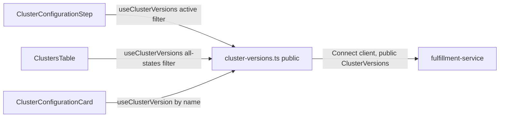

# ClusterVersion — UI Design

| Field       | Value                                 |
|-------------|---------------------------------------|
| Author(s)   | Elay Aharoni |
| Jira        | [OSAC-1269](https://issues.redhat.com/browse/OSAC-1269) |
| PRD         | [prd.md](./prd.md) |
| Date        | 2026-07-30 |

# 1. Overview

This design specifies the `osac-ui` implementation for `ClusterVersion` (OSAC-1269): a managed catalog of OpenShift versions that replaces raw `release_image` input across the cluster-creation wizard, catalog item field definitions, and cluster list/detail views. It covers two UI surfaces: (1) version selection in the cluster-creation wizard, replacing the free-text release-image field; (2) version and lifecycle-state display on cluster list and detail views via a client-side join against the `ClusterVersion` catalog. Per the PRD's FR-9 (revised in `enhancement-proposals` PR #191), `ClusterVersion` catalog management (create, delete, lifecycle transitions) is CLI/API-only in v0.2 — `osac-ui` has no admin surface for it. The backend API and data model — the fulfillment-service `ClusterVersions` service and `ClusterSpec.version` — are an already-finalized, already-shipped contract; this document addresses only how `osac-ui` consumes and surfaces them. **Note on data shape:** `ClusterSpec.version` is a `ClusterVersionReference` message (`{id, name, project, shared}`), not a plain string — this replaced an earlier `version_name` string field as part of a broader "typed reference" migration (`osac` PR merging OSAC-3730) that also changed `catalog_item` the same way. `enhancement-proposals`' own `design.md`/`prd.md` for this feature still describe the older `version_name` string shape and have not been updated for this rename; this document follows the current fulfillment-service source (`osac/fulfillment-service/proto/public/osac/public/v1/cluster_type.proto`, `cluster_version_type.proto`) rather than that stale prose. See the [PRD](./prd.md) for the full product requirements.

# 2. Goals and Non-Goals

## 2.1 Goals

**User-facing goals, by persona:**

- **Tenant User:** When creating a cluster, pick an OpenShift version from a list of supported versions instead of pasting an internal release-image URL from memory or documentation. Obsolete and disabled versions are never offered as options at all — there's nothing to accidentally pick. If the chosen version is deprecated, see a clear warning at selection time rather than discovering it later. When viewing a cluster (in the list or on its detail page), see its OpenShift version and whether that version is still active, deprecated, or obsolete — without needing to cross-reference a separate catalog.
- **Cloud Provider Admin:** No change to this persona's UI experience — per PRD FR-9, managing the version catalog itself (creating versions, retiring them, setting the default) is a CLI/API workflow in v0.2, not a UI one. This is called out explicitly because earlier drafts of this design did include admin UI for this; it was removed following a PRD revision (`enhancement-proposals` PR #191, see §2.2).

**Implementation-approach goals** (how the above gets built, for the engineers implementing it):

- Follow the existing hooks-layer conventions (`useApiFetch` + `useApiQuery` + `apiQueryKey`) established in `libs/ui-components/src/api/v1/networking.ts` and `instance-types.ts` for `ClusterVersion` API access. [Codebase: `docs/api-query-arch.md`]
- Reuse the existing client-side cross-resource join pattern (`useVmDetailsDisplay.ts`) for resolving and displaying a cluster's version and lifecycle state. [Codebase: `libs/ui-components/src/components/vm/DetailsPage/useVmDetailsDisplay.ts`]
- Batch-fetch `ClusterVersion` data for the cluster list table instead of issuing one fetch per row. [Codebase: `libs/ui-components/src/components/Cluster/ClustersTable.tsx`]

## 2.2 Non-Goals

- ACM `ClusterImageSet` auto-sync UI — versions remain admin-entered in v0.2. [PRD: §2.2 Non-Goals]
- A generic, backend-driven "field type" rendering system for catalog field definitions. Version selection remains a hardcoded wizard-step widget, consistent with how `instance_type` is implemented today — the `FieldDefinition` proto has no type discriminator to drive one. [Codebase: `catalogProvision/catalogFieldDefinition.ts`]
- CLI implementation — covered by the linked fulfillment-service design, not this document.
- **`ClusterVersion` catalog management UI** (create, delete, lifecycle state transitions, set-default) — per PRD FR-9 (revised in `enhancement-proposals` PR #191), this is CLI/API-only in v0.2; "the interaction model is expected to change when versions become system-populated (OSAC-1415)." `osac-ui` has no admin surface for `ClusterVersion` at all. [PRD: FR-9] [User]
- **UI for changing an existing cluster's version after creation.** `allowed_upgrades` and the associated version-change validation were removed from the backend data model entirely in PR #191 (not deferred — deleted). There is no version-change API surface for `osac-ui` to build against. Resolves the prior Open Question 8.1. [Codebase: `enhancement-proposals` `design.md`, PR #191] [User]

# 3. Motivation / Background

Today, a Tenant User creating a cluster must type or paste an exact OpenShift release-image URL (e.g. `quay.io/openshift-release-dev/ocp-release:4.17.0-multi`) into a plain text field, with no validation until the server rejects it during provisioning — there's no way to browse what versions exist, and a typo or stale URL isn't caught until much later in the flow. The same raw, unhelpful string is echoed back verbatim on the cluster's detail page afterward, with no indication of whether that version is still current, deprecated, or long obsolete. In implementation terms: `ClusterConfigurationStep.tsx` renders `spec.releaseImage` as a plain-text `InputField`, and `ClusterConfigurationCard.tsx` echoes the same raw string on the cluster detail page — neither surface resolves, validates, or contextualizes the value in any way.

`ClusterVersion` replaces this raw string with a managed reference — `ClusterSpec.version`, a `ClusterVersionReference{id, name, project, shared}` message, not a plain string — that the fulfillment-service already validates, resolves, and tracks through a lifecycle (active/deprecated/obsolete) [Codebase: `osac/fulfillment-service/proto/public/osac/public/v1/cluster_type.proto`]. The UI's job is twofold: replace the wizard's free-text field with a version picker sourced from the catalog; and, everywhere a cluster's version is displayed, resolve the reference's `name` to its descriptive metadata and *current* lifecycle state, since the cluster object stores only a name reference (nested one level under `version`) and lifecycle state can change independently of the cluster (FR-6). Populating and maintaining the catalog itself is a Cloud Provider Admin task performed via CLI/API — per PRD FR-9, `osac-ui` has no admin surface for it in v0.2.

### What this looks like

The wizard's configuration step changes from a free-text field to a dropdown, with a warning shown only when the user picks a deprecated version:

```text
Before:  Release image  [ quay.io/openshift-release-dev/ocp-release:4.17.0-multi_______ ]
                          (free text — no validation, no way to browse options)

After:   Version        [ 4.17.0                                              ▾ ]
                          ⚠ This version is deprecated and will be removed in a future release.
```

The cluster list and detail pages gain a resolved version string plus a colored lifecycle badge, in place of the old raw image string:

```text
Before (cluster detail):  Release image:  quay.io/openshift-release-dev/ocp-release:4.17.0-multi

After  (cluster detail):  Version:        4.17.0   [Deprecated]
After  (cluster list):    ... | Version: 4.17.0 | Lifecycle: [Deprecated] | ...
```

These are plain-text sketches of the interaction, not visual mockups — the actual PatternFly components (`SelectField`, `Alert`, `Label`) are specified in §4.1.

# 4. Design

## 4.1 Architecture

Both UI surfaces share a single new, read-only hook module:

- **`libs/ui-components/src/api/v1/cluster-versions.ts`** (public) — `useClusterVersions(params)`, `useClusterVersion(id)`. Used by both tenant-facing surfaces (wizard picker, cluster list/detail join). Backed by `@osac/types`' public `ClusterVersions` service, which never returns `spec.image` and hides disabled/obsolete entries from `List` unless explicitly filtered [Codebase: `design.md` "Public `ClusterVersions/List` hides disabled and obsolete..."].

There is no private hook module for this resource in `osac-ui`. Per PRD FR-9 (revised in PR #191), `ClusterVersion` catalog management is CLI/API-only — `osac-ui` never needs `Create`/`Update`/`Delete`/lifecycle mutations, and therefore never needs `spec.image` (private-only) or `@osac/types/private`'s `ClusterVersions` service at all. This is a simpler shape than the `ClusterCatalogItems` public/private split (`cluster-catalog-item.ts` vs. `private/cluster-catalog-item.ts`), which exists specifically because *that* resource has an admin-managed UI counterpart — `ClusterVersion` does not.



This diagram shows that no component talks to a Connect client directly — every UI surface routes through the one hook module, which reaches the fulfillment-service `ClusterVersions` service's public API. The reader's takeaway: adding a new consumer of version data never requires a new API integration, only a new hook call against the existing module.

**Wizard (tenant-facing).** `ClusterConfigurationStep.tsx` replaces the `spec.releaseImage` `InputField` with a `SelectField name="spec.versionName"`, fed by `useClusterVersions({ filter: CLUSTER_VERSION_ACTIVE_LIST_FILTER })` — mirroring `VmConfigurationStep.tsx`'s `instanceType` field exactly [Codebase: `wizard/adapters/computeInstance/VmConfigurationStep.tsx`]. The Formik-side value stays a plain string (the selected `ClusterVersion`'s `metadata.name`) — it does **not** need to become a nested `{name}` object in form state; the same pattern already used for `hostType` and `catalogItemId` in this same wizard (plain string in `ClusterWizardValues`, wrapped into `{ id }`/`{ name }` only when the outgoing payload is built) applies here. `fields.ts` renames `CLUSTER_RELEASE_IMAGE_WIRE_PATH` (`'release_image'`) to `CLUSTER_VERSION_WIRE_PATH` (`'version'`, **not** `'version_name'` — the catalog item field-definition path fulfillment-service now checks is `"version"` [Codebase: `osac/fulfillment-service/internal/servers/private_cluster_catalog_items_server.go:169`]) and the form field from `releaseImage` to `versionName`; `schemas.ts`, `payload.ts`, `applyCatalogDefaults.ts`, and `clusterAdapter.ts` rename their `releaseImage`/`spec.releaseImage` references accordingly. `payload.ts`'s `buildClusterCreatePayload()` sets `spec.version = { name: values.spec.versionName.trim() }` on the outgoing `MessageInitShape<typeof ClusterSchema>['spec']` — mirroring how the same function already builds `spec.catalogItem = { id: catalogItem.id }` and each node set's `hostType: { id: hostTypeId }` [Codebase: `wizard/adapters/cluster/payload.ts`]. `id`/`project`/`shared` are left unset on the outgoing reference, matching the CLI's own construction of the same message (`&publicv1.ClusterVersionReference{Name: c.args.version}` [Codebase: `osac/fulfillment-service/internal/cmd/cli/create/cluster/create_cluster_cmd.go:330`]) and the proto's stated defaults (empty `project`, `shared=true`). `getCatalogFieldOverlay('version', definitions, t('Version'))` still supplies label/editable/default overlay from the catalog item's field definitions, matching FR-10 and today's `release_image` overlay usage — but the default value itself is now a **struct** (`{ "name": "4-17-0" }`), not a bare string, since the field's underlying value is a reference. `catalogFieldDefinition.ts`'s `fieldDefinitionDefaultToInputString()` (shared with the compute-instance wizard) has no handling for a struct default today — it falls through to `''` for any plain object — so `applyClusterCatalogConfigurationDefaults()` must unwrap `{ name }` from the parsed default itself (or a small, cluster-version-specific extension of the shared helper) before calling `helpers.setFieldValue('spec.versionName', name)`; without this fix, a catalog item that locks/defaults the version field would silently show a blank field instead of the intended default (FR-10).

`CLUSTER_VERSION_ACTIVE_LIST_FILTER` must match both `ACTIVE` and `DEPRECATED` states (`this.spec.state in [1, 2]`, i.e. `CLUSTER_VERSION_STATE_ACTIVE`/`CLUSTER_VERSION_STATE_DEPRECATED`) plus `enabled == true` — **not** `ACTIVE` alone. FR-7/FR-15 require that "creating a cluster with a deprecated version succeeds" and that deprecated versions "remain available for new cluster creation," so they must appear as selectable dropdown options; only `OBSOLETE` (state `3`) and disabled entries are excluded. Options are built with a new `formatClusterVersionOptionLabel` helper (`libs/ui-components/src/components/vm/utils.ts`-style, co-located with the new `cluster-versions.ts` module or an analogous `components/Cluster/utils.ts`), appending a "(deprecated)" suffix for `DEPRECATED` entries. Per FR-7/FR-15, selecting a deprecated version does not block submission; the step renders an inline PatternFly `Alert` (`variant="warning"`) below the select when the chosen version's state is `DEPRECATED` (e.g., "Version 4.17.0 is deprecated and will be removed in a future release."). Server-side validation errors (version not found, obsolete, or unresolvable) surface through the wizard's existing submission-error handling — no new error-display mechanism is introduced.

**Cluster list (`ClustersTable.tsx`, tenant- and admin-visible).** Per review feedback [PR review: batzionb]: since the `ClusterVersion` catalog is small (tens of entries, not thousands — see §4.4), fetch the whole catalog once and resolve versions client-side, mirroring exactly how `VmListPage.tsx`/`VmTable.tsx` already resolve the instance-type column for VMs — no name-scoped filtering and no per-entry fallback fetches. This replaces an earlier, more complex draft of this section that scoped the `List` call to just the referenced clusters' names and added a capped `Get`-fallback for names that scoped call might not return; that approach is now a rejected alternative (see §5) rather than the design.

The table's container calls `useClusterVersions({ filter: CLUSTER_VERSION_ALL_STATES_LIST_FILTER })` once, unconditionally — not scoped to the currently-rendered clusters at all. `CLUSTER_VERSION_ALL_STATES_LIST_FILTER` (`this.spec.state in [0, 1, 2, 3] && this.spec.enabled in [true, false]`) explicitly touches both `spec.state` and `spec.enabled`, which is what defeats the public `List` RPC's default disabled/obsolete hiding (that hiding rule keys off which *fields* the filter touches, not whether a filter is present at all) — so the response reliably includes every version regardless of lifecycle state or enablement, with no runtime ambiguity to reason about. Build a `Map<string, ClusterVersion>` keyed by `metadata.name` from the response, exactly mirroring `VmTable.tsx`'s existing `instanceTypeById` map (built the same way from `useInstanceTypes()`'s unfiltered result). Each row looks up its `cluster.spec?.version?.name` in that map — no per-row fetch, no fallback `Get` calls, and no fan-out concern of any kind, since the one `List` call already has everything. Two new columns: **Version** (the resolved `ClusterVersion.spec.version` string, e.g. "4.17.0", falling back to the raw reference name if the entry genuinely doesn't exist — e.g., deleted — mirroring `ClusterConfigurationCard.tsx`'s existing catalog-item-name fallback) and **Lifecycle** (`ClusterVersionLifecycleLabel`, blank if unresolved).

This also removes a concern the earlier draft had to account for explicitly: since `CLUSTER_VERSION_ALL_STATES_LIST_FILTER` unambiguously requests everything by construction, there is no longer any unconfirmed assumption about `List` behavior for the implementer to verify — Story 2.01's former "confirm the real `List` behavior" acceptance item is removed as moot.

**Cluster detail (`ClusterConfigurationCard.tsx`).** The raw-string swap for this card is already done in `main`, independent of this design's decomposition: a prior compile-fix (`osac` PR merging OSAC-3730, which introduced `ClusterVersionReference` across the API) already relabeled the field "Version" and changed the line to `displayValue(cluster.spec?.version?.name)`, so the card compiles against the current generated types. This design's remaining work is to replace that raw-string line with `useClusterVersion(cluster.spec?.version?.name)`, rendering the resolved version string plus `ClusterVersionLifecycleLabel`, with a `Skeleton` while loading — the exact pattern already used in the same file for `cluster.spec?.catalogItem?.id` via `useClusterCatalogItem`. A single `Get`-by-name call resolves regardless of the version's lifecycle state (FR-2's "a specific version can be viewed regardless of its state"), so no all-states filter is needed here, unlike the list table's batched `List` call.

There is no admin catalog management UI for `ClusterVersion` in `osac-ui` — per PRD FR-9 (revised in PR #191), catalog management (create, delete, lifecycle transitions, set-default) is CLI/API-only in v0.2. Everything about the admin list page, row actions (Edit/Deprecate/Obsolete/Reactivate/Set-as-default/Delete), and the create form that appeared in earlier drafts of this design has been removed — see §5 for why it isn't relocated elsewhere either.

**Lifecycle state label.** Reuse the generic `ResourceLifecycleLabel` component (`libs/ui-components/src/components/Resource/ResourceLifecycleLabel.tsx`), introduced by the instance-type lifecycle work — do **not** build a new standalone label component [Codebase-review: batzionb]. `ResourceLifecycleLabel`'s `LifecycleKind = 'active' | 'deprecated' | 'obsolete' | 'unspecified'` and its `green`/`orange`/`grey` color mapping already match `ClusterVersionState` exactly (`ACTIVE`/`DEPRECATED`/`OBSOLETE`/`UNSPECIFIED`) — orange, not gold/amber, is already `ResourceLifecycleLabel`'s built-in `deprecated` color, so no separate UX confirmation is needed here. Follow the same thin-wrapper pattern already established for instance types (`InstanceType/InstanceTypeLifecycleLabel.tsx`): a new `ClusterVersionLifecycleLabel` component maps `ClusterVersionState` to `{ lifecycle, text }` via a `Record<ClusterVersionState, ResourceLifecycleLabelProps>` (mirroring `instanceTypeLifecycleMap`) and renders `<ResourceLifecycleLabel {...props} />`. This design's one addition beyond that established pattern: wrap the rendered `ResourceLifecycleLabel` in a PatternFly `Tooltip` when `state` is `DEPRECATED` or `OBSOLETE` and the corresponding timestamp is present — `InstanceTypeLifecycleLabel` has no such tooltip today, so this part has no existing precedent to reuse.

## 4.2 Data Model / Schema Changes

No schema changes originate in `osac-ui` — `ClusterVersion` is defined and owned by the fulfillment-service. Two prerequisites outside this design's control block implementation:

1. `libs/types/src/index.ts` (public barrel) does not yet export the already-generated `cluster_version_type_pb`/`cluster_versions_service_pb` modules, though they exist on disk and the private variant is already exported from `index-private.ts`. **Re-verified against the current `osac-ui` `main` tip** after review feedback that "types were updated recently so [this] not relevant": the type regeneration (point 2 below) is indeed done, but this barrel-export gap is a separate, still-open item — `libs/types/src/index.ts` still has no `cluster_version_type_pb`/`cluster_versions_service_pb` lines as of the latest `main` (the most recent regeneration commit only added an unrelated `security_rule_type_pb` export). This is a hand-maintained barrel file requiring a two-line addition alongside the existing `cluster_type_pb`/`clusters_service_pb` exports. [Codebase: `libs/types/src/index.ts`]
2. `ClusterSpec.version` and `ClusterTemplateSpecDefaults.version` — both typed `ClusterVersionReference`, not the plain-string `version_name` this design originally assumed — are **already present** in the generated types on disk: `libs/types` was regenerated against the current fulfillment-service source as part of an unrelated typed-reference migration (`osac` PR merging OSAC-3730, plus a follow-up regeneration), which also already fixed `buf.gen.yaml`'s `git_repo`/`subdir` inputs to point at `osac-project/osac`'s `fulfillment-service/proto/{public,private}` (previously pointed at the archived standalone `fulfillment-service` repo). No further codegen-source fix or `pnpm gen-types` re-run is required for this prerequisite — only the barrel-export gap in point 1 remains open. [Codebase: `libs/types/src/osac/public/v1/cluster_type_pb.ts`, `libs/types/buf.gen.yaml`]

## 4.3 API Changes

No new backend API — this section covers the new `osac-ui`-internal hook surface wrapping the already-specified `ClusterVersions` service [Codebase: enhancement-proposals `design.md`]. One new `ApiRoute` entry in `libs/ui-components/src/api/types.ts`: `'v1/cluster_versions'` (public only — no private route, per §4.1).

| Hook | Module | RPC | Notes |
|---|---|---|---|
| `useClusterVersions(params)` | public | `List` | `select: data.items`; used with `CLUSTER_VERSION_ACTIVE_LIST_FILTER` (wizard) or `CLUSTER_VERSION_ALL_STATES_LIST_FILTER` (cluster table join — fetches the whole catalog unconditionally, not scoped to the rendered clusters) |
| `useClusterVersion(id)` | public | `Get` | `select: data.object`; used by cluster detail join |

`osac-ui` has no mutation hooks for `ClusterVersion` — `Create`/`Update`/`Delete`/lifecycle-state transitions are CLI/API-only per PRD FR-9, so there's no `useCreateClusterVersion()`/`useUpdateClusterVersion()`/`useDeleteClusterVersion()`/`useSetClusterVersionLifecycleState()` in this design, and no `ClusterVersionsUpdateRequest`/`update_mask` concern for `osac-ui` to account for.

Example — wizard lists selectable versions:

```json
// Request (useClusterVersions, CLUSTER_VERSION_ACTIVE_LIST_FILTER)
{ "filter": "this.spec.state in [1, 2] && this.spec.enabled == true" }

// Response (spec.image absent — public schema)
{ "items": [ { "id": "uuid", "metadata": { "name": "4-17-0" }, "spec": { "version": "4.17.0", "enabled": true, "isDefault": true, "state": "ACTIVE" }, "status": {} } ] }
```

Example — cluster table join fetches the whole catalog once, regardless of which clusters are rendered:

```json
// Request (useClusterVersions, CLUSTER_VERSION_ALL_STATES_LIST_FILTER)
{ "filter": "this.spec.state in [0, 1, 2, 3] && this.spec.enabled in [true, false]" }
```

`CLUSTER_VERSION_ALL_STATES_LIST_FILTER` explicitly touches both `spec.state` (every `ClusterVersionState` value, including `UNSPECIFIED`) and `spec.enabled` (both `true` and `false`) — which is what reliably bypasses the public `List` RPC's default disabled/obsolete hiding, since that rule keys off which fields the filter touches, not whether a filter is present. Per review feedback [PR review: batzionb], this replaces an earlier design that scoped the `List` call to just the referenced clusters' `metadata.name` values via a `buildClusterVersionNamesFilter()` helper, plus a capped `Get`-fallback for names that call might not return — that approach depended on an unconfirmed assumption about `List` behavior for a targeted filter, which this simpler, unconditional all-states fetch no longer needs to reason about at all (the small size of the `ClusterVersion` catalog, §4.4, makes fetching everything unconditionally the right tradeoff). See §5 for the now-rejected name-scoped-filter-plus-fallback alternative.

All changes are additive to the API surface from the UI's perspective; the `Clusters`/`ClusterTemplates` field rename (`release_image` → `version`, a `ClusterVersionReference`) is a breaking change already shipped in the fulfillment-service and covered by §7 below.

## 4.4 Scalability and Performance

Impact is minimal and bounded by existing patterns. The cluster list table's batched `ClusterVersion` fetch adds one additional `List` call per table render (cached 5s per the shared `QueryClient` defaults), independent of cluster count — this avoids the N+1 pattern a naive per-row implementation would introduce. The version catalog itself is expected to be small (tens of entries, not thousands), so client-side map construction and lookup are O(n) with negligible cost. No new polling behavior is introduced beyond the existing 30s background refetch interval already applied to all `useApiQuery` hooks.

## 4.5 Security Considerations

`osac-ui` only ever calls the public `ClusterVersions` API (`List`/`Get`) — it never imports `@osac/types/private` for this resource, since it has no admin surface that would need `spec.image` or write access. `spec.image` is therefore structurally unreachable from any `osac-ui` code path, with no code-review convention or lint rule needed to enforce it (unlike `ClusterCatalogItems`, where a public/private split genuinely exists because that resource does have an admin-facing UI counterpart). Write access to `ClusterVersion` (create/update/delete/lifecycle transitions) is CLI/API-only per PRD FR-9, enforced server-side via OPA — not a concern for this design at all.

## 4.6 Failure Handling and Recovery

| Scenario | UI behavior |
|---|---|
| Wizard: selected version becomes obsolete/deleted between load and submit | `CreateCluster` rejects with `InvalidArgument`; the wizard surfaces the server error via its existing submission-error handling and the user reselects a version. |
| Wizard: `ClusterVersions/List` call fails or is slow | `SelectField` shows its existing loading state (`isLoading`); on failure, the field shows no options and the wizard's existing field-level error display applies — no new error UI. |
| Cluster detail/list: referenced version was deleted (rare — delete is blocked while referenced, but can occur if reference cleanup and version deletion race, or for legacy pre-migration clusters per the PRD's Assumptions) | Falls back to displaying the raw reference name (`cluster.spec?.version?.name`) with no lifecycle label, mirroring the existing `ClusterConfigurationCard` fallback for an unresolved `catalogItem`. |

## 4.7 RBAC / Tenancy

`ClusterVersion` is a platform-global, non-tenant-scoped resource [Codebase: `design.md` RBAC/Tenancy — `"shared"` tenant]. All authenticated users can read it via the public API. Create/update/delete/lifecycle transitions are Cloud Provider Admin-only per PRD FR-9, enforced server-side via OPA — but that's a CLI/API concern, not an `osac-ui` one: there's no admin route or nav entry for `osac-ui` to gate.

## 4.8 Extensibility / Future-Proofing

The wizard's hardcoded-widget approach (no generic field-type registry) means a future field with similar "pick from a managed catalog" needs (e.g., a future `ComputeImage` catalog for VMaaS, noted as a PRD non-goal here) would follow the same recipe as `instanceType`/`versionName`: a dedicated hook, a dedicated `SelectField`, and an overlay call for label/editable/default — not a new abstraction. `allowed_upgrades` was removed from the backend data model entirely in PR #191, not deferred — if OSAC-1415 introduces a version-change or upgrade-graph capability later, that will need its own design, informed by whatever API shape ships at that time; nothing in this design should be read as a placeholder for it. Resolves the prior Open Question 8.1.

# 5. Alternatives Considered

**Generic field-type-driven form rendering** (a `field_definitions`-declared type enum that picks a widget automatically, rather than hardcoding `SelectField` for the cluster's version field). Rejected: the `FieldDefinition` proto has no type discriminator today, and introducing one would require a coordinated fulfillment-service proto change out of scope for this UI design; the hardcoded-widget approach is also what `instance_type` already does, so it introduces no new inconsistency.

**Per-row version fetch in `ClustersTable.tsx`** instead of one `List` call resolving the whole table. Rejected: with N clusters, this issues N `Get` calls per table render; TanStack Query's cache would dedupe repeated calls for the same version across rows but still issues one request per distinct version referenced on first render, and doesn't scale as cleanly as a single `List` call that already has the entire (small) catalog.

**A `metadata.name`-scoped `List` filter** (`buildClusterVersionNamesFilter()`, matching only the versions actually referenced by the currently-rendered clusters) plus a capped `Get`-fallback via `useQueries` for any requested name the scoped call didn't return, instead of fetching the whole catalog unconditionally. This was the design's approach through several review rounds, on the reasoning that a broad "match every state and enabled value" filter is a tautology — logically equivalent to no filter at all — and that a targeted identity lookup sidesteps having to reason about the public `List` RPC's default disabled/obsolete hiding entirely. **Rejected per review feedback** [PR review: batzionb]: the `ClusterVersion` catalog is small enough (§4.4) that this precision isn't worth the added complexity — the `isSuccess` gating, the `CLUSTER_VERSION_FALLBACK_MAX` cap, and the `useQueries`/Rules-of-Hooks handling it required. Fetching the whole catalog once via `CLUSTER_VERSION_ALL_STATES_LIST_FILTER` (§4.1, §4.3) is simpler, has no fallback-fetch machinery at all, and mirrors the existing `VmListPage.tsx`/`VmTable.tsx` pattern for the instance-type column — being a tautology is not a defect when the goal is precisely "return everything."

**Extending `ResourceStatusLabel`'s `StatusKind` union with `'deprecated' | 'obsolete'`**, or building a wholly new standalone label component, instead of reusing `ResourceLifecycleLabel`. Rejected: `ResourceStatusLabel`'s `StatusKind` semantics (ready/failed/progressing/unspecified) describe *runtime reconciliation state*, and every other consumer of `ResourceStatusLabel` relies on that meaning — adding catalog-lifecycle semantics to the same union risks a consumer accidentally treating a "deprecated" `ClusterVersion` as some kind of resource-condition failure. But a wholly new component would also be wrong: `ResourceLifecycleLabel` (`libs/ui-components/src/components/Resource/ResourceLifecycleLabel.tsx`) already exists precisely for catalog-lifecycle semantics (`'active' | 'deprecated' | 'obsolete' | 'unspecified'`, introduced by the instance-type lifecycle work), with the exact green/orange/grey mapping this design needs [Codebase-review: batzionb]. The correct approach — and what this design now specifies in §4.1 — is a thin `ClusterVersionLifecycleLabel` wrapper following the established `InstanceTypeLifecycleLabel.tsx` pattern, not a new label component and not an extension of `ResourceStatusLabel`.

# 6. Observability and Monitoring

No new observability changes. Existing monitoring mechanisms (fulfillment-service gRPC metrics and structured logging) already cover the underlying API calls [Codebase: `design.md` Observability and Monitoring]; this design adds no client-side telemetry beyond what any other page in the app already emits (none, per current codebase conventions).

# 7. Impact and Compatibility

The wizard's field rename (`releaseImage` → `versionName`) and the removal of the free-text release-image input are backward-incompatible with any in-progress cluster-creation flow relying on the old field name, but this is coordinated with the fulfillment-service's `release_image` → `version` API change (a typed `ClusterVersionReference`, not a same-shape string rename) — that change has already shipped in fulfillment-service, ahead of the PRD's originally-planned "same coordinated v0.2 deployment" framing [PRD: §"Version Skew Strategy"]. No existing production catalog items reference `release_image` (per the PRD's Assumptions), so no catalog item migration is required in the UI. The `libs/types` barrel-export fix (§4.2, point 1) is the only remaining prerequisite — the underlying type regeneration itself has already landed.

# 8. Open Questions

No open questions remain. The two previously open in this section are both resolved by `enhancement-proposals` PR #191 (revised PRD/BE design):

- *Does this design need UI for changing an existing cluster's version?* — **No.** `allowed_upgrades` was removed from the backend data model entirely (not deferred), and PRD FR-9 explicitly scopes `osac-ui` to wizard selection + lifecycle display only. See §2.2 Non-Goals and §4.8.
- *Should a lint rule enforce the `spec.image` public/private boundary?* — **Moot.** `osac-ui` has no private `ClusterVersions` hook at all now (§4.1, §4.5), so there's no boundary to enforce.

---

## Provenance

Authored: draft @ design 0.4.1 - 96de078, workspace fix/proxy-any-wrapper-type-resolution @ afbc45d (2 behind origin/main)
Final: revise @ design 0.8.0 - 7efcedb, workspace main @ d968bbc

> Context changed between draft and revise.

<!-- ai-workflow-provenance:{"schema_version":1,"provenance_kind":"session","workflow":"design","workflow_version":"0.8.0","ai_workflows":"7efcedb","source_repo":"d968bbc","source_repo_branch":"main","commits_behind_main":0,"commits_ahead_main":0,"main_ref":"main","phases":["draft","respond","respond","respond","revise","respond","respond","respond","revise","revise","revise"],"authoring_modes":["skill"],"context_changed":true,"origin_untracked":false} -->
