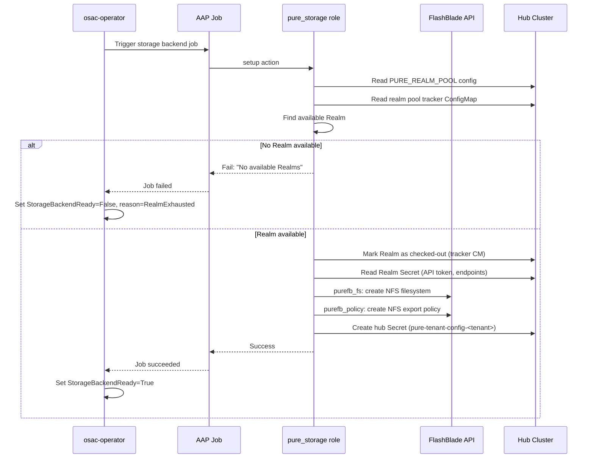

title: pure-flashblade-storage-provider
authors:
  - sdanni@redhat.com
creation-date: 2026-07-27
last-updated: 2026-07-27
tracking-link:
  - https://redhat.atlassian.net/browse/OSAC-2117
prd:
  - "prd.md"
see-also:
  - "/enhancements/tenant-specific-storageclasses"
  - "/enhancements/OSAC-1110-storage-tier"
replaces:
  - N/A
superseded-by:
  - N/A

# Pure Storage FlashBlade File Storage (NFS) Provider

## Summary

This enhancement adds Pure Storage FlashBlade as an NFS file storage provider in OSAC by implementing a new `pure_storage` Ansible template role that integrates with the existing provider-agnostic storage dispatch system. The role manages a pre-created Realm pool checkout/release lifecycle, installs the PX-CSI driver via OLM on workload clusters, and creates tenant-isolated StorageClasses with OSAC labels. No changes are required to the osac-operator or fulfillment-service. See [PRD](prd.md) for detailed requirements.

## Motivation

OSAC currently supports only VAST as a file storage backend. Datacenters running Pure Storage FlashBlade hardware cannot provision tenant-isolated NFS storage through OSAC, forcing manual configuration outside the platform. FlashBlade is a widely deployed enterprise file and object storage platform with built-in multi-tenancy through Secure Multi-Tenancy (SMT) Realms, making it a natural fit for OSAC's per-tenant isolation model.

The existing storage provider dispatch system (`osac.service.storage_provider`) is already dynamic: adding a `provider: "pure"` entry to `STORAGE_TIERS` automatically dispatches to `osac.templates.pure_storage`. This design leverages that extensibility, requiring only a new template role and its configuration artifacts. The osac-operator's StorageReconciler discovers StorageClasses by OSAC labels, not by provider type, so Pure-backed StorageClasses integrate into the existing tenant storage resolution without operator changes.

The key design challenge is Realm pool management. Unlike VAST, where OSAC creates tenants on-demand via the VAST VMS API, FlashBlade Realms must be pre-created by array administrators and "checked out" to OSAC tenants during onboarding. This introduces pool state tracking, checkout/release semantics, and exhaustion handling as novel concepts in OSAC's storage provisioning.

### Goals

- Reuse the existing storage provider dispatch and four-action interface (`setup`, `ensure_storage_class`, `teardown_cluster_storage`, `teardown_backend`) without modifying the dispatcher, playbooks, or operator.
- Produce StorageClasses with identical OSAC label semantics to VAST (`osac.openshift.io/tenant`, `osac.openshift.io/storage-tier`, `osac.openshift.io/storage-protocol`, `app.kubernetes.io/managed-by: osac-aap`) so the operator, UI, and compute instance controllers discover them without modification.
- Use Realm-scoped API tokens exclusively for storage operations within a Realm, limiting blast radius to a single tenant's Realm.
- Support both CaaS and VMaaS provisioning targets.
- Surface Realm exhaustion as a clear error with blocked status on the Tenant CR.

### Non-Goals

- FlashBlade S3/object storage support (blocked on Pure's S3 CSI maturity).
- FlashArray block storage support (not deployed in current datacenter configurations).
- Admin-facing UI for Realm pool management or storage backend registration.
- Pure Fusion fleet-level orchestration (not yet GA; targeted FY2027).

## Proposal

This enhancement introduces a single new Ansible template role, `osac.templates.pure_storage`, that implements the four storage provider actions against Pure Storage FlashBlade. The role manages three concerns:

1. **Realm pool checkout and release.** Pre-created Realms are registered via a ConfigMap (`PURE_REALM_POOL`). During `setup`, the role checks out an available Realm by writing a checkout annotation to a tracking ConfigMap. During `teardown_backend`, the Realm is released back to the pool (or destroyed, depending on the resolution of OQ-1). Realm exhaustion fails the AAP job with a descriptive error, and the operator surfaces this as a `StorageBackendReady=False` condition on the Tenant CR.

2. **PX-CSI driver installation.** The `ensure_storage_class` action installs the Portworx Enterprise Operator via OLM on the target workload cluster, creates the `px-pure-secret` credential Secret containing the Realm-scoped API token, and creates per-tier NFS StorageClasses with OSAC labels.

3. **Backend provisioning within the Realm.** The `setup` action uses the `purestorage.flashblade` Ansible collection to create NFS filesystems (`purefb_fs`), NFS export policies (`purefb_policy`), and persists the Realm configuration to a hub Secret for the `ensure_storage_class` stage to consume.

The dispatcher routes to this role automatically when `STORAGE_TIERS` contains entries with `"provider": "pure"`. No changes to the dispatcher, existing playbooks, osac-operator, or fulfillment-service are required.

### Workflow Description

#### Cloud Infrastructure Admin: Backend Registration

Starting state: A Pure Storage FlashBlade array is deployed with Purity//FB 4.6.1+ and network connectivity from workload clusters to the management API and NFS data network.

1. The Cloud Infrastructure Admin creates FlashBlade Realms on the array using the Pure Storage management console or API. Each Realm is configured with capacity quotas and QoS rate limits appropriate for a single tenant.

2. For each Realm, the admin generates a Realm-scoped API token with `storage_admin` role and creates a Kubernetes Secret on the hub cluster in the `osac-system` namespace:

   ```yaml
   apiVersion: v1
   kind: Secret
   metadata:
     name: pure-realm-<realm-name>
     namespace: osac-system
     labels:
       app.kubernetes.io/managed-by: osac-admin
       osac.openshift.io/pure-realm-pool: "true"
   type: Opaque
   stringData:
     realm_name: "<realm-name>"
     api_token: "<realm-scoped-api-token>"
     mgmt_endpoint: "<fb-management-vip>"
     nfs_endpoint: "<fb-nfs-data-vip>"
   ```

3. The admin registers the Realm pool in the storage-operations Instance Group ConfigMap by adding Realm references and the array-admin API token (used only for Realm lifecycle operations during teardown):

   ```yaml
   PURE_REALM_POOL: |
     [
       {"realm_name": "realm-01", "secret_name": "pure-realm-realm-01"},
       {"realm_name": "realm-02", "secret_name": "pure-realm-realm-02"}
     ]
   ```

4. The admin registers a `StorageBackend` with `provider: "pure"` and creates `StorageTier` resources via the fulfillment-service private API, associating tiers with the backend and specifying `protocol: NFS`.

5. The admin updates the `STORAGE_TIERS` ConfigMap entry to include Pure tiers:

   ```json
   [
     {"name": "pure-standard", "protocol": "nfs", "provider": "pure"},
     {"name": "pure-high-perf", "protocol": "nfs", "provider": "pure",
      "export_rules": "*(rw,no_root_squash)"}
   ]
   ```

#### Cloud Provider Admin: Tenant Onboarding

Starting state: A Tenant CR is created. The osac-operator's StorageReconciler detects no hub Secret for the tenant and triggers the `osac-create-tenant-storage-backend` AAP job template (Stage 1).



The diagram shows the `setup` action flow. The role reads the Realm pool configuration, finds an available Realm, checks it out, provisions FlashBlade resources within the Realm, and persists the tenant configuration to a hub Secret.

1. The `setup` action reads `PURE_REALM_POOL` from the Instance Group ConfigMap and loads the Realm pool tracker ConfigMap (`pure-realm-pool-tracker` in `osac-system`).

2. It selects the first Realm not marked as checked-out. If none are available, the task fails with: `"No available Realms in the Pure FlashBlade pool. Register additional Realms or tear down unused tenants."`

3. It reads the selected Realm's Secret to obtain `api_token`, `mgmt_endpoint`, `nfs_endpoint`, and `realm_name`.

4. Using the `purestorage.flashblade` collection with the Realm-scoped API token, it creates NFS filesystems and export policies within the Realm.

5. It marks the Realm as checked out in the tracker ConfigMap (tenant name, timestamp, Realm name).

6. It persists the tenant configuration to a hub Secret labeled `osac.openshift.io/tenant: <tenant-name>`:

   ```yaml
   apiVersion: v1
   kind: Secret
   metadata:
     name: pure-tenant-config-<tenant-name>
     namespace: osac-system
     labels:
       app.kubernetes.io/managed-by: osac-aap
       osac.openshift.io/tenant: "<tenant-name>"
   type: Opaque
   stringData:
     storage_provider_type: "pure"
     realm_name: "<realm-name>"
     api_token: "<realm-scoped-api-token>"
     mgmt_endpoint: "<fb-management-vip>"
     nfs_endpoint: "<fb-nfs-data-vip>"
   ```

7. The operator detects the hub Secret and sets `StorageBackendReady=True`.

8. The operator triggers `osac-create-tenant-cluster-storage` (Stage 2). The `ensure_storage_class` action:
   - Installs the Portworx Enterprise Operator via OLM on the target cluster (if not already installed).
   - Creates the `px-pure-secret` Secret in the PX-CSI namespace with `pure.json` containing the Realm-scoped credentials.
   - Creates per-tier NFS StorageClasses with OSAC labels and PX-CSI parameters.
   - Creates VolumeSnapshotClasses if the VolumeSnapshot CRD is installed.

9. The operator discovers the new StorageClasses by label and populates `Tenant.status.storageClasses`.

#### Cloud Provider Admin: Tenant Offboarding

Starting state: A Tenant CR is being deleted.

1. The operator triggers `osac-delete-tenant-cluster-storage`. The `teardown_cluster_storage` action removes StorageClasses, VolumeSnapshotClasses, and the `px-pure-secret` from the target cluster.

2. The operator triggers `osac-delete-tenant-storage-backend`. The `teardown_backend` action:
   - Reads the hub Secret to identify the Realm.
   - Removes NFS export policies and filesystems within the Realm.
   - Releases the Realm in the tracker ConfigMap (marks as available) or destroys the Realm (if single-use; see OQ-1).
   - Deletes the hub Secret.

#### Tenant Admin / Tenant User: Storage Consumption

Starting state: Tenant onboarding is complete. StorageClasses are visible on the workload cluster.

1. The Tenant Admin or User discovers available StorageClasses through the OSAC console (which reads `Tenant.status.storageClasses` from the public API), or via `kubectl get storageclass -l osac.openshift.io/tenant=<tenant-name>`.

2. The user creates PVCs referencing the Pure-backed StorageClass. PX-CSI provisions NFS volumes within the tenant's Realm on FlashBlade.

#### Error Handling

**Realm exhaustion:** The `setup` action fails with a descriptive error message. The AAP job reports failure. The operator sets `StorageBackendReady=False` with `reason: RealmExhausted`. The operator does not retry automatically (matching existing VAST behavior for backend failures). The Cloud Provider Admin sees the condition on the Tenant CR and can register additional Realms or tear down unused tenants.

**CSI installation failure:** The `ensure_storage_class` action fails if the Portworx Enterprise Operator cannot be installed (e.g., OLM catalog unavailable, operator prerequisites not met). The AAP job reports failure. The operator sets `ClusterStorageReady=False`. The Cloud Provider Admin investigates the cluster.

**FlashBlade API unreachable:** The `setup` action's `purefb_fs` or `purefb_policy` calls fail with a connection error. The block/rescue pattern rolls back any partially-created FlashBlade resources and releases the Realm back to the pool. The AAP job reports failure with the connection error.

**Network connectivity:** If the workload cluster cannot reach the FlashBlade NFS data VIP, PVC provisioning by PX-CSI fails at the CSI level. This manifests as PVCs stuck in Pending state. The Tenant Admin sees the PVC event. Network connectivity is an infrastructure prerequisite documented in the PRD Assumptions section.

### API Extensions

No new CRDs, gRPC services, admission webhooks, or finalizers are introduced. This enhancement operates entirely within the existing OSAC storage provisioning framework:

- **fulfillment-service:** A Cloud Infrastructure Admin creates `StorageBackend` resources with `provider: "pure"` and associates them with `StorageTier` resources via the existing private CRUD APIs. No code changes.

- **osac-operator:** The `StorageReconciler` discovers Pure-backed StorageClasses via the same label-based mechanism it uses for VAST. No code changes.

- **osac-aap:** The dispatcher includes the new role via the existing dynamic dispatch pattern (`include_role: name: "osac.templates.{{ _current_provider }}_storage"`). No changes to the dispatcher or playbooks.

### Implementation Details/Notes/Constraints

#### Template Role Structure

The `pure_storage` role lives at `osac-aap/collections/ansible_collections/osac/templates/roles/pure_storage/` and follows the four-action pattern established by `vast_storage`:

```
pure_storage/
  meta/
    osac.yaml           # Role metadata
  defaults/
    main.yaml           # Pure-specific defaults
  tasks/
    setup.yaml          # Stage 1: Realm checkout + FlashBlade provisioning
    ensure_storage_class.yaml  # Stage 2: PX-CSI + StorageClass creation
    teardown_cluster_storage.yaml  # Cluster-side cleanup
    teardown_backend.yaml          # Backend cleanup + Realm release
    read_realm_credentials.yaml    # Read Realm Secret from hub
    ensure_pxcsi_operator.yaml     # OLM operator installation
```

**`meta/osac.yaml`:**

```yaml
title: Pure Storage FlashBlade Provider
description: >
  Provisions Pure Storage FlashBlade NFS storage for OSAC tenants.
  Uses pre-created Realms with Realm-scoped API tokens for tenant isolation.
  Installs PX-CSI (Portworx CSI) via OLM. Creates K8s Secrets and
  StorageClasses with PX-CSI parameters and OSAC labels. Admin
  credentials never enter tenant-namespace Secrets.

template_type: storage_provider
implementation_strategy: pure
capabilities:
  supported_protocols:
    - nfs
  provisioning_targets:
    - vmaas
    - hcp_control_plane
    - hcp_worker_root
    - hcp_data_plane
```

#### Default Variables (`defaults/main.yaml`)

```yaml
# CSI provisioner name — PX-CSI (Portworx CSI, replaces deprecated pure-csi)
pure_storage_csi_provisioner: "pxd.portworx.com"

# Hub Secret prefix for per-tenant Pure config
pure_storage_tenant_config_secret_prefix: "pure-tenant-config-"

# Namespace for hub-cluster config Secrets
pure_storage_config_namespace: "{{ lookup('env', 'OSAC_STORAGE_CONFIG_NAMESPACE') | default('osac-system', true) }}"

# Realm pool tracker ConfigMap name
pure_storage_realm_pool_tracker: "pure-realm-pool-tracker"

# PX-CSI credential Secret name (fixed by PX-CSI driver requirement)
pure_storage_csi_secret_name: "px-pure-secret"

# PX-CSI operator installation via OLM
pure_storage_csi_operator_namespace: "portworx"
pure_storage_csi_operator_channel: "stable"
pure_storage_csi_operator_approval: "Automatic"
pure_storage_csi_operator_catalog_source: "certified-operators"
pure_storage_csi_operator_catalog_namespace: "openshift-marketplace"

# Default NFS export rules for StorageClass
pure_storage_default_export_rules: "*(rw)"

# Default NFS version for mount options
pure_storage_nfs_version: "nfsvers=4.1"

# TLS certificate validation for FlashBlade API
pure_storage_validate_certs: "{{ lookup('env', 'PURE_VALIDATE_CERTS') | default('true', true) | bool }}"
```

#### Realm Pool State Tracking

Realm checkout state is tracked in a ConfigMap on the hub cluster (`pure-realm-pool-tracker` in `osac-system`). The ConfigMap data maps Realm names to their checkout status:

```yaml
apiVersion: v1
kind: ConfigMap
metadata:
  name: pure-realm-pool-tracker
  namespace: osac-system
  labels:
    app.kubernetes.io/managed-by: osac-aap
data:
  # JSON object: realm_name -> checkout info (or null if available)
  pool_state: |
    {
      "realm-01": {"tenant": "tenant-alpha", "checked_out_at": "2026-07-27T10:00:00Z"},
      "realm-02": null
    }
```

The `setup` action reads the ConfigMap, finds the first null entry, and atomically updates it with the tenant name and timestamp using `kubernetes.core.k8s` with `state: present`. The `teardown_backend` action sets the entry back to null (release) or removes it (destroy). Concurrent checkout is serialized by AAP's job execution model -- only one storage backend job runs per tenant, and the ConfigMap update is the last step before writing the hub Secret.

A ConfigMap (rather than a dedicated CRD or database table) is chosen because: (a) the Realm pool is small (tens of entries), (b) AAP jobs already interact with K8s resources, (c) it avoids fulfillment-service schema changes, and (d) it matches the config-file-based registration model.

#### Hub Secret Format for Pure

The hub Secret persisted during `setup` stores the Realm credentials and endpoint information needed by `ensure_storage_class` to create the PX-CSI credential Secret on the target cluster:

```yaml
stringData:
  storage_provider_type: "pure"
  realm_name: "<realm-name>"
  api_token: "<realm-scoped-api-token>"
  mgmt_endpoint: "<fb-management-vip>"
  nfs_endpoint: "<fb-nfs-data-vip>"
```

The `ensure_storage_class` action reads this Secret and constructs the `px-pure-secret` on the target cluster with the `pure.json` format required by PX-CSI:

```json
{
  "FlashBlades": [{
    "MgmtEndPoint": "<mgmt_endpoint>",
    "APIToken": "<api_token>",
    "NFSEndPoint": "<nfs_endpoint>",
    "realm": "<realm_name>"
  }]
}
```

#### PX-CSI Operator Installation

The `ensure_pxcsi_operator.yaml` task installs the Portworx Enterprise Operator via OLM, following the same pattern as the VAST role's `ensure_csi_operator.yaml`:

1. Check if the operator's CRD is already present (idempotency check).
2. Create the operator namespace.
3. Create an OperatorGroup.
4. Create a Subscription to the `certified-operators` CatalogSource.
5. Wait for the operator deployment to become available.

The Portworx Enterprise Operator is Red Hat-certified and listed in the Red Hat Ecosystem Catalog.

#### StorageClass Creation

Per-tier NFS StorageClasses are created with PX-CSI parameters and OSAC labels:

```yaml
apiVersion: storage.k8s.io/v1
kind: StorageClass
metadata:
  name: "pure-nfs-<tenant_name>-<tier_name>"
  labels:
    app.kubernetes.io/managed-by: osac-aap
    osac.openshift.io/tenant: "<tenant_name>"
    osac.openshift.io/storage-tier: "<tier_name>"
    osac.openshift.io/storage-protocol: "nfs"
provisioner: pxd.portworx.com
parameters:
  backend: "pure_file"
  pure_export_rules: "*(rw)"
  pure_nfs_endpoint: "<nfs-data-vip>"
mountOptions:
  - nfsvers=4.1
  - tcp
reclaimPolicy: Delete
volumeBindingMode: Immediate
```

The naming convention (`pure-nfs-<tenant>-<tier>`) and label set are consistent with the VAST role's pattern (`vast-nfs-<tenant>-<tier>`).

#### VolumeSnapshotClass Creation

When the VolumeSnapshot CRD is installed, a VolumeSnapshotClass is created per tier:

```yaml
apiVersion: snapshot.storage.k8s.io/v1
kind: VolumeSnapshotClass
metadata:
  name: "pure-snapshot-<tenant_name>-<tier_name>"
  labels:
    app.kubernetes.io/managed-by: osac-aap
    osac.openshift.io/tenant: "<tenant_name>"
    osac.openshift.io/storage-tier: "<tier_name>"
driver: pxd.portworx.com
deletionPolicy: Delete
```

FlashBlade snapshot limitations apply: maximum 64 snapshots per volume, in-place restore only (original PVC must be deleted first), only latest snapshot restorable.

#### Instance Group Configuration

New example files for Pure storage operations:

**ConfigMap (`configmap-storage-operations-ig-example.yaml`, updated):**

```yaml
STORAGE_TIERS: |
  [
    {"name": "pure-standard", "protocol": "nfs", "provider": "pure"}
  ]

PURE_REALM_POOL: |
  [
    {"realm_name": "realm-01", "secret_name": "pure-realm-realm-01"},
    {"realm_name": "realm-02", "secret_name": "pure-realm-realm-02"}
  ]
```

**Secret (`secret-storage-operations-ig-example.yaml`, updated):**

```yaml
# Pure FlashBlade array-admin API token — used ONLY for Realm lifecycle
# operations (destroy/eradicate during teardown). Storage operations within
# a Realm use Realm-scoped tokens from per-Realm Secrets.
PURE_ARRAY_ADMIN_TOKEN: ""
PURE_MGMT_ENDPOINT: ""
```

The array-admin token is needed only for `teardown_backend` if the Realm is destroyed on offboarding.

#### Ansible Collection Vendoring

The `purestorage.flashblade` collection (v1.26.0+) must be added to `osac-aap/collections/requirements.yml` and vendored into the `vendor/` directory. Its Python dependency `py-pure-client` must be added to the execution environment's Python requirements.

### Security Considerations

**Credential isolation.** Three tiers of credentials are used, each with different scope and storage:

| Credential | Scope | Stored in | Used by |
|---|---|---|---|
| Array-admin API token | Entire FlashBlade | IG Secret (`PURE_ARRAY_ADMIN_TOKEN`) | `teardown_backend` only (Realm destroy) |
| Realm-scoped API token (`storage_admin`) | Single Realm | Per-Realm K8s Secret + hub Secret | `setup`, `ensure_storage_class` |
| PX-CSI Realm token | Single Realm | `px-pure-secret` on workload cluster | PX-CSI driver at runtime |

Array-admin credentials are never written to hub Secrets, tenant-namespace Secrets, or any resource accessible to tenants. Realm-scoped tokens limit blast radius: a compromised token can affect only the tenant's Realm, not other tenants or the array.

**Secret management.** Per-Realm Secrets are created by the Cloud Infrastructure Admin (not by OSAC). OSAC reads them during `setup` and copies the Realm-scoped token to the hub Secret and the workload cluster's `px-pure-secret`. The `always` block in `setup` and `ensure_storage_class` clears all credential facts from play scope after use, matching the VAST role's pattern.

**Tenant isolation on FlashBlade.** Realms provide management-plane isolation (resources within a Realm are invisible to other Realm-scoped tokens). NFS data-plane isolation relies on export policies created by the Pure role restricting client access. Network-level isolation (workload cluster pod CIDRs reaching only their assigned Realm's NFS endpoint) is an infrastructure prerequisite.

### Failure Handling and Recovery

**Realm checkout failure (pool exhausted).** The `setup` task fails with: `"No available Realms in the Pure FlashBlade pool."` No Realm is checked out, no hub Secret is created. The AAP job fails. The operator sets `StorageBackendReady=False`. Recovery: admin registers additional Realms or tears down unused tenants. The operator retries on the next reconciliation trigger.

**FlashBlade API failure during setup.** The `setup` task uses a `block/rescue` pattern. On failure: the rescue block removes any partially-created NFS filesystems and export policies, releases the Realm in the tracker ConfigMap, and deletes the hub Secret if partially written. The AAP job reports the original error. The role is idempotent: re-running `setup` after a failure retries from scratch.

**PX-CSI operator installation failure.** The `ensure_pxcsi_operator.yaml` task checks for the operator CRD before creating OLM resources (idempotency). If the Subscription or operator deployment fails, the task fails. The operator sets `ClusterStorageReady=False`. Recovery: the Cloud Provider Admin investigates the cluster's OLM state.

**StorageClass creation failure.** The `ensure_storage_class` action uses `kubernetes.core.k8s` with `state: present` for idempotent creation. If a StorageClass cannot be created (e.g., PX-CSI not ready), the task fails. The `always` block clears credential facts. Re-running the action retries creation.

**Controller restart mid-reconciliation.** The operator's `StorageReconciler` is stateless: it re-reads the Tenant CR, checks for the hub Secret, resolves StorageClasses by label, and triggers AAP jobs through the `RunProvisioningLifecycle` pattern. A restart causes a full re-evaluation with no data loss.

**Teardown with missing Realm Secret.** If the per-Realm Secret has been deleted before `teardown_backend` runs, the role cannot authenticate to FlashBlade to clean up resources. The role logs a warning and releases the Realm in the tracker ConfigMap without FlashBlade cleanup. The admin must manually clean up FlashBlade resources.

### RBAC / Tenancy

No RBAC or tenancy changes are required. The Pure role creates resources with the same tenant isolation metadata as VAST:

- `osac.openshift.io/tenant: <tenant-name>` label on StorageClasses, hub Secrets, and CSI Secrets.
- `app.kubernetes.io/managed-by: osac-aap` label on all managed resources.
- The operator filters StorageClasses and hub Secrets by these labels.
- OPA policies enforce tenant isolation at the fulfillment-service API level (unchanged).

The `pure-realm-pool-tracker` ConfigMap and per-Realm Secrets in `osac-system` are accessible only to the storage-operations Instance Group service account, not to tenants.

### Observability and Monitoring

No new Prometheus metrics or alerts are introduced. Existing monitoring mechanisms apply:

- **AAP job status:** Job success/failure is tracked in `Tenant.status.storageBackendJobs` and `Tenant.status.clusterStorageJobs` by the operator.
- **Tenant conditions:** `StorageBackendReady` and `ClusterStorageReady` conditions surface provisioning state. Realm exhaustion appears as `StorageBackendReady=False` with a descriptive message.
- **Kubernetes events:** The operator emits `Warning` events for duplicate StorageClasses and `Normal` events for successful provisioning (existing behavior).
- **Ansible task logs:** The Pure role logs Realm checkout/release, FlashBlade API calls, and CSI operator installation steps through standard Ansible output captured by AAP.

### Risks and Mitigations

| Risk | Impact | Mitigation |
|---|---|---|
| Realm-scoped tokens may not work with all `purestorage.flashblade` modules | Backend provisioning within a Realm fails; must fall back to array-admin tokens, increasing blast radius | Validate during implementation with a test FlashBlade. If confirmed, use array-admin tokens for provisioning but scope CSI driver tokens per-Realm |
| Portworx Enterprise Operator may require interactive setup (Portworx Central registration) | CSI installation automation is more complex than OLM Subscription | Investigate during implementation; if interactive steps are needed, document them as a prerequisite or use Helm-based installation as fallback |
| ConfigMap-based Realm pool tracker has no built-in concurrency control | Concurrent `setup` jobs could check out the same Realm | AAP serializes storage backend jobs per tenant; cross-tenant concurrent checkout is mitigated by read-modify-write with `resourceVersion` on the ConfigMap |
| FlashBlade Realm destroy requires array-admin credentials | Teardown fails if array-admin token is missing or revoked | `teardown_backend` degrades gracefully: releases the Realm in the tracker (so it appears available) and logs a warning. Admin must manually destroy the Realm on FlashBlade |

### Drawbacks

The Realm pool model introduces operational complexity compared to VAST's on-demand tenant creation. Admins must pre-create Realms on FlashBlade, generate API tokens, create Secrets, and register the pool in a ConfigMap -- a multi-step manual process. If the Realm pool is undersized, tenant onboarding blocks until more Realms are registered.

This complexity is inherent to FlashBlade's multi-tenancy architecture: Realm creation requires array-admin privileges that OSAC should not hold at runtime. The trade-off is justified because: (a) Realm-scoped tokens provide genuine isolation, (b) the pool model matches Pure's SAW reference architecture, and (c) the alternative (OSAC holding array-admin credentials and creating Realms on-demand) would violate the least-privilege principle.

The ConfigMap-based state tracker is simple but not a first-class API resource. It has no schema validation, no RBAC beyond namespace-level access, and requires the admin to read raw JSON to understand pool state. If OSAC adds more storage providers with similar pool models, a dedicated Realm pool CRD or fulfillment-service API may be warranted.

## Alternatives (Not Implemented)

### Alternative 1: OSAC Creates Realms On-Demand

Instead of pre-created Realms, OSAC could create a new Realm for each tenant during `setup`, similar to how VAST creates tenants on-demand.

**Pros:** Eliminates the Realm pool registration workflow. No pool exhaustion concern.
**Cons:** Requires OSAC to hold array-admin credentials at runtime, violating least privilege. Realm creation is a privileged operation that datacenter admins may not want automated. Realm naming and sizing decisions belong to infrastructure admins.
**Rejected because:** The PRD explicitly specifies pre-created Realms via config-file registration.

### Alternative 2: Database-Backed Realm Pool State

Track Realm checkout state in the fulfillment-service PostgreSQL database instead of a ConfigMap.

**Pros:** First-class API, schema validation, query support, audit log.
**Cons:** Requires fulfillment-service schema changes (new table), new private API endpoints, and cross-component coordination. Increases scope significantly.
**Rejected because:** The pool is small (tens of entries), ConfigMap access is native to AAP jobs, and the fulfillment-service is explicitly out of scope for code changes.

### Alternative 3: Helm-Based PX-CSI Installation

Install PX-CSI via Helm chart instead of OLM.

**Pros:** More direct control over installation parameters.
**Cons:** Loses OLM lifecycle management (automatic upgrades, health checks). Inconsistent with VAST's OLM-based CSI installation pattern. Portworx Enterprise Operator is Red Hat-certified in OLM.
**Rejected because:** OLM is the standard mechanism for operator installation on OpenShift, and consistency with the VAST role's approach reduces maintenance burden.

### Alternative 4: Legacy `pure-csi` Driver

Use the original PSO (`pure-csi`) driver instead of PX-CSI.

**Pros:** Simpler installation (Helm only), fewer dependencies.
**Cons:** Deprecated since January 2022 with no active maintenance. No Realm support. End-of-support reached.
**Rejected because:** Using a deprecated driver is a liability. PX-CSI is the only supported CSI driver for Pure Storage.

## Open Questions

### OQ-1: Realm Reuse vs. Single-Use Model

Can FlashBlade Realms be reused after tenant teardown -- OSAC wipes the Realm contents (deletes filesystems, export policies) and refreshes API tokens, returning the Realm to the available pool -- or are Realms single-use, destroyed on teardown and requiring the Cloud Infrastructure Admin to register replacements?

**Impact:** Determines the `teardown_backend` workflow. Reuse keeps the Realm intact and releases it; single-use destroys/eradicates the Realm (requires array-admin credentials). The design handles both: `teardown_backend` reads a `PURE_REALM_REUSE` config flag (default: `true` for release-and-reuse).

**Owner:** Storage team / Pure Storage SME

### OQ-2: FlashBlade Servers vs. Realms for NFS Data-Plane Isolation

FlashBlade supports both "servers" (data access isolation for NFS/SMB) and "Realms" (management/administrative isolation). Does the Pure role need to configure FlashBlade servers in addition to Realms for NFS data-plane isolation? How does the PX-CSI `pure_nfs_server` StorageClass parameter relate to this?

**Impact:** May add an additional configuration step to the `setup` workflow if NFS server objects must be created within each Realm.

**Owner:** Storage team / Pure Storage SME

### OQ-3: Portworx Enterprise Operator Licensing

Does the Portworx Enterprise Operator require a license key or Portworx Central registration to function in a non-interactive (Ansible-driven) installation? If so, how is the license provided?

**Impact:** Determines whether `ensure_pxcsi_operator.yaml` needs additional configuration steps beyond OLM Subscription creation.

**Owner:** Storage team / Portworx SME

## Test Plan

### Unit Tests (osac-aap)

- `ansible-lint` validation of all Pure role task files, defaults, and metadata.
- Molecule or integration test for the `pure_storage` role using mocked FlashBlade API responses (via `ansible.builtin.uri` mocking) and a kind cluster:
  - `setup`: Realm checkout, FlashBlade resource creation, hub Secret creation, rollback on failure.
  - `ensure_storage_class`: OLM operator installation, `px-pure-secret` creation, StorageClass creation with correct labels and parameters, idempotency (short-circuit when SCs exist).
  - `teardown_cluster_storage`: StorageClass and Secret removal.
  - `teardown_backend`: Realm release/destroy, hub Secret deletion.
  - Realm exhaustion: all Realms checked out, descriptive error message.

### Integration Tests (osac-aap, kind-based)

- Storage provider dispatch test: verify `provider: "pure"` in `STORAGE_TIERS` correctly dispatches to `osac.templates.pure_storage`.
- StorageClass label verification: ensure created StorageClasses have correct `osac.openshift.io/tenant`, `osac.openshift.io/storage-tier`, and `osac.openshift.io/storage-protocol` labels.
- Hub Secret format: verify the hub Secret is created with correct labels and data fields.
- Realm pool tracker: verify checkout/release cycle updates the ConfigMap correctly.

### E2E Tests (osac-test-infra, pytest)

- Tenant onboarding with a Pure file storage tier: create a Tenant with `STORAGE_TIERS` containing a Pure NFS tier, verify `StorageBackendReady=True` and `ClusterStorageReady=True` conditions, verify StorageClasses appear in `Tenant.status.storageClasses`.
- This test requires a FlashBlade test environment or mock. In CI without FlashBlade hardware, the test can be skipped via a feature flag (matching the existing `STORAGE_TESTS_ENABLED` pattern in osac-aap CI).

## Graduation Criteria

Graduation criteria will be defined when targeting a release. Expected stages: Dev Preview -> Tech Preview -> GA based on production deployment feedback with Pure Storage FlashBlade hardware.

- **Dev Preview:** Pure template role functional with mocked FlashBlade. StorageClasses created correctly. Realm pool checkout/release works.
- **Tech Preview:** Validated against real FlashBlade hardware. PX-CSI driver provisioning works end-to-end. Realm-scoped token isolation confirmed.
- **GA:** Production deployment, admin documentation complete, E2E test suite passing in CI.

## Upgrade / Downgrade Strategy

This is a new storage provider with no upgrade impact. OSAC does not currently support upgrades, so data migration and backward compatibility are not concerns at this stage.

**Downgrade:** Removing Pure support requires: (1) tearing down all tenants using Pure storage tiers, (2) removing `provider: "pure"` entries from `STORAGE_TIERS`, (3) removing the `pure_storage` role from osac-aap, and (4) deleting the Realm pool tracker ConfigMap and per-Realm Secrets.

## Version Skew Strategy

No version skew considerations apply. The Pure template role is an osac-aap component with no direct binary interface to the operator or fulfillment-service. The operator discovers StorageClasses by labels (not provider type), and the fulfillment-service accepts arbitrary provider strings. Upgrading osac-aap independently does not break existing Pure-backed tenants.

The PX-CSI driver version on workload clusters is managed by OLM (via the Subscription's `channel` setting). PX-CSI version skew with the FlashBlade firmware version is governed by Pure Storage's compatibility matrix, not by OSAC.

## Support Procedures

**Detecting failures:**
- `kubectl get tenant <name> -o jsonpath='{.status.conditions}'` -- check `StorageBackendReady` and `ClusterStorageReady` conditions.
- `kubectl get configmap pure-realm-pool-tracker -n osac-system -o jsonpath='{.data.pool_state}'` -- inspect Realm checkout state.
- AAP job logs for `osac-create-tenant-storage-backend` and `osac-create-tenant-cluster-storage` jobs.
- `kubectl get storageclass -l osac.openshift.io/tenant=<name>` on the workload cluster.

**Disabling the Pure provider:** Remove `provider: "pure"` tiers from `STORAGE_TIERS` in the Instance Group ConfigMap. Existing Pure-backed tenants continue to function (StorageClasses persist), but new tenant onboarding does not provision Pure storage. No impact on cluster health or other providers.

**Recovery after re-enabling:** Re-adding Pure tiers to `STORAGE_TIERS` and ensuring the Realm pool is configured restores the provisioning path. Existing tenants with Pure StorageClasses are unaffected. New tenants onboard through the standard flow.

## Infrastructure Needed

- **`purestorage.flashblade` Ansible collection:** Must be added to `osac-aap/collections/requirements.yml` and vendored. Requires `py-pure-client` Python SDK in the execution environment.
- **FlashBlade test environment:** For integration testing with real hardware. Can be deferred to Tech Preview; Dev Preview uses mocked API responses.
- **Portworx Enterprise Operator access:** OLM Subscription to `certified-operators` CatalogSource (available by default on OpenShift).


## Provenance

Authored: draft @ design 0.3.0 - 92734a2, workspace OSAC-2117 @ 1baec0f

<!-- ai-workflow-provenance:{"schema_version":1,"provenance_kind":"session","workflow":"design","workflow_version":"0.3.0","ai_workflows":"92734a2","source_repo":"1baec0f","source_repo_branch":"OSAC-2117","commits_behind_main":0,"commits_ahead_main":0,"main_ref":"main","phases":["draft"],"authoring_modes":["skill"],"context_changed":false} -->
