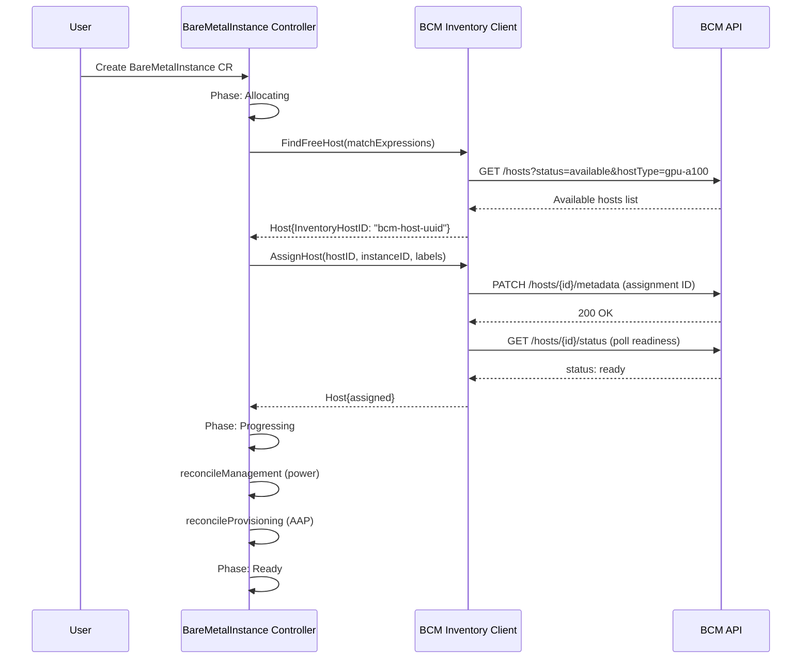

# BCM Backend Integration for BMaaS

## Summary

Implement BCM (Bare Metal Cloud) as a new pluggable inventory backend for the bare-metal-fulfillment-operator, conforming to the existing `inventory.Client` interface. The BCM backend discovers available hosts from BCM inventory, assigns them to BareMetalInstance CRs via the standard lifecycle controller, and handles host preparation delays specific to BCM infrastructure. See [PRD](prd.md) for detailed requirements.

## Motivation

OSAC provisions bare metal hosts through a pluggable inventory backend interface (`internal/inventory/client.go`). Today, two backends exist: OpenStack (Ironic node inventory) and Metal3 (BareMetalHost CRDs). Customers managing NVIDIA GPU clusters use BCM as their infrastructure management platform. Without a BCM inventory backend, these customers cannot fulfill BareMetalInstance requests through OSAC.

Adding BCM as a third backend also validates the pluggable architecture's extensibility. If the interface requires changes to accommodate BCM, those changes are better discovered now than during future integrations.

### Goals

- Implement `inventory.Client` for BCM without modifying the interface contract or the BareMetalInstance controller.
- Authenticate to BCM using mutual TLS (mTLS) with credentials managed as Kubernetes Secrets.
- Handle BCM-specific host preparation delays (2-5 minutes after assignment) within the inventory backend, transparently to the controller.
- Reuse existing operator configuration patterns (YAML config file mounted via ConfigMap/Secret, `inventory.Config` struct with `type: bcm`).

### Non-Goals

- Implementing a BCM management backend (`management.Client`). Power control remains handled by the existing management backend (OpenStack/Ironic). A BCM management backend is a future enhancement.
- Sysinfo-based hardware auto-classification. Host type matching uses admin-assigned labels in BCM.
- Multi-backend deployments. Each deployment uses one inventory backend.
- Health checks on assigned nodes. OSAC does not periodically verify that assigned nodes still exist in BCM.
- Status reporting back to BCM beyond the assignment identifier.
- UI/Enclave configuration changes (tracked separately under OSAC-2229).

## Proposal

Add a new `internal/inventory/bcm.go` file implementing `inventory.Client` against the BCM REST API. The implementation follows the same patterns as `openstack.go` and `metal3.go`: a factory function registered via `init()`, backend-specific configuration parsed from `inventory.Config.Options`, and the three interface methods (`FindFreeHost`, `AssignHost`, `UnassignHost`).

The BCM backend introduces one behavioral difference from existing backends: after assignment, a BCM host requires a preparation phase (approximately 2-5 minutes) before it is ready for provisioning. The `AssignHost` method handles this by polling BCM for readiness after writing the assignment identifier. If preparation fails, the method returns an error, causing the controller to set the BareMetalInstance to `Failed` phase through existing error handling.

No changes are required to the BareMetalInstance controller, the `inventory.Client` interface, or the `management.Client` interface.

### Workflow Description

#### Configuration (Day-0)

1. Cloud Infrastructure Admin pre-registers bare metal hosts in BCM with appropriate host type labels.
2. Cloud Infrastructure Admin creates a Kubernetes Secret containing BCM mTLS client certificate and key.
3. Cloud Infrastructure Admin creates an inventory ConfigMap with `type: bcm` and BCM-specific options (endpoint URL, Secret reference, CA certificate).
4. The operator reads the inventory config at startup, instantiates the BCM inventory client via the `NewClient` registry, and begins reconciling BareMetalInstance CRs.

```yaml
# /etc/osac/inventory/inventory.yaml
name: bcm-prod
type: bcm
hostClass: bcm
networkClass: bcm
options:
  bcm:
    endpoint: "https://bcm.example.com:443"
    tlsSecretName: bcm-mtls-credentials
    tlsSecretNamespace: osac
    caCertPath: /etc/osac/inventory/ca.crt
    hostPrepTimeoutSeconds: 600
    hostPrepPollIntervalSeconds: 15
```

#### Provisioning (Day-1)

1. Tenant submits a BareMetalInstance request (via fulfillment-service API or direct CR creation).
2. BareMetalInstance controller enters `Allocating` phase and calls `inventory.Client.FindFreeHost()`.
3. BCM backend queries BCM API for available hosts matching the requested `hostType`, filtering out already-assigned hosts.
4. Controller calls `inventory.Client.AssignHost()` with the selected host's BCM identifier.
5. BCM backend writes the OSAC assignment identifier to the host's metadata in BCM.
6. BCM backend polls for host preparation completion (BMH readiness). If preparation succeeds, returns the assigned `Host`. If preparation times out, returns an error.
7. Controller transitions to `Progressing` phase and continues with management (power) and provisioning (AAP template) reconciliation.
8. On successful completion of all stages, BareMetalInstance transitions to `Ready`.



#### Deprovisioning

1. User deletes the BareMetalInstance CR.
2. Controller enters `Deleting` phase, runs deprovisioning (AAP deprovision template), then calls `inventory.Client.UnassignHost()`.
3. BCM backend clears the assignment identifier from the host's metadata in BCM.
4. Host returns to BCM's available pool for reuse.

#### Error Handling: BCM Unreachable

When BCM is unreachable, the BCM client returns an error. The controller's existing error handling sets the BareMetalInstance to `Failed` phase with a condition message identifying BCM as the failing component. The controller requeues the reconciliation with backoff.

#### Error Handling: Host Preparation Failure

If host preparation exceeds the configured timeout (`hostPrepTimeoutSeconds`), `AssignHost` clears the assignment identifier from BCM (releasing the host) and returns an error. The controller sets `Allocated` condition to `False` with reason `Failed` and message indicating preparation timeout. The controller requeues, allowing a retry with a different host.

### API Extensions

No new CRDs, gRPC services, or API surface changes are required. The BCM backend is an internal inventory plugin that conforms to the existing `inventory.Client` interface.

The only extension is the inventory configuration schema, which gains a new `type: bcm` value and BCM-specific options within the `options.bcm` map:

| Field | Type | Required | Description |
|-------|------|----------|-------------|
| `endpoint` | string | Yes | BCM API base URL |
| `tlsSecretName` | string | Yes | Name of the Kubernetes Secret containing mTLS client cert and key |
| `tlsSecretNamespace` | string | Yes | Namespace of the TLS Secret |
| `caCertPath` | string | No | Path to CA certificate for BCM server verification. Defaults to system trust store. |
| `hostPrepTimeoutSeconds` | int | No | Maximum time to wait for host preparation after assignment. Default: 600 (10 minutes). |
| `hostPrepPollIntervalSeconds` | int | No | Interval between host readiness polls. Default: 15. |

## UX Alignment

No `@temp-api` file exists for BareMetalInstance in `osac-ux/libs/ui-components/src/api/v1/`. This section is not applicable. The BCM backend is transparent to the UI; tenants observe the same BareMetalInstance lifecycle regardless of inventory backend.

### Implementation Details/Notes/Constraints

#### BCM Client Implementation

The BCM client (`internal/inventory/bcm.go`) follows the same structure as the OpenStack client:

```go
func init() {
    newClientFuncs["bcm"] = NewBCMClient
}

type BCMClient struct {
    httpClient             *http.Client
    endpoint               string
    hostClass              string
    networkClass           string
    hostPrepTimeout        time.Duration
    hostPrepPollInterval   time.Duration
}
```

The client uses a standard `net/http.Client` configured with mTLS from Kubernetes Secret-mounted certificates. It does not use gophercloud (that is OpenStack-specific).

#### BCM API Mapping

| `inventory.Client` method | BCM API call | Description |
|---------------------------|-------------|-------------|
| `FindFreeHost` | `GET /hosts` with status and host type filters | Lists available hosts not yet assigned to an OSAC instance |
| `AssignHost` | `PATCH /hosts/{id}/metadata` + poll `GET /hosts/{id}/status` | Writes assignment identifier, waits for host preparation |
| `UnassignHost` | `PATCH /hosts/{id}/metadata` (remove assignment) | Clears assignment identifier, releases host |

#### Host Identification

BCM hosts are identified by their BCM UUID. The `Host.InventoryHostID` field stores this UUID directly (unlike Metal3 which uses `namespace/name` format). This is consistent with the OpenStack backend which also uses UUIDs.

#### Host Type Matching

BCM hosts are matched by `hostType` using admin-assigned labels in BCM metadata. The `FindFreeHost` implementation filters BCM hosts by:
1. Host type label matching the requested `matchExpressions["hostType"]`.
2. Assignment status: only hosts without an existing OSAC assignment identifier.
3. `managedBy` label matching (defaults to `osac` if unset).

Hosts are shuffled before selection to distribute load, consistent with existing backend behavior.

#### Assignment Identifier

When a host is assigned, the BCM backend writes a single assignment identifier (the BareMetalInstance UID) to the host's metadata in BCM. No tenant-identifying data is stored in BCM. This satisfies PRD requirement NFR-2.

The metadata key is `osac_assignment_id`. This is a flat string value, not a nested map, because BCM metadata supports simple key-value pairs.

#### Host Preparation Handling

BCM hosts require a preparation phase after assignment (approximately 2-5 minutes). The `AssignHost` method implements this as a polling loop:

1. Write assignment identifier to BCM host metadata.
2. Poll `GET /hosts/{id}/status` at `hostPrepPollIntervalSeconds` intervals.
3. If host status transitions to `ready` within `hostPrepTimeoutSeconds`, return the assigned `Host`.
4. If timeout is reached, clear the assignment identifier from BCM (release host) and return an error.

The polling occurs within the `AssignHost` call, which means the controller's reconciliation loop is blocked during preparation. This is acceptable because:
- The BareMetalInstance controller supports configurable `maxConcurrentReconciles` (default 1, configurable via `OSAC_BAREMETALINSTANCE_MAX_CONCURRENT_RECONCILES`).
- Operators deploying BCM should increase concurrency to avoid blocking other instances during preparation.
- The preparation timeout is bounded and configurable.

Alternative: Return immediately from `AssignHost` and handle preparation polling in the controller. This was rejected because it would require changes to the `inventory.Client` interface or the controller, violating the pluggable backend contract.

#### Authentication and Reconnection

The BCM client authenticates using mTLS. The TLS configuration is loaded at startup from:
- Client certificate and key: mounted from the Kubernetes Secret referenced by `tlsSecretName`/`tlsSecretNamespace`.
- CA certificate: loaded from `caCertPath` (optional; falls back to system trust store).

Unlike the OpenStack client which implements token-based auth retry (`isAuthError` + `reconnect`), the BCM client uses certificate-based auth which does not expire mid-session. If the certificate is rotated on disk (e.g., by cert-manager), the client reloads it on the next connection attempt using `tls.Config.GetCertificate`.

#### Error Categorization

| Error condition | gRPC code equivalent | User-visible message |
|----------------|---------------------|---------------------|
| BCM endpoint unreachable | UNAVAILABLE | "BCM inventory backend unreachable at {endpoint}" |
| mTLS authentication failure | UNAUTHENTICATED | "BCM authentication failed: verify mTLS certificates" |
| No matching hosts available | NOT_FOUND | "No matching hosts available" (existing message) |
| Host already assigned by another instance | ALREADY_EXISTS | Returns `nil` host (existing pattern) |
| Host preparation timeout | DEADLINE_EXCEEDED | "BCM host preparation timed out after {timeout}s" |
| Host preparation failure | FAILED_PRECONDITION | "BCM host preparation failed: {reason}" |

### Security Considerations

**Authentication:** BCM communication uses mutual TLS. The client certificate and key are stored in a Kubernetes Secret and mounted into the operator pod. The operator never logs or exposes certificate material. No secrets are stored in the inventory ConfigMap.

**Data exposure:** Only the BareMetalInstance UID (a Kubernetes-generated UUID) is written to BCM. No tenant name, namespace, labels, or other identifying information leaves the OSAC cluster. A BCM administrator who needs tenant context must query the fulfillment-service API using the instance UID.

**Network policy:** The operator pod requires outbound HTTPS access to the BCM endpoint. The existing network policy in `config/network-policy/` should be extended to allow egress to the configured BCM endpoint.

**Input validation:** The BCM endpoint URL is validated at startup. Host IDs returned by BCM are treated as opaque strings and never interpolated into shell commands or SQL queries.

### Failure Handling and Recovery

| Failure mode | System behavior | User observation | Recovery |
|-------------|----------------|-----------------|----------|
| BCM unreachable during FindFreeHost | Controller returns error, requeues with backoff | BareMetalInstance stays in `Allocating` phase; `Allocated` condition shows BCM error | Automatic retry on requeue. Manual: verify BCM endpoint and network connectivity. |
| BCM unreachable during AssignHost | Controller returns error, requeues | BareMetalInstance stays in `Allocating` phase | Automatic retry. `ExternalHostID` is already set; next reconciliation retries assignment on the same host. |
| Host preparation timeout | BCM client clears assignment, returns error | BareMetalInstance transitions to `Failed` with preparation timeout message | Controller requeues; next reconciliation clears `ExternalHostID` and selects a new host. |
| BCM unreachable during UnassignHost | Controller returns error, retains finalizer | BareMetalInstance stays in `Deleting` phase | Automatic retry. Finalizer prevents resource deletion until cleanup succeeds. |
| mTLS certificate expired | All BCM calls fail with TLS handshake error | BareMetalInstance shows authentication error in conditions | Manual: rotate certificates in the Kubernetes Secret. Operator reloads on next connection. |
| Host removed from BCM while assigned | Not immediately detected (known limitation) | BareMetalInstance remains in current phase | Manual: delete the BareMetalInstance to trigger cleanup. Future enhancement: periodic health checks. |

All BCM client methods are idempotent. Retrying a failed `AssignHost` on the same host is safe because BCM's metadata update is a PUT/PATCH that overwrites the previous value. Retrying `UnassignHost` is safe because clearing a nonexistent assignment identifier is a no-op.

### RBAC / Tenancy

No RBAC changes are required. The BCM backend operates entirely within the operator's existing service account permissions. It does not create, modify, or read any new Kubernetes resources beyond what the BareMetalInstance controller already accesses.

Tenant isolation is preserved:
- `osac.openshift.io/tenant` and `osac.openshift.io/owner-reference` annotations on BareMetalInstance CRs remain enforced by existing OPA policies.
- BCM receives only the BareMetalInstance UID, not tenant identifiers.
- The inventory backend selection is an operator-level configuration, not a per-tenant setting. Tenants cannot choose or influence which backend serves their requests.

### Observability and Monitoring

New structured log events in the BCM client:

| Log message | Level | Fields | Description |
|------------|-------|--------|-------------|
| "BCM host preparation started" | Info | `hostID`, `instanceID` | Emitted after assignment identifier is written |
| "BCM host preparation poll" | Debug (V=1) | `hostID`, `status`, `elapsed` | Emitted on each readiness poll |
| "BCM host preparation completed" | Info | `hostID`, `instanceID`, `duration` | Emitted when host becomes ready |
| "BCM host preparation timed out" | Error | `hostID`, `timeout` | Emitted when preparation exceeds timeout |
| "BCM auth error, certificate may need rotation" | Error | `endpoint`, `error` | Emitted on mTLS handshake failure |

New Prometheus metrics:

| Metric | Type | Labels | Description |
|--------|------|--------|-------------|
| `osac_bcm_host_preparation_duration_seconds` | Histogram | `host_type`, `result` (success/failure/timeout) | Time from assignment to host readiness |
| `osac_bcm_api_requests_total` | Counter | `method` (find/assign/unassign), `status` (success/error) | Total BCM API calls |
| `osac_bcm_api_request_duration_seconds` | Histogram | `method` | BCM API call latency |

### Risks and Mitigations

| Risk | Impact | Likelihood | Mitigation |
|------|--------|-----------|------------|
| BCM API changes in future versions | Backend breaks on BCM upgrade | Medium | Pin to BCM 10.25.03+ API. Document supported BCM versions. Add integration tests against BCM API mock. |
| Host preparation blocks controller reconciliation | Other BareMetalInstances delayed during preparation | Medium | Increase `maxConcurrentReconciles` in BCM deployments. Document this in operator configuration guide. Preparation timeout is bounded and configurable. |
| mTLS certificate rotation causes brief downtime | BCM calls fail until new certificate is loaded | Low | Use `tls.Config.GetCertificate` for automatic reload. Document certificate rotation procedure. |
| BCM metadata storage format changes | Assignment identifier not found or misread | Low | Use a well-defined metadata key (`osac_assignment_id`). Validate metadata format on read. |

### Drawbacks

- **Blocking preparation polling:** The host preparation polling within `AssignHost` blocks the controller goroutine for up to 10 minutes per host. This is a pragmatic trade-off to avoid modifying the `inventory.Client` interface. If future backends have longer preparation times, the interface may need to be extended with an asynchronous preparation API.

- **Single inventory backend per deployment:** BCM cannot coexist with OpenStack or Metal3 inventory in the same deployment. This is a pre-existing architectural constraint, not introduced by this design.

- **No management backend:** Power management for BCM-managed hosts still routes through the existing management backend (typically OpenStack/Ironic). If BCM provides its own power management API in the future, a separate `management.Client` implementation would be needed.

## Alternatives (Not Implemented)

### Asynchronous Host Preparation via Interface Extension

Add a `PrepareHost` method to `inventory.Client` that returns immediately and a `IsHostReady` method for polling. The controller would call `PrepareHost` after `AssignHost` and poll `IsHostReady` on subsequent reconciliations.

**Rejected because:** This modifies the interface contract that OpenStack and Metal3 backends implement. Those backends have no preparation phase, so they would need no-op implementations. The interface change adds complexity across all backends for a BCM-specific concern. If multiple future backends need asynchronous preparation, this alternative should be revisited.

### BCM as a Management Backend

Implement `management.Client` for BCM in addition to `inventory.Client`, routing power control through BCM's API.

**Deferred because:** The PRD explicitly states that power control is independent of the inventory backend. The current architecture separates inventory and management concerns. If BCM's power management API becomes a requirement, it can be added as a separate `management.Client` implementation without modifying the inventory backend.

### Direct BCM CRD Integration (Metal3-style)

Create a BCM-specific CRD that mirrors BCM hosts in the Kubernetes cluster, then use a Metal3-style Kubernetes-native inventory client.

**Rejected because:** This adds a CRD synchronization layer and a new controller. The OpenStack-style direct API approach is simpler, avoids state synchronization issues, and matches BCM's nature as an external service with its own source of truth.

## Test Plan

### Unit Tests

- `internal/inventory/bcm_test.go`:
  - `FindFreeHost` returns a matching host when BCM has available hosts.
  - `FindFreeHost` returns `nil` when no hosts match the requested `hostType`.
  - `FindFreeHost` excludes hosts with existing OSAC assignment identifiers.
  - `FindFreeHost` filters by `managedBy` label, defaulting to `osac`.
  - `FindFreeHost` shuffles candidates to distribute load.
  - `AssignHost` writes assignment identifier to BCM metadata and polls for readiness.
  - `AssignHost` returns `nil` when host is already assigned to a different instance.
  - `AssignHost` returns error when host preparation times out, and clears assignment.
  - `AssignHost` rejects empty `inventoryHostID` and `bareMetalInstanceID`.
  - `UnassignHost` clears assignment identifier from BCM metadata.
  - `UnassignHost` is idempotent (clearing nonexistent assignment is a no-op).
  - mTLS configuration is correctly loaded from provided certificate paths.
  - BCM endpoint URL validation rejects invalid URLs at client creation.

- `internal/inventory/client_test.go`:
  - `NewClient` with `type: bcm` returns a `BCMClient` instance.
  - `NewClient` with unsupported type returns `nil`.

### Integration Tests

- BareMetalInstance controller with BCM inventory mock:
  - Full lifecycle: create BareMetalInstance -> Allocating -> Progressing -> Ready -> delete -> Deleting -> removed.
  - Host preparation timeout: create BareMetalInstance -> Allocating -> Failed (preparation timeout) -> requeue -> Allocating (new host).
  - BCM unreachable: create BareMetalInstance -> Allocating -> Failed (BCM error) -> requeue (automatic retry).
  - Concurrent BareMetalInstances: multiple instances allocate from the same BCM inventory without conflicts.

### E2E Tests

- Full BareMetalInstance lifecycle against BCM mock server:
  - Create BareMetalPool with BCM inventory -> BareMetalInstances are created and reach `Ready` phase.
  - Delete BareMetalPool -> all BareMetalInstances are cleaned up and hosts released in BCM.
  - Verify no tenant-identifying data appears in BCM mock's stored metadata (only assignment identifier).

E2E tests use a lightweight BCM mock HTTP server deployed in the Kind test cluster. The mock simulates host discovery, assignment, preparation delay, and unassignment. This satisfies PRD requirement FR-10 (E2E tests without a real BCM instance).

## Graduation Criteria

### Alpha (Dev Preview)

- BCM inventory client implemented and passing unit tests.
- Integration tests passing with BCM mock in envtest.
- E2E tests passing with BCM mock server in Kind cluster.
- Documentation for operator configuration with BCM backend.

### Beta (Tech Preview)

- Validated against a real BCM 10.25.03+ instance in a staging environment.
- Metrics and structured logging verified in Prometheus/Grafana.
- Certificate rotation procedure documented and tested.
- Performance baseline established for host preparation times.

### GA (Stable)

- Production deployment validated by at least one customer (Foxconn or Telefonica).
- Runbook for BCM-related support procedures published.
- No interface changes required after Beta validation.

## Upgrade / Downgrade Strategy

**Upgrade:** Adding the BCM backend is additive. Existing deployments using OpenStack or Metal3 inventory are unaffected. To adopt BCM:
1. Deploy the new operator version (which includes `bcm.go`).
2. Update the inventory ConfigMap to `type: bcm` with BCM-specific options.
3. Create the mTLS Secret with BCM certificates.
4. Restart the operator.

No CRD changes, no schema migrations, no data migration.

**Downgrade:** To revert from BCM to a previous inventory backend:
1. Delete all BareMetalInstances to release hosts in BCM.
2. Update the inventory ConfigMap to the previous backend type.
3. Deploy the previous operator version (or keep the new version; the BCM code is inert when not configured).

If BareMetalInstances exist when downgrading, their finalizers will block deletion because the BCM client is unavailable. Manual finalizer removal would be required. This should be documented in the downgrade procedure.

## Version Skew Strategy

The BCM backend is self-contained within the bare-metal-fulfillment-operator. It does not introduce cross-component dependencies. Version skew considerations:

- **Operator <-> BCM:** The operator pins to BCM API version 10.25.03+. BCM API versioning is managed externally. If BCM makes breaking API changes, the operator must be updated before upgrading BCM.
- **Operator <-> fulfillment-service:** No new API surface. BareMetalInstance CRDs are unchanged. No version skew risk.
- **Operator <-> osac-installer:** The Helm chart gains new ConfigMap and Secret templates for BCM configuration. The operator Helm chart version must match the operator binary version.

## Support Procedures

**Symptom: BareMetalInstance stuck in Allocating phase**
1. Check operator logs for BCM-related errors: `kubectl logs -n osac deployment/bare-metal-fulfillment-operator | grep -i bcm`
2. Verify BCM endpoint connectivity: `kubectl exec -n osac deployment/bare-metal-fulfillment-operator -- curl -k https://<bcm-endpoint>/health`
3. Verify mTLS Secret exists and contains valid certificates: `kubectl get secret -n osac <tlsSecretName>`
4. Check `osac_bcm_api_requests_total` metric for error rate.

**Symptom: BareMetalInstance stuck in Progressing after BCM assignment**
1. Check `osac_bcm_host_preparation_duration_seconds` histogram for abnormal preparation times.
2. Verify host status in BCM directly (admin access required).
3. If host preparation is consistently timing out, increase `hostPrepTimeoutSeconds` in inventory config.

**Symptom: BareMetalInstance deletion blocked (stuck in Deleting)**
1. Verify BCM is reachable (see above).
2. Check for `BareMetalInstanceInventoryFinalizer` on the CR: `kubectl get bmi <name> -o jsonpath='{.metadata.finalizers}'`
3. If BCM is permanently unavailable and the host is already decommissioned, manually remove the finalizer as a last resort.

**Disabling the BCM backend:** Change the inventory ConfigMap `type` field to a different backend and restart the operator. Existing BareMetalInstances with BCM-assigned hosts will fail to reconcile; delete them before switching backends.
