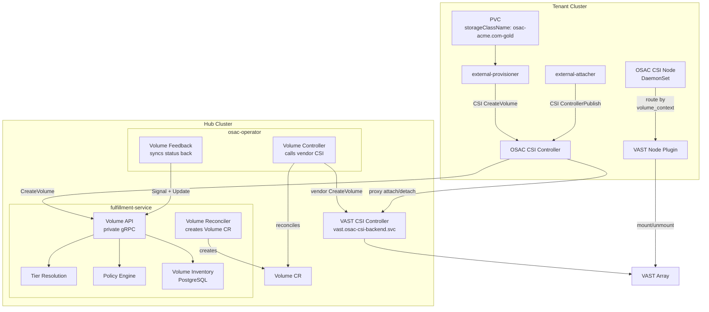
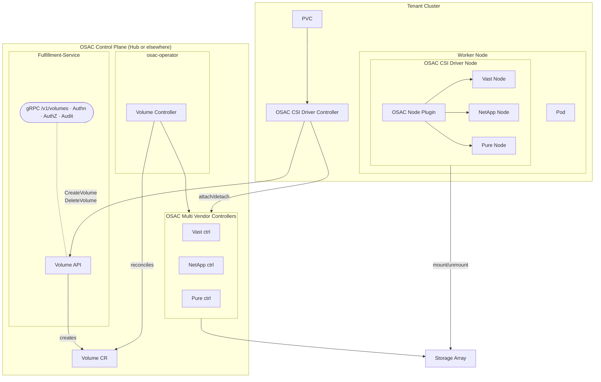
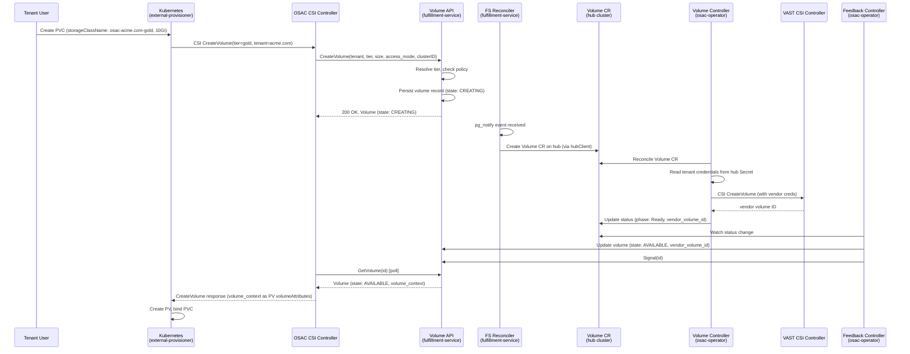
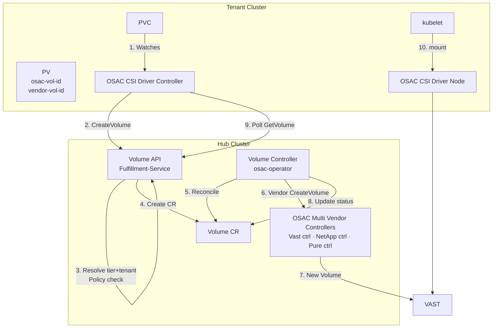
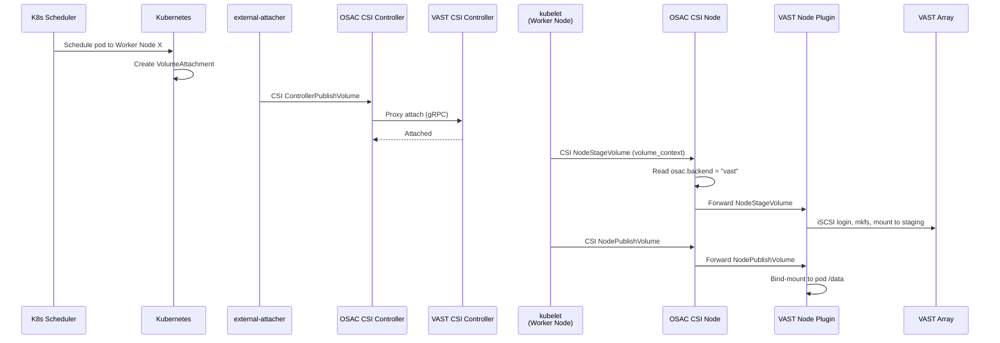
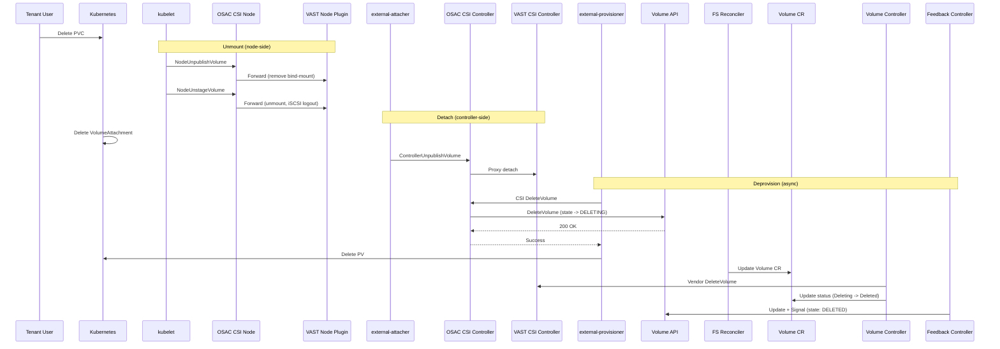

# Storage Control Plane

## Summary

This design introduces a vendor-agnostic storage layer for OSAC CaaS tenant clusters. A single CSI driver (`osac.csi.openshift.io`) presents opaque storage tiers to tenants. The fulfillment-service handles tier resolution, policy enforcement, and volume inventory via a private Volume API. The osac-operator reconciles Volume CRs on the hub cluster, calling vendor CSI controllers to create and delete volumes on storage arrays. See [PRD](prd.md) for detailed requirements.

## Motivation

OSAC CaaS tenants need block storage on their clusters, but no vendor-agnostic storage layer exists today. The existing Cluster Storage Setup ([OSAC-1001](https://redhat.atlassian.net/browse/OSAC-1001), [OSAC-1332](https://redhat.atlassian.net/browse/OSAC-1332)) deploys vendor CSI operators (VAST) directly on clusters, exposing vendor-specific StorageClasses, distributing vendor credentials to every cluster, and providing no central inventory or policy enforcement point.

### Goals

- Reuse the existing fulfillment-service GenericServer, GenericDAO, and gRPC service registration patterns for the Volume API.
- Follow the existing OSAC resource lifecycle pattern: fulfillment-service creates a CR on the hub, osac-operator reconciles it, feedback controller syncs status back (same as ComputeInstance and ClusterOrder).
- Maintain compatibility with the existing StorageReconciler, `status.storageClasses`, and storage conditions (`StorageBackendReady` and `ClusterStorageReady` on Tenant, `ClusterStorageReady` on ClusterOrder) in the osac-operator.
- Keep the CSI driver thin: a single gRPC call from the driver to the fulfillment-service for each volume operation, with all orchestration server-side.
- Package the CSI driver as a Helm chart following the existing osac-installer pattern (each component ships its own chart, umbrella assembles them).
- Extend the existing AAP two-stage onboarding to deploy the OSAC CSI driver instead of (or alongside) vendor CSI operators.

### Non-Goals

- Public Volume API for tenant-facing volume management ([OSAC-984](https://redhat.atlassian.net/browse/OSAC-984)).
- Quota lifecycle with reserve/commit/release.
- VMaaS storage integration (ComputeInstance lifecycle).
- Volume snapshots and clones.
- CSI certification (conformance tests, OLM bundle).
- Multi-vendor support beyond VAST.

## Proposal

The storage control plane spans four repositories plus the installer:

| Repository | What it owns | Why here |
|---|---|---|
| `osac-csi-driver` | CSI meta-driver binary, gRPC proxy for attach/detach, Helm chart for CSI deployment (controller Deployment, node DaemonSet, CSIDriver, StorageClasses, RBAC) | CSI drivers have a unique deployment model (DaemonSet + Deployment with kubelet integration, vendor sidecars, unix sockets) that does not fit any existing repo |
| `fulfillment-service` | Private Volume API (gRPC + REST), tier resolution, policy engine, volume inventory (PostgreSQL). Reconciler creates Volume CRs on the hub cluster. | Already owns StorageBackend and StorageTier (OSAC-917). Shares DB, auth, and OPA infrastructure. |
| `osac-operator` | Volume CRD, Volume controller (calls vendor CSI controller), Volume feedback controller (syncs status back to fulfillment-service) | Follows the dual-controller pattern used by ComputeInstance and ClusterOrder. The operator runs on the hub where vendor controllers are deployed. |
| `osac-aap` | Ansible roles modified to deploy the OSAC CSI driver and vendor plugins to tenant clusters | Existing pattern: AAP handles cluster-side provisioning |
| `osac-installer` | Umbrella Helm chart wiring: adds osac-csi-driver as an optional dependency | Existing pattern: each component ships its own chart, osac-installer assembles them |

The Volume API is declarative and asynchronous. The CSI driver calls CreateVolume, which persists a volume record and returns immediately. The fulfillment-service reconciler creates a Volume CR on the hub cluster. The osac-operator's Volume controller picks up the CR, calls the vendor CSI controller to create the volume on the array, and updates the CR status. The feedback controller syncs the status back to the fulfillment-service. The CSI driver polls GetVolume until the volume is AVAILABLE, then returns volume_context to Kubernetes.

### Architecture: Volume lifecycle components



Key takeaway: the tenant cluster has no vendor controllers and no vendor credentials. Volume creation and deletion are orchestrated by the osac-operator on the hub via Volume CRs. The CSI driver only proxies attach/detach directly to the vendor controller. The node plugin never contacts the control plane.

### Components: OSAC storage and CSI deployment topology



### Workflow Description

#### CaaS PVC Provisioning (primary flow)

Starting state: a tenant cluster has been provisioned via ClusterOrder, the OSAC CSI driver and VAST node plugins are deployed, and StorageClasses matching the tenant's configured tiers exist on the cluster.

**Actors:** Tenant User (creates PVC), Kubernetes (external-provisioner, external-attacher, kubelet), OSAC CSI Driver, fulfillment-service (Volume API + reconciler), osac-operator (Volume controller + feedback controller), VAST CSI Controller, VAST Array.

The tenant user who created the cluster is the authenticated identity for all CSI-initiated Volume API calls on that cluster.

##### Flow: PVC provisioning (CaaS)



The provisioning flow follows the existing OSAC resource lifecycle pattern (same as ComputeInstance):
1. CSI driver calls Volume API, which persists the record and returns immediately
2. PostgreSQL NOTIFY triggers the fulfillment-service reconciler, which creates a Volume CR on the hub
3. The osac-operator Volume controller reconciles the CR: reads per-tenant credentials from the hub Secret (`vast-tenant-config-{tenant}`), calls the vendor CSI controller, updates the CR status
4. The feedback controller detects the status change, syncs it back to the fulfillment-service via Update + Signal RPCs
5. The CSI driver polls GetVolume until AVAILABLE, then returns `volume_context` to Kubernetes
6. Kubernetes stores `volume_context` on the PersistentVolume as `spec.csi.volumeAttributes`

##### Flow: CaaS numbered steps



##### Flow: Mount (after PVC is bound)



1. Pod is scheduled to a worker node.
2. Kubernetes creates a VolumeAttachment resource.
3. external-attacher calls ControllerPublishVolume on the OSAC CSI Controller.
4. OSAC CSI Controller proxies to VAST CSI Controller (attach).
5. kubelet calls NodeStageVolume on the OSAC CSI Node plugin.
6. OSAC CSI Node reads `volume_context["osac.backend"]` = "vast", routes to VAST node plugin socket.
7. VAST node plugin stages the volume (iSCSI login, filesystem format, mount to staging path).
8. kubelet calls NodePublishVolume; OSAC CSI Node routes to VAST node plugin.
9. VAST node plugin bind-mounts the staged volume to the pod's mount point.

No control plane calls are made from the node. All routing information is baked into `volume_context` at CreateVolume time.

##### Flow: Deletion



1. Tenant User deletes PVC.
2. Unmount (reverse of mount): kubelet -> OSAC Node -> VAST Node (NodeUnpublishVolume, NodeUnstageVolume).
3. Detach: external-attacher -> OSAC Controller -> VAST Controller (ControllerUnpublishVolume).
4. Deprovision: external-provisioner calls DeleteVolume on OSAC CSI Controller.
5. OSAC CSI Controller calls Volume API `DeleteVolume`. Volume API transitions state to DELETING, returns immediately.
6. Fulfillment-service reconciler updates the Volume CR on the hub.
7. Operator Volume controller reconciles: calls VAST CSI controller to delete the vendor volume, updates CR status.
8. Feedback controller syncs status back. Fulfillment-service transitions volume to DELETED.
9. OSAC CSI Controller returns success to Kubernetes after step 5. It does not wait for vendor deletion.
10. Kubernetes deletes PV.

#### Error Handling

**PVC with unconfigured StorageClass:** The PVC stays Pending with a standard Kubernetes event. No custom error handling.

**Policy denial (unauthorized tenant or tier):** The Volume API returns `PERMISSION_DENIED`. The CSI controller returns a CSI error. The PVC stays Pending with an event describing the denial.

**Vendor volume creation failure:** The operator Volume controller retries via the standard `provisioning.RunProvisioningLifecycle()` pattern (backoff, retry, status update). The volume name is generated by external-provisioner from the PVC's Kubernetes UID (e.g., `pvc-{PVC-UID}`), which is globally unique across clusters and namespaces. The vendor CSI CreateVolume is idempotent by name per the CSI spec.

**Duplicate CreateVolume (retry after timeout):** If Kubernetes retries and the CSI driver calls CreateVolume again for the same PVC, external-provisioner sends the same PVC-UID-based name. The Volume API returns 409 Conflict (volume already exists). The CSI driver resolves the existing volume ID by calling `ListVolumes` with a CEL filter on the volume name, then polls `GetVolume(id)` until the volume reaches AVAILABLE. The name pass-through is guaranteed by the CSI spec: external-provisioner generates the volume name from `pvc-{PVC-UID}` and passes it unchanged through `CreateVolumeRequest.name` to the CSI driver, which forwards it to the Volume API. The `ListVolumes` name filter must return exactly one match (the volume name has a unique constraint in the database). Zero matches indicates a data integrity issue (the 409 said the volume exists, but it cannot be found); the CSI driver treats this as a fatal error and returns it to Kubernetes for retry. Multiple matches are impossible due to the uniqueness constraint.

**Fulfillment-service unreachable:** The CSI controller returns `UNAVAILABLE`. Kubernetes retries with exponential backoff.

**Operator crash mid-reconcile:** The Volume CR persists on the hub. On restart, the operator picks up all Volume CRs and re-reconciles. Vendor CSI CreateVolume is idempotent by name.

### API Extensions

**New gRPC service: `osac.private.v1.Volumes`** (fulfillment-service)
- Private CRUD service for volume inventory records.
- No public API counterpart. Follows the existing GenericServer pattern (List, Get, Create, Update, Delete, Signal).
- The Signal RPC is called by the operator feedback controller to trigger re-reconciliation after status changes.

**New Volume CRD** (osac-operator)
- `Volume` custom resource on the hub cluster, in namespace `osac-volume` (following `osac-computeinstance` convention).
- Created by the fulfillment-service reconciler (via hubClient), reconciled by the osac-operator.
- Follows the dual-controller pattern: resource controller (calls vendor CSI) + feedback controller (syncs status back).

**New internal storage packages** (fulfillment-service)
- `internal/storage/tier.go`: tier lookup logic.
- `internal/storage/policy.go`: policy engine.
- These are Go packages called by the Volume API handler for validation before persisting. The tier resolution, policy, and credential logic is implemented as internal packages rather than a separate `StorageInternal` gRPC service, keeping the CSI driver thin and allowing the orchestration sequence to evolve server-side without driver changes.

**New fulfillment-service reconciler** (fulfillment-service)
- `internal/controllers/volume/volume_reconciler_function.go`: creates/updates/deletes Volume CRs on the hub cluster.
- Follows the existing pattern in `internal/controllers/computeinstance/computeinstance_reconciler_function.go`.
- Uses `hubClient` from `hub_cache.go` to interact with the hub cluster's Kubernetes API.

**CSIDriver resource** (osac-csi-driver Helm chart)
- Name: `osac.csi.openshift.io`
- Registered on each tenant cluster where the OSAC CSI driver is deployed.

**StorageClass resources** (osac-csi-driver Helm chart / AAP)
- Provisioner: `osac.csi.openshift.io`
- Names follow the pattern `osac-{tenant}-{tier}` (e.g., `osac-acme.com-gold`).
- Labels: `osac.openshift.io/tenant`, `osac.openshift.io/storage-tier`, `osac.openshift.io/storage-protocol`
- Parameters: `tier` (StorageTier name), `tenant` (tenant name)
- `reclaimPolicy: Delete` (standard for dynamic provisioning; ensures vendor volumes are cleaned up when PVCs are deleted)

**Cluster teardown cleanup:** The Volume controller adds an `osac.openshift.io/volume-cleanup` finalizer to a ClusterOrder when the first volume is created on that cluster. This finalizer blocks ClusterOrder deletion until all volumes are processed. On ClusterOrder deletion, the Volume controller queries volumes matching `spec.cluster` and reads each volume's PV `persistentVolumeReclaimPolicy` (via cross-cluster kubeconfig) to decide what to do:

- `reclaimPolicy: Delete`: deletes the vendor volume on the array, transitions the volume to DELETED.
- `reclaimPolicy: Retain`: clears PVC/PV references in status, keeps the vendor volume on the array, volume stays AVAILABLE for potential re-attachment to a new cluster.
- PV not found (cluster already gone): deletes the vendor volume on the array (safe default).

Once all volumes are processed, the finalizer is removed and ClusterOrder deletion proceeds. `cluster` is the ownership key that associates volumes to clusters.

**Existing resources modified:**
- `osac-aap` storage roles: modified to deploy OSAC CSI driver instead of vendor CSI operator on tenant clusters.
- `osac-installer` Chart.yaml: new optional dependency on osac-csi-driver.
- No changes to Tenant or ClusterOrder CRDs. The existing `StorageBackendReady` and `ClusterStorageReady` conditions continue to function as-is.

### Implementation Details/Notes/Constraints

#### Volume Proto Definition (fulfillment-service)

New proto files in `fulfillment-service/proto/private/osac/private/v1/`:

**`volume_type.proto`:**

```protobuf
syntax = "proto3";
package osac.private.v1;

import "private/osac/private/v1/metadata_type.proto";

message Volume {
  string id = 1;
  Metadata metadata = 2;
  VolumeSpec spec = 3;
  VolumeStatus status = 4;
}

message VolumeSpec {
  string storage_tier = 1;
  int64 size_gib = 2;
  string access_mode = 3;
  string cluster = 4;
  PVCReference pvc_ref = 5;
}

message PVCReference {
  string name = 1;
  string namespace = 2;
  string cluster = 3;
}

message VolumeStatus {
  VolumeState state = 1;
  string message = 2;
  string vendor_volume_id = 3;
  string backend = 4;
  string protocol = 5;
  PVCReference pvc_ref = 6;
  PVReference pv_ref = 7;
}

message PVReference {
  string name = 1;
  string cluster = 2;
}

enum VolumeState {
  VOLUME_STATE_UNSPECIFIED = 0;
  VOLUME_STATE_CREATING = 1;
  VOLUME_STATE_AVAILABLE = 2;
  VOLUME_STATE_FAILED = 3;
  VOLUME_STATE_DELETING = 4;
  VOLUME_STATE_DELETED = 5;
}
```

Five states: `CREATING`, `AVAILABLE`, `FAILED`, `DELETING`, `DELETED`. `FAILED` signals that vendor provisioning permanently failed after max retries and requires admin intervention.

Spec fields use names (user-facing input): `storage_tier` (StorageTier name from StorageClass parameters), `cluster` (cluster name). Status fields use system-resolved values: `vendor_volume_id` (opaque vendor identifier), `backend` (StorageBackend name used for this volume).

`spec.pvc_ref` is set when the volume is PVC-driven (CSI driver passes PVC name, namespace, cluster). Empty for API-driven volumes (OSAC-984 future). `status.pvc_ref` is the operator's confirmation that the PVC exists on the tenant cluster. `status.pv_ref` is set after the PV is created.

**`volumes_service.proto`:**

```protobuf
syntax = "proto3";
package osac.private.v1;

import "private/osac/private/v1/volume_type.proto";
import "google/api/annotations.proto";
import "google/protobuf/empty.proto";

service Volumes {
  rpc ListVolumes(ListVolumesRequest) returns (ListVolumesResponse) {
    option (google.api.http) = { get: "/api/private/v1/volumes" };
  }
  rpc GetVolume(GetVolumeRequest) returns (GetVolumeResponse) {
    option (google.api.http) = { get: "/api/private/v1/volumes/{id}" };
  }
  rpc CreateVolume(CreateVolumeRequest) returns (CreateVolumeResponse) {
    option (google.api.http) = { post: "/api/private/v1/volumes" body: "object" };
  }
  rpc UpdateVolume(UpdateVolumeRequest) returns (UpdateVolumeResponse) {
    option (google.api.http) = { patch: "/api/private/v1/volumes/{object.id}" body: "object" };
  }
  rpc DeleteVolume(DeleteVolumeRequest) returns (google.protobuf.Empty) {
    option (google.api.http) = { delete: "/api/private/v1/volumes/{id}" };
  }
  rpc Signal(SignalVolumeRequest) returns (SignalVolumeResponse) {
    option (google.api.http) = { post: "/api/private/v1/volumes/{id}/signal" };
  }
}
```

Request and response messages follow the existing pattern (`CreateVolumeRequest { Volume object }`, `CreateVolumeResponse { Volume object }`). The Signal RPC is called by the operator feedback controller to trigger re-reconciliation in the fulfillment-service after Volume CR status changes.

#### Volume API Server (fulfillment-service)

`fulfillment-service/internal/servers/private_volumes_server.go` follows the existing GenericServer pattern:

```go
type PrivateVolumesServer struct {
    privatev1.UnimplementedVolumesServer
    generic      *GenericServer[*privatev1.Volume]
    tierResolver *storage.TierResolver
    policyEngine *storage.PolicyEngine
}
```

**CreateVolume handler logic:**

1. Validate required fields (`storage_tier`, `size_gib`, `cluster`).
2. Check for existing volume with the same name: if found in CREATING state, return 409 Conflict with the existing volume ID. If found in AVAILABLE state, return the existing volume (idempotent).
3. Look up the StorageTier by ID and its associated StorageBackend to populate backend metadata on the volume record.
4. Check policy: evaluate OPA rules for tier-access authorization.
5. Persist the volume record with `status.state = CREATING`.
6. Return 200 with the CREATING volume to the CSI driver.

The handler does not call the vendor CSI controller. The pg_notify event triggers the fulfillment-service reconciler, which creates a Volume CR on the hub. The osac-operator handles the vendor call.

**DeleteVolume handler logic:**

1. Verify ownership (tenant from JWT claims).
2. If state is already `DELETING` or `DELETED`, return success (idempotent).
3. If volume not found, return success (idempotent, already cleaned up).
4. Transition state to `DELETING`.
5. Return success. The reconciler and operator handle the actual vendor deletion.

**Database migration** (`82_create_volumes_tables.up.sql`):

Standard table structure: `id`, `name`, `creation_timestamp`, `deletion_timestamp`, `finalizers`, `creator`, `tenant`, `project`, `labels`, `annotations`, `data` (JSONB), `version`. Plus `archived_volumes` table. Unique name index on active records. Immutability trigger on `id`, `name`, `tenant`.

**Event payload:** Add `Volume volume = 40;` to the `Event.payload` oneof in `event_type.proto` (next available field number after storage_tier at 39).

**Service registration:** Register `privatev1.RegisterVolumesServer(grpcServer, privateVolumesServer)` in `start_grpc_server_cmd.go` and `privatev1.RegisterVolumesHandler` in `start_rest_gateway_cmd.go`.

#### Fulfillment-Service Volume Reconciler

`fulfillment-service/internal/controllers/volume/volume_reconciler_function.go` follows the existing ComputeInstance reconciler pattern:

1. Subscribes to all volume events via the private events server (`has(event.volume)` filter), including `OBJECT_CREATED`, `OBJECT_UPDATED`, and `OBJECT_SIGNALED`. This ensures deletion transitions (state -> DELETING) are processed immediately, not deferred to the periodic sync.
2. On event: fetches the volume record from PostgreSQL.
3. If the volume is in CREATING state and no Volume CR exists on the hub: builds a `VolumeSpec` (maps proto fields to CRD fields), creates the Volume CR on the hub via `hubClient.Create()`.
4. If the volume is in DELETING state: updates or deletes the Volume CR on the hub.
5. On periodic sync (default 1 hour): re-reconciles all volumes to catch any missed events.

The `hubClient` is obtained from `hub_cache.go`, which constructs a controller-runtime client from the hub's kubeconfig stored in the database. The Volume CR is created with:
- Label `osac.openshift.io/volume-uuid: <fulfillment-service-volume-id>` for the feedback controller to map back.
- Annotation `osac.openshift.io/tenant: <tenant>` propagated from the volume record's `metadata.tenant` field (set server-side from JWT claims, not client-supplied). The operator uses this annotation to derive the credential Secret name.

#### Volume CRD (osac-operator)

New files in `osac-operator/api/v1alpha1/`:

**`volume_types.go`:**

```go
type VolumeSpec struct {
    StorageTier string `json:"storageTier"`
    SizeGiB     int64  `json:"sizeGiB"`
    AccessMode  string `json:"accessMode"`
    Cluster     string `json:"cluster"`

    // PVCRef is set when the volume was triggered by a PVC creation.
    // Empty for API-driven volume creation (OSAC-984).
    // +kubebuilder:validation:Optional
    PVCRef *PVCReferenceType `json:"pvcRef,omitempty"`

}

type PVCReferenceType struct {
    Name      string `json:"name"`
    Namespace string `json:"namespace"`
    Cluster   string `json:"cluster"`
}

type PVReferenceType struct {
    Name    string `json:"name"`
    Cluster string `json:"cluster"`
}

type VolumeStatus struct {
    Phase              PhaseType          `json:"phase,omitempty"`
    Conditions         []metav1.Condition `json:"conditions,omitempty"`
    VendorVolumeID     string             `json:"vendorVolumeID,omitempty"`
    Backend            string             `json:"backend,omitempty"`
    Protocol           string             `json:"protocol,omitempty"`
    ProvisioningJobs   []JobStatus        `json:"provisioningJobs,omitempty"`
    DesiredConfigVersion string           `json:"desiredConfigVersion,omitempty"`

    // PVCRef: operator-confirmed PVC association on the tenant cluster.
    // +kubebuilder:validation:Optional
    PVCRef *PVCReferenceType `json:"pvcRef,omitempty"`

    // PVRef is set after the PV is created on the tenant cluster.
    // +kubebuilder:validation:Optional
    PVRef *PVReferenceType `json:"pvRef,omitempty"`
}
```

**Conditions** (`volume_conditions.go`):

| Condition | True when |
|---|---|
| `VendorProvisioned` | Volume has been created on the vendor storage array (set at step 9 in the provisioning flow) |
| `PVCBound` | PVC on the tenant cluster is bound to a PV. Operator confirms via cross-cluster kubeconfig (set at step 13 in the provisioning flow) |

**Phase values:** `Progressing`, `Ready`, `Failed`, `Deleting`. Follows the existing OSAC convention (same as ClusterOrder).

**Phase and condition combinations:**

| Phase | VendorProvisioned | PVCBound | Meaning |
|---|---|---|---|
| Progressing | False | False | Volume CR created, waiting for vendor call |
| Progressing | True | False | Volume exists on array, waiting for PVC to bind on tenant cluster |
| Ready | True | True | Fully provisioned, PVC bound, volume consumable |
| Failed | False | False | Vendor call permanently failed after max retries |
| Failed | True | False | Volume created on array but PVC never bound (CSI driver timed out, StorageClass misconfigured) |
| Deleting | True | False | PVC deleted or cluster being torn down, vendor volume being removed |
| Deleting | False | False | Vendor volume already deleted, cleaning up Volume CR |

**Labels and finalizers** (`volume_names.go`):

```go
const (
    osacVolumeNameLabel            = "osac.openshift.io/volume"
    osacVolumeIDLabel              = "osac.openshift.io/volume-uuid"
    osacVolumeFinalizer            = "osac.openshift.io/volume-finalizer"
    osacVolumeFeedbackFinalizer    = "osac.openshift.io/volume-feedback"
    osacVolumeCleanupFinalizer     = "osac.openshift.io/volume-cleanup"
    defaultVolumeNamespace         = "osac-volume"
)
```

The `volume-cleanup` finalizer is added to a ClusterOrder when the first volume is created on that cluster. It blocks ClusterOrder deletion until all volumes for that cluster are processed (deleted or retained based on `retainOnClusterDeletion`).

#### Volume Controller (osac-operator)

`osac-operator/internal/controller/volume_controller.go` follows the dual-controller pattern:

**Resource controller lifecycle:**

The Volume controller manages the full volume lifecycle across hub and tenant clusters. The following steps map to the conditions and phases defined above:

```text
Step  Who                     What happens                          Phase / Conditions
----  ---                     ------------                          ------------------
1     FS Reconciler           Creates Volume CR on hub              Progressing
                                                                    VendorProvisioned: False
                                                                    PVCBound: False

2     Volume Controller       Adds finalizer                        (unchanged)
                              Resolves vendor CSI address
                              (vast.osac-csi-backend.svc.cluster.local)
                              Reads tenant creds from hub Secret
                              (vast-tenant-config-{tenant})

3     Volume Controller       Calls vendor CSI CreateVolume         (unchanged)
                              with creds via CSI secrets param

4     Volume Controller       Vendor returns vendor_volume_id       Progressing
                              Updates Volume CR status:             VendorProvisioned: True
                              vendorVolumeID, backend, protocol     PVCBound: False

5     Feedback Controller     Syncs status to fulfillment-service   (unchanged)
                              Update(state: AVAILABLE) + Signal

6     CSI Driver              GetVolume returns AVAILABLE           (unchanged)
                              Returns volume_context to K8s
                              external-provisioner creates PV
                              PVC binds to PV

7     Volume Controller       Cross-cluster GET + requeue:           Ready
                              GETs PVs on tenant cluster,           VendorProvisioned: True
                              finds PV with osac.volume-id          PVCBound: True
                              in volumeAttributes. If not
                              found yet, requeue with short
                              interval. Once found:
                                status.pvcRef (confirmed)
                                status.pvRef (PV name, cluster)
                              Annotates PVC and PV with
                                osac.openshift.io/volume

8     Feedback Controller     Syncs pvRef, pvcRef, Ready phase      (unchanged)
                              to fulfillment-service
```

**Resource controller operations:**
1. Watches Volume CRs in the `osac-volume` namespace.
2. On create: adds finalizer, resolves vendor CSI controller, reads tenant credentials, calls vendor CSI CreateVolume (steps 2-4 above).
3. On vendor success: updates conditions (`VendorProvisioned: True`), requeues to check PVC/PV binding on the tenant cluster (step 7).
4. On requeue: does a cross-cluster GET for PVs with `osac.volume-id` in volumeAttributes. If PV not found or PVC not bound, requeues with a short interval. Once PVC is bound: updates conditions (`PVCBound: True`), sets phase to Ready, populates status.pvcRef and status.pvRef, annotates PVC and PV on the tenant cluster with `osac.openshift.io/volume: <volume-cr-name>`. This is the standard reconcile-check-requeue pattern, not a persistent cross-cluster watch.
5. On delete: calls vendor CSI DeleteVolume, removes finalizer.
6. On ClusterOrder deletion: processes volumes based on PV reclaim policy (see Cluster teardown cleanup).
7. Uses `provisioning.RunProvisioningLifecycle()` for retry, backoff, and status flush.

**Vendor controller routing:** The operator resolves the vendor CSI controller via in-cluster DNS. The namespace is `osac-csi-backend`, the service name is the vendor provider name from the StorageBackend `provider` field (e.g., `vast`). The DNS address is `vast.osac-csi-backend.svc.cluster.local`. This works for single-hub and multi-hub (each hub has its own operator + vendor controller pair, all communication is in-cluster).

**Credential handling:** The operator derives per-tenant credentials from the existing hub Secret. The `osac.openshift.io/tenant` annotation on the Volume CR maps to `vast-tenant-config-{tenant}` in the `osac-system` namespace. All users of the same tenant share the same per-tenant VMS Manager credentials. This follows the existing StorageReconciler pattern.

**Feedback controller** (`volume_feedback_controller.go`):
1. Watches Volume CRs, filtered by `osac.openshift.io/volume-uuid` label (only CRs created by the fulfillment-service).
2. On status change: fetches the volume record from the fulfillment-service via gRPC Get, maps CR phase to proto state (Progressing -> CREATING, Ready -> AVAILABLE, Failed -> FAILED, Deleting -> DELETING), updates the fulfillment-service record via gRPC Update.
3. Syncs PVC/PV references (status.pvcRef, status.pvRef) back to the fulfillment-service volume record.
4. On CR deletion (last finalizer): calls Signal RPC to notify the fulfillment-service to archive the record.

#### PVC/PV Tracking

The Volume CR tracks its relationship to PVCs and PVs:

- `spec.pvcRef` (optional): set at Volume CR creation when the volume was triggered by a PVC. Contains PVC name, namespace, and cluster.
- `status.pvcRef`: operator-confirmed PVC association. Set when the operator verifies the PVC exists on the tenant cluster via cross-cluster kubeconfig (step 7).
- `status.pvRef`: set when the operator finds the PV on the tenant cluster by matching `osac.volume-id` in `spec.csi.volumeAttributes` (step 7).
- The operator annotates both PVC and PV on the tenant cluster with `osac.openshift.io/volume: <volume-cr-name>`. This enables filtering OSAC-managed PVCs/PVs in the OpenShift UI.
- The PV also carries `osac.volume-id` in `spec.csi.volumeAttributes` for programmatic lookups (set by the CSI driver when returning volume_context).

#### Storage Logic Layer (fulfillment-service)

New packages in `fulfillment-service/internal/storage/`:

**`tier.go`:**

Looks up a StorageTier by ID (via GenericDAO), follows its `backends[0].backend_id` to the StorageBackend record, and returns the backend's provider, protocol, and QoS parameters. Initially supports one backend per tier (matching the StorageTier constraint).

**`policy.go` (PolicyEngine):**

Evaluates whether a tenant is authorized to perform a storage operation on a given tier. Uses OPA (the same Rego engine as the existing auth interceptor) with storage-specific policy rules: is the tenant allowed to use this tier? The policy engine is called by the Volume API handler before persisting the volume record.

#### CSI Driver Changes

**`pkg/fulfillment/client.go`:**

Replace the `LoggingStub` with a real gRPC client. The `Client` interface covers the Volume API:

```go
type Client interface {
    CreateVolume(ctx context.Context, req *CreateVolumeRequest) (*Volume, error)
    GetVolume(ctx context.Context, req *GetVolumeRequest) (*Volume, error)
    DeleteVolume(ctx context.Context, req *DeleteVolumeRequest) error
    Close() error
}
```

`GetVolume` is needed for the poll loop. The gRPC client connects to the fulfillment-service endpoint (configurable via `--fulfillment-endpoint`). For CaaS (hub + spoke), the endpoint is the fulfillment-service's Kubernetes Service or Route.

**`pkg/driver/controller.go`:**

The CreateVolume handler:

1. Extract `tier` and `tenant` from StorageClass parameters.
2. Call `fulfillment.CreateVolume(ctx, {tenant, tier, size, accessMode, clusterID, pvcRef})`.
3. If 200 (CREATING): poll `fulfillment.GetVolume(ctx, {id})` with backoff until `state = AVAILABLE`.
4. If 409 (volume with this name already exists): poll `fulfillment.GetVolume` until `state = AVAILABLE`.
5. When AVAILABLE: build `volume_context` from VolumeStatus fields (`status.backend` -> `osac.backend`, `status.vendor_volume_id` -> `osac.volume-id`, `status.protocol` -> `osac.protocol`) and return it to Kubernetes. Kubernetes stores it on the PV as `spec.csi.volumeAttributes`.
6. If poll exceeds the CSI timeout: return error. Kubernetes retries the entire CreateVolume call, which hits the 409 path and resumes polling.

The DeleteVolume handler:

1. Call `fulfillment.DeleteVolume(ctx, {volumeID})`.
2. Volume API transitions state to DELETING and returns immediately.
3. Return success to Kubernetes. The operator handles vendor deletion via the Volume CR.

ControllerPublishVolume/ControllerUnpublishVolume (attach/detach) still proxy directly to the vendor CSI controller via `proxyMgr`, since attach/detach requires node-level information the Volume API does not have.

**`pkg/driver/node.go`:**

No changes to the node plugin logic. It remains a pure passthrough router. The in-memory `volumeBackends` map for tracking vendor assignments across Stage/Unstage operations is a known limitation (volatile on restart). This is acceptable because kubelet re-issues NodeStageVolume with full `volume_context` after a node plugin restart.

#### Helm Chart

New directory `osac-csi-driver/charts/csi-driver/` with:

| Template | Resource | Purpose |
|---|---|---|
| `controller.yaml` | Deployment | CSI controller plugin with external-provisioner + external-attacher sidecars |
| `node.yaml` | DaemonSet | CSI node plugin with node-driver-registrar sidecar + vendor node plugin containers |
| `csidriver.yaml` | CSIDriver | Registers `osac.csi.openshift.io` with Kubernetes |
| `rbac.yaml` | ServiceAccount, ClusterRole, ClusterRoleBinding | RBAC for CSI operations |
| `storageclasses.yaml` | StorageClass (templated) | One per tenant storage tier, parameterized from values |

`values.yaml` key parameters (image tags and chart versions are pinned to tested versions at deploy time; values below are defaults):

```yaml
driver:
  name: osac.csi.openshift.io
  image:
    repository: ghcr.io/osac-project/osac-csi-driver
    tag: latest
fulfillment:
  endpoint: ""  # gRPC endpoint for fulfillment-service
vendors:
  vast:
    enabled: true
    node:
      image: vastdata/csi:latest
tenant:
  name: ""
  storageTiers: []
```

#### osac-installer Umbrella Chart

Add to `osac-installer/charts/osac/Chart.yaml`:

```yaml
- name: osac-csi-driver
  version: ">=0.0.0"
  repository: "file://../../base/osac-csi-driver/charts/csi-driver"
  alias: csiDriver
  condition: csiDriver.enabled
```

The CSI driver chart is optional (`condition: csiDriver.enabled`). Not every OSAC deployment needs storage.

#### AAP Integration

The `osac-create-tenant-cluster-storage` AAP playbook (Stage 2) is modified to:

1. Deploy the OSAC CSI driver Helm chart to the target cluster (instead of installing the VAST CSI operator via OLM).
2. Deploy the VAST CSI controller as a separate Deployment on the hub cluster (in `osac-csi-backend` namespace) if not already running. The service name matches the provider name (e.g., `vast`), so it's reachable at `vast.osac-csi-backend.svc.cluster.local`.
3. Deploy the VAST node plugin as a co-located container in the OSAC CSI node DaemonSet on the target cluster.
4. Create StorageClasses with provisioner `osac.csi.openshift.io` and parameters `tier=<tierName>`, `tenant=<tenantName>`.
5. Create a CSI Secret on the target cluster with credentials for the fulfillment-service (not VAST credentials, which stay on the hub).

The `osac-delete-tenant-cluster-storage` playbook is modified to:

1. Query the Volume API for all volumes with `cluster_id` matching the cluster being deleted.
2. Call DeleteVolume on each (the operator handles vendor-side cleanup via the Volume CR).
3. Uninstall the OSAC CSI driver Helm chart from the target cluster.
4. Clean up StorageClasses.

StorageClass naming changes from `vast-{protocol}-{tenant}-{tier}` to `osac-{tenant}-{tier}` (e.g., `osac-acme.com-gold`). The vendor name and protocol are dropped from the name since the OSAC driver abstracts the vendor. The protocol remains available via the `osac.openshift.io/storage-protocol` label. The existing labels (`osac.openshift.io/tenant`, `osac.openshift.io/storage-tier`) are preserved so the StorageReconciler's label-based tier resolution continues to work. No code parses StorageClass names; labels are the structured data.

### Security Considerations

**Credential isolation:** Vendor credentials (VAST username/password) never leave the hub cluster. They are stored in per-tenant hub Secrets created by AAP (`vast-tenant-config-{tenant}` in `osac-system` namespace). The osac-operator reads these Secrets when reconciling Volume CRs and passes credentials to the vendor CSI controller via the CSI `secrets` parameter. Credentials are never returned to the fulfillment-service or exposed on tenant clusters.

**Cross-cluster authentication:** The CSI driver on tenant clusters authenticates to the fulfillment-service using the tenant user's credentials (the user/admin who created the cluster) with the existing JWT interceptor. For the first release, this uses unencrypted gRPC (matching the POC). TLS is a follow-up improvement.

**Tenant isolation:** The Volume API enforces tenant isolation via the same mechanism as all other fulfillment-service resources: the JWT token carries tenant claims, and the GenericDAO filters queries by tenant. A tenant can only see and operate on its own volumes. OPA policies additionally enforce tier-access rules (a tenant can only use tiers that have been assigned to it).

**CSI driver identity:** The CSI driver on each tenant cluster authenticates with a tenant-scoped identity, not an admin identity. The following security invariants apply:

- Each CSI identity is bound server-side to exactly one tenant.
- Volume API authorization is least-privilege and method-scoped (CreateVolume, GetVolume, DeleteVolume only).
- CSI requests are subject to the same tenant ownership and tier-access OPA checks as any other caller.
- The CSI identity does not use the broad admin allowlist.

**OPA policy updates:** Add Volume API private endpoints to a new CSI-specific role in `authz.rego` (not the admin allowlist). This role permits only the Volume API methods the CSI driver needs (Create, Get, Delete) and enforces tenant scoping via JWT claims.

**Input validation:** The Volume API validates all inputs before persisting: `storage_tier` must reference an existing StorageTier, `size_gib` must be positive, `access_mode` must be a recognized value. Validation follows the protovalidate interceptor pattern. The CSI driver validates that required StorageClass parameters (`tier`) are present before calling the Volume API.

### Failure Handling and Recovery

| Failure Mode | What Happens | Recovery | User Observes |
|---|---|---|---|
| Fulfillment-service unreachable | CSI controller returns `UNAVAILABLE` | Kubernetes retries CreateVolume with exponential backoff | PVC stays Pending |
| Tier resolution fails (invalid tier) | Volume API returns `NOT_FOUND` | No retry (tier does not exist) | PVC stays Pending with event |
| Policy check fails (unauthorized) | Volume API returns `PERMISSION_DENIED` | No retry until policy changes | PVC stays Pending with event |
| Vendor CreateVolume fails | Operator logs error, updates Volume CR conditions | Operator retries via RunProvisioningLifecycle with backoff. CSI driver continues polling. | PVC stays Pending |
| CSI controller pod restarts mid-poll | In-flight GetVolume poll is lost | Kubernetes retries CreateVolume, gets 409 (exists), resumes polling | PVC stays Pending, then succeeds |
| Operator restarts mid-reconcile | Volume CR persists on hub | Operator re-reconciles all Volume CRs on startup. Vendor CreateVolume is idempotent by name. | PVC stays Pending, then succeeds |
| Fulfillment-service reconciler misses event | Volume record in CREATING but no CR on hub | Periodic sync (default 1 hour) catches missed events and creates the CR | PVC stays Pending, then succeeds |
| Volume stuck in CREATING (stale) | Vendor call keeps failing beyond threshold | Operator sets Volume CR conditions with error details. Admin can inspect via private API. | PVC stays Pending |
| CSI node pod restarts | In-memory `volumeBackends` map is lost | kubelet re-issues NodeStageVolume with full `volume_context` | Temporary I/O error, then automatic recovery |

### RBAC / Tenancy

**Volume API tenancy:** Volumes are tenant-scoped. The `metadata.tenant` field is set from JWT claims on create (same as all fulfillment-service resources). The GenericDAO filters List/Get queries by tenant.

**CSI driver identity:** The CSI driver on each tenant cluster authenticates with a tenant-scoped identity, not an admin identity. The following security invariants apply:

- Each CSI identity is bound server-side to exactly one tenant.
- Volume API authorization is least-privilege and method-scoped (CreateVolume, GetVolume, DeleteVolume only).
- CSI requests are subject to the same tenant ownership and tier-access OPA checks as any other caller.
- The CSI identity does not use the broad admin allowlist.

**OPA policy updates:** Add Volume API private endpoints to a new CSI-specific role in `authz.rego` (not the admin allowlist). This role permits only the Volume API methods the CSI driver needs (Create, Get, Delete) and enforces tenant scoping via JWT claims.

**Operator RBAC:** The Volume controller needs RBAC for Volume CRs (get, list, watch, create, update, patch, delete), ClusterOrders (get, watch, update, patch for the `volume-cleanup` finalizer), Secrets in the storage config namespace (get for tenant credentials), and network access to the vendor CSI controller service in `osac-csi-backend` namespace.

**StorageClass visibility:** Tenants see StorageClasses on their clusters but cannot access vendor credentials. StorageClasses are labeled with `osac.openshift.io/tenant` for tenant-scoping.

### Observability and Monitoring

**New Prometheus metrics (fulfillment-service):**
- `osac_volume_operations_total` (counter, labels: `operation`, `state`, `tenant`): total volume API operations.
- `osac_volume_operation_duration_seconds` (histogram, labels: `operation`): latency of volume API operations including tier resolution and policy check.
- `osac_volumes_by_state` (gauge, labels: `state`, `tenant`): current count of volumes in each state.

**New Kubernetes events (osac-operator Volume controller):**
- `VolumeProvisionSucceeded` (Normal): volume successfully created on vendor array.
- `VolumeProvisionFailed` (Warning): vendor volume creation failed with reason.

**New Kubernetes events (CSI driver):**
- `PolicyDenied` (Warning): tenant not authorized for the requested tier.

**Structured log events:** The CSI driver, fulfillment-service, and operator all log structured events for volume operations.

### Risks and Mitigations

| Risk | Impact | Mitigation |
|---|---|---|
| Hub cluster is a single point of failure for provisioning | New PVC requests fail when fulfillment-service or operator is unreachable | Node mounts continue to work without the hub (volume_context is self-contained). Only new provisioning/deprovisioning is affected. Kubernetes retries automatically. |
| Cross-cluster latency for CaaS | CreateVolume latency increases due to hub roundtrip | The latency is only at provisioning time (not at mount time). CSI sidecars handle retries. |
| StorageClass naming migration | Existing volumes use vendor-specific StorageClasses; new volumes use OSAC StorageClasses | New clusters get OSAC StorageClasses from the start. Existing clusters continue using vendor StorageClasses until re-provisioned. |
| Volume inventory divergence | Vendor-side volume exists but inventory record is stale or missing | Accepted risk. A reconciler to sync inventory with vendor state is a future improvement. |
| Orphaned volumes after interrupted teardown | Teardown playbook crashes mid-cleanup, leaving volumes on the array | The operator handles DELETING Volume CRs on restart. A periodic orphan scan (query volumes whose `cluster_id` references a deleted cluster) is a pre-GA hardening improvement. |

### Drawbacks

The primary drawback is added complexity: introducing a new CSI driver, Volume API, Volume CRD, and operator controller adds moving parts compared to the current approach of deploying vendor CSI operators directly. The hub cluster becomes a control plane dependency for all storage provisioning. However, the alternative (vendor CSI drivers on every tenant cluster with vendor credentials) is untenable as the platform scales: it exposes vendor details, distributes credentials, and provides no central inventory or policy enforcement.

The in-memory `volumeBackends` map on the node plugin is a known limitation. On node plugin pod restart, the mapping is lost. kubelet re-issues NodeStageVolume with full `volume_context` which rebuilds the mapping, but there is a brief window where unstage/unpublish for previously staged volumes may fail. This is a pragmatic trade-off: persisting the map to disk adds complexity for a scenario that resolves itself automatically.

### UX Alignment

No UX changes in this EP. This design delivers a private Volume API only. The public Volume API and UI integration are [OSAC-984](https://redhat.atlassian.net/browse/OSAC-984) scope.

## Alternatives (Not Implemented)

### Alternative 1: Storage logic as a standalone service

Instead of embedding the storage logic in the fulfillment-service, deploy a separate `osac-storage-api` service.

**Pros:** Independent scaling, independent release cycle, smaller blast radius.
**Cons:** Duplicates DB, auth, and OPA infrastructure already in fulfillment-service. Adds a new Helm chart, deployment, and operational burden. StorageBackend and StorageTier already live in fulfillment-service, so the storage logic would need cross-service calls to access them.
**Rejected because:** The storage logic shares DB, auth, and OPA with existing fulfillment-service resources. A separate service adds operational cost without architectural benefit.

### Alternative 2: Fulfillment-service calls vendor CSI directly

Instead of creating a Volume CR and having the operator call the vendor CSI controller, the fulfillment-service calls the vendor controller directly via a background reconciler.

**Pros:** Fewer moving parts (no Volume CRD, no operator controller, no feedback controller).
**Cons:** Introduces a new reconciler pattern in the fulfillment-service (which is primarily request-response). The fulfillment-service needs gRPC connections to vendor controllers on the hub, but may run outside the hub cluster. Does not follow the established OSAC pattern (ComputeInstance, ClusterOrder all use operator reconciliation).
**Rejected because:** The Volume CR + operator pattern is consistent with how every other OSAC resource is managed. The operator runs on the hub where vendor controllers are deployed, so vendor calls are always in-cluster.

### Alternative 3: CSI driver proxies vendor calls (client-side orchestration)

Instead of the operator calling the VAST controller, the CSI driver receives routing info and credentials from the Volume API, then proxies the vendor CreateVolume/DeleteVolume call itself.

**Pros:** No Volume CRD needed. Simpler operator.
**Cons:** Vendor credentials transit through the tenant cluster (weakens credential isolation). The CSI driver becomes a thicker client.
**Rejected because:** Credential isolation is a core requirement. Vendor calls from the operator keep credentials on the hub.

### Alternative 4: Do nothing (continue with vendor CSI operators)

Continue deploying vendor CSI operators (VAST) directly on tenant clusters.

**Pros:** No new components. Minimal engineering effort.
**Cons:** Tenants see vendor-specific StorageClasses. Vendor credentials stored on tenant clusters. No central inventory. No policy enforcement point.
**Rejected because:** Does not meet the PRD requirements for vendor abstraction, credential isolation, or volume inventory.

## Open Questions

### 1. Cross-cluster authentication and transport security

For the first release, the CSI driver uses the tenant user's credentials with the existing JWT interceptor over unencrypted gRPC (matching the POC). This needs to be hardened before GA: TLS on the gRPC connection, and potentially mTLS or SPIFFE for stronger isolation. A spike to evaluate options is recommended as a follow-up.

**Owner:** Storage team
**Impact:** Follow-up work after the first release. Does not block initial implementation.

### 2. Immutable cluster identity for volume ownership

The design uses `spec.cluster` (a name) to associate volumes with clusters and for teardown cleanup. Cluster names can be reused: if a cluster is deleted and a new one is created with the same name, old volume records would incorrectly match during teardown.

A potential solution: use the ClusterOrder's fulfillment-service UUID (`osac.openshift.io/clusterorder-uuid` label) instead of the name. AAP already receives the ClusterOrder CR during provisioning and can inject the UUID into the CSI driver's Helm values. The CSI driver passes it to the Volume API, which stores it on the volume record. Teardown matches by UUID, which is immutable and unique.

**Owner:** Storage team
**Impact:** Affects the Volume proto spec (`cluster` field), CSI driver configuration, AAP provisioning roles, and the teardown cleanup query.

### 3. Attach/detach routing

The design routes ControllerPublishVolume/ControllerUnpublishVolume (attach/detach) directly from the CSI controller on the tenant cluster to the VAST controller on the hub. This is a cross-cluster connection that needs an endpoint address, authentication, and failure handling, none of which are specified. Options: (a) configure the VAST controller endpoint on the CSI driver via Helm values, (b) route attach/detach through the Volume API so there's only one cross-cluster connection. Roy's architecture doc lists "attach" as a Volume API operation, suggesting it could go through the Volume API.

**Owner:** Storage team
**Impact:** Determines whether the CSI driver needs a direct cross-cluster connection to the VAST controller, or if all operations go through the Volume API.

### 4. Data-plane credentials for node mount operations

The design states that vendor credentials never reach the tenant cluster. This is true for management API credentials (create/delete/attach/detach volumes on the array), which stay on the hub. However, the VAST node plugin may need data-plane credentials at mount time (e.g., iSCSI CHAP authentication). The current AAP setup references `csi.storage.k8s.io/node-stage-secret-name` on block StorageClasses, suggesting a CSI Secret with connection credentials is needed on the tenant cluster for mount operations.

If CHAP is enabled, the credential isolation claim should be clarified: "no vendor management credentials on tenant clusters; data-plane connection credentials are present for mount operations." If CHAP is not required, mount operations are IP-based (using the export ACL set during attach) and no credentials are needed on the tenant cluster.

**Owner:** Storage team
**Impact:** Affects the credential isolation claim in the Security Considerations section and whether a CSI Secret is needed on the tenant cluster.

## Test Plan

### Unit Tests

**fulfillment-service:**
- Volume API server: Create validates required fields, forces tenant from JWT, persists in CREATING state. Returns 409 on duplicate name. Delete transitions to DELETING. Get/List filters by tenant.
- Volume reconciler: creates Volume CR on hub when volume is CREATING. Updates/deletes CR when volume state changes.
- Tier lookup: reads StorageTier and its associated StorageBackend. Returns NOT_FOUND for nonexistent tier. Returns error when StorageBackend is missing.
- Policy engine: allows authorized tenant for permitted tier. Denies unauthorized tenant. Denies access to tier not assigned to tenant.
- Migration: volumes table created with correct columns, archived table, immutability triggers.

**osac-operator:**
- Volume controller: reconciles Volume CR, calls vendor CSI controller, updates CR status. Retries on vendor failure. Handles deletion. Annotates PVC/PV on tenant cluster.
- Volume feedback controller: syncs CR phase to fulfillment-service state. Calls Signal on CR deletion.
- Volume CRD: validates spec fields, condition helpers.

**osac-csi-driver:**
- Controller CreateVolume: calls fulfillment CreateVolume, receives CREATING volume, polls GetVolume until AVAILABLE, returns volume_context. Handles 409 Conflict on retry.
- Controller DeleteVolume: calls fulfillment DeleteVolume, returns success immediately.
- Node routing: routes to correct vendor socket based on volume_context. Records backend in volumeBackends map. Looks up backend for unstage/unpublish.
- Fulfillment client: connects to endpoint, handles unavailable errors, closes cleanly.

### Integration Tests

**fulfillment-service:**
- Volume lifecycle: create -> get -> list (filtered by tenant) -> update (state transitions) -> delete. Verify tenant isolation (tenant A cannot see tenant B's volumes). Verify tier resolution against real StorageTier and StorageBackend DB records.

**osac-operator:**
- Volume controller integration: create Volume CR, verify it reconciles, verify vendor CSI is called, verify status updates. Test with envtest.

**osac-csi-driver:**
- CSI sanity tests: run the standard `csi-test` suite against the driver with a mock fulfillment-service endpoint. Verifies CSI spec compliance.

### E2E Tests

- Provision a tenant cluster via ClusterOrder. Verify OSAC CSI driver, VAST node plugins, and StorageClasses are deployed.
- Create a PVC with an OSAC StorageClass on the tenant cluster. Verify volume is provisioned on the VAST backend, Volume CR is created on the hub, and the volume is recorded in the fulfillment-service inventory.
- Create a pod that mounts the PVC. Verify the pod can read and write data.
- Delete the PVC. Verify the volume is cleaned up on the VAST backend and the inventory record transitions to DELETED.
- Create a PVC referencing a nonexistent StorageClass. Verify PVC stays Pending.
- Verify PVC and PV carry `osac.openshift.io/volume` annotations.

## Graduation Criteria

Graduation criteria will be defined when targeting a release. Expected stages: Dev Preview -> Tech Preview -> GA based on production deployment feedback.

## Upgrade / Downgrade Strategy

This is a new capability with no existing deployments to upgrade from. OSAC does not currently support upgrades, so data migration and backward compatibility are not concerns at this stage.

For clusters already using vendor CSI operators (VAST): migrating existing volumes to the OSAC CSI driver is not in scope. New clusters provisioned after this feature lands will use the OSAC CSI driver. Existing clusters continue using their current vendor CSI setup.

Downgrade requires uninstalling the OSAC CSI driver Helm chart and re-deploying the vendor CSI operator via the original AAP roles. Any volumes created through the OSAC driver become inaccessible until the vendor CSI operator is restored with the correct StorageClasses.

## Version Skew Strategy

The OSAC CSI driver, fulfillment-service Volume API, and osac-operator Volume controller are deployed independently. Version skew handling:

- **CSI driver newer than fulfillment-service:** The driver calls Volume API RPCs that may not exist yet. The fulfillment-service returns `UNIMPLEMENTED`, and the driver treats this as a fatal error (PVC stays Pending). Resolution: deploy fulfillment-service first.
- **Fulfillment-service newer than operator:** The fulfillment-service creates Volume CRs the operator doesn't recognize. The operator ignores unknown fields (Kubernetes API forward compatibility). No impact.
- **Operator newer than fulfillment-service:** New status fields on the Volume CR are not synced back because the feedback controller's gRPC Update uses the fulfillment-service's proto schema. No impact until the fulfillment-service catches up.
- **Recommended deploy order:** fulfillment-service -> osac-operator -> osac-csi-driver -> osac-aap roles.

## Support Procedures

**Detecting failures:**
- PVCs stuck in Pending: check events on the PVC (`kubectl describe pvc`). Events from the OSAC CSI driver include `PolicyDenied` with detailed reasons.
- Volume CRs on the hub: `kubectl get volumes -n osac-volume`. Check CR conditions for provisioning errors.
- CSI driver pods: `kubectl logs -n osac-csi-driver deployment/osac-csi-controller`. The logging interceptor logs every gRPC call with method, duration, and result.
- Fulfillment-service: volume operations appear in the fulfillment-service logs. Query `osac_volume_operations_total` metric for error rates.
- Inventory: query volumes via the private REST API (`GET /api/private/v1/volumes`) to check for volumes stuck in CREATING state.

**Disabling the feature:**
- Set `csiDriver.enabled=false` in the osac-installer Helm values to stop deploying the CSI driver on new clusters.
- Existing clusters: uninstall the OSAC CSI driver Helm chart. Pods using OSAC-provisioned volumes will lose access to their storage until a vendor CSI operator is deployed with matching StorageClasses.
- The fulfillment-service Volume API continues to serve inventory queries even with the CSI driver disabled.

**Recovery:**
- Re-enabling the CSI driver (re-deploying the Helm chart) restores PVC provisioning. Existing PVCs that were bound before disabling continue to work (the volume data is on the VAST array, not in the CSI driver).
- Volumes stuck in CREATING state can be manually cleaned up via the private Volume API (`DELETE /api/private/v1/volumes/{id}`).

## Infrastructure Needed

- New GitHub repository: `osac-project/osac-csi-driver` (already exists, created under OSAC-2882).
- CI for osac-csi-driver: GitHub Actions for lint, build, and test (pre-commit workflow already exists; test and container build workflows needed).
- No new test infrastructure beyond existing kind clusters and the osac-test-infra framework.

---

## Provenance

Authored: draft @ design 0.4.0 - 7b6dfe0, workspace main @ 17cb3b3

<!-- ai-workflow-provenance:{"schema_version":1,"provenance_kind":"session","workflow":"design","workflow_version":"0.4.0","ai_workflows":"7b6dfe0","source_repo":"17cb3b3","source_repo_branch":"main","commits_behind_main":0,"commits_ahead_main":0,"main_ref":"main","phases":["draft"],"authoring_modes":["skill"],"context_changed":false} -->
