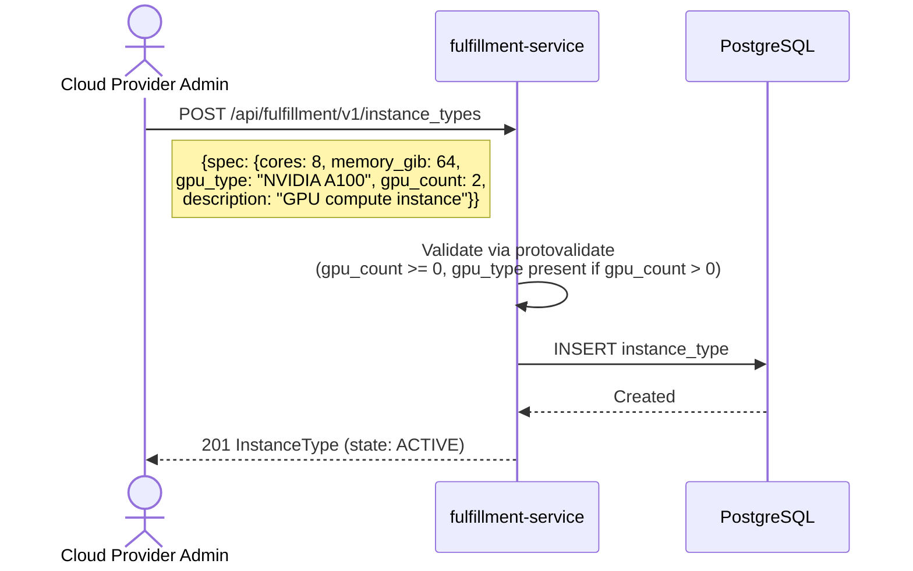
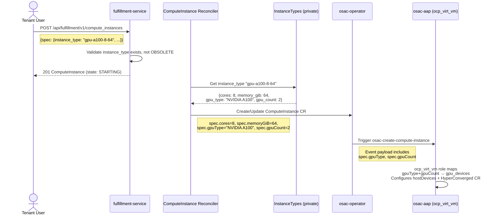

# GPU-Enabled InstanceTypes for ComputeInstances (MVP)

## Summary

This design extends the InstanceType resource with GPU type and count fields so that Cloud Provider Admins can define GPU-enabled compute bundles and Tenant Users can create ComputeInstances with GPU hardware attached via KubeVirt passthrough. The change is concentrated in three layers: proto schema additions to InstanceType (fulfillment-service), CRD field additions to the osac-operator ComputeInstance spec, and wiring in the ComputeInstance reconciler to map GPU fields from the resolved InstanceType into the operator CR — where the existing AAP `ocp_virt_vm` role already handles GPU passthrough via `gpu_devices`. See [PRD](prd.md) for detailed requirements.

## Motivation

OSAC provisions KubeVirt-based ComputeInstances using InstanceTypes as pre-configured compute bundles (cores, memory). The Ansible-level GPU passthrough plumbing exists (OSAC-42): the `ocp_virt_vm` role accepts a `gpu_devices` list, configures `hostDevices` in the KubeVirt VM spec, and patches the HyperConverged CR to permit the PCI devices. However, there is no way for a Cloud Provider Admin to define an InstanceType that includes GPU hardware, and no path for the fulfillment-service reconciler to propagate GPU configuration from the InstanceType through the operator CR to the AAP role.

The gap is in the API and controller layers: InstanceTypeSpec models only `cores` and `memory_gib`, the osac-operator ComputeInstanceSpec has no GPU fields, and the reconciler's `addExplicitFields` function reads only cores and memory from the resolved InstanceType.

### Goals

- Add `gpu_type` (string) and `gpu_count` (int32) fields to `InstanceTypeSpec` in both public and private proto definitions, following the existing immutable-after-creation pattern used by `cores` and `memory_gib`.
- Add GPU fields to the osac-operator `ComputeInstanceSpec` CRD so the reconciler can propagate GPU configuration to the AAP job payload.
- Wire the ComputeInstance reconciler to read GPU fields from the resolved InstanceType and set them on the operator CR.
- Reuse the existing AAP `ocp_virt_vm` role's `gpu_devices` parameter — no AAP changes required for MVP.
- Maintain full backward compatibility: existing InstanceTypes without GPU fields continue to work unchanged; ComputeInstances created with non-GPU InstanceTypes are unaffected.

### Non-Goals

- GPU discovery API — deferred to OSAC-1839.
- Per-tenant GPU quotas — deferred to OSAC-1839.
- GPU type validation at the API layer — Cloud Admin's responsibility, same as CPU/RAM sizing. [Source: PRD scope]
- MIG / vGPU support — deferred to OSAC-1839.
- GPU-aware multi-cluster placement — single VMaaS cluster assumption. [Source: PRD scope]
- GPU VM live migration — deferred to OSAC-1839.
- UI changes for GPU InstanceTypes — UI work tracked separately; the API ships first.

## Proposal

Three components change:

1. **fulfillment-service** — Proto schema: add `gpu_type` and `gpu_count` to `InstanceTypeSpec`. Server: add immutability enforcement for the new fields. Database: add immutability trigger columns.

2. **osac-operator** — CRD: add `GpuType` and `GpuCount` fields to `ComputeInstanceSpec`. The operator already passes the full spec to AAP as the event payload.

3. **fulfillment-service reconciler** — `addExplicitFields` reads GPU fields from the resolved InstanceType and sets them on the operator CR spec.

No changes to osac-aap are required. The existing `ocp_virt_vm` role already handles GPU passthrough via the `gpu_devices` parameter. The operator-to-AAP bridge maps the CRD fields to the AAP variable format.

### Workflow Description

#### Cloud Provider Admin Creates a GPU-Enabled InstanceType



#### Tenant User Creates a ComputeInstance with GPU InstanceType



#### Tenant User Lists InstanceTypes (Identifying GPU-Enabled Ones)

Tenant Users call `GET /api/fulfillment/v1/instance_types` and inspect `spec.gpu_type` and `spec.gpu_count` to identify GPU-enabled options. The existing CEL filter supports filtering on the new fields:

```
this.spec.gpu_count > 0
```

The UI (tracked separately) will display GPU information alongside cores and memory in the InstanceType selector.

### API Extensions

#### Proto Schema: `InstanceTypeSpec` (public and private)

Both `proto/public/osac/public/v1/instance_type_type.proto` and `proto/private/osac/private/v1/instance_type_type.proto` receive the same additions:

```protobuf
message InstanceTypeSpec {
  // Number of CPU cores. Immutable after creation.
  int32 cores = 1;

  // Amount of memory in GiB. Immutable after creation.
  int32 memory_gib = 2;

  // Human friendly description of the instance type, using Markdown format.
  string description = 3;

  // Current lifecycle state of the instance type.
  InstanceTypeState state = 4;

  // Deprecation details. Only meaningful when state is DEPRECATED or OBSOLETE.
  InstanceTypeDeprecation deprecation = 5;

  // GPU accelerator type identifier (e.g., "NVIDIA A100", "AMD MI300X").
  // Free-text string managed by the Cloud Provider Admin. No OSAC-side validation
  // is performed on the value — the admin is responsible for ensuring it matches
  // available hardware. Immutable after creation.
  //
  // When gpu_count is greater than zero, this field must be non-empty.
  // When gpu_count is zero or unset, this field should be empty.
  optional string gpu_type = 6;

  // Number of GPU devices attached to instances of this type.
  // Immutable after creation. Defaults to zero (no GPU).
  //
  // When greater than zero, gpu_type must also be set.
  optional int32 gpu_count = 7;
}
```

**Field design decisions:**

- **`optional` qualifier**: Both fields use `optional` so zero-value and unset are distinguishable. A non-GPU InstanceType has both fields unset. A GPU InstanceType has both set. This avoids ambiguity when patching and in List responses. [Source: existing pattern — `ComputeInstanceSpec.run_strategy` uses `optional`]
- **`gpu_type` as free-text string**: The PRD explicitly scopes GPU type as free text with no OSAC-side validation. This matches the existing pattern where `cores` and `memory_gib` are admin-managed without platform-side hardware validation. [Source: PRD MVP scope]
- **Immutable after creation**: GPU fields follow the same immutability pattern as `cores` and `memory_gib`. Changing GPU configuration after creation would require reprovisioning the VM, which is out of scope for MVP. [Source: PRD — InstanceType lifecycle consistency]
- **Field numbers 6 and 7**: Next available after `deprecation` (field 5).

**Validation rules (protovalidate):**

```protobuf
// Message-level CEL constraint for gpu_type/gpu_count consistency.
option (buf.validate.message).cel = {
  id: "gpu_fields_consistency"
  expression: "(!has(this.gpu_count) || this.gpu_count == 0 || (has(this.gpu_type) && this.gpu_type != ''))"
  message: "gpu_type must be set when gpu_count is greater than zero"
};
```

No additional constraint is needed to reject `gpu_type` without `gpu_count` — a GPU type with count=0 is harmless (it will be ignored) and does not warrant a validation error. [Assumption: This leniency is acceptable — stricter validation can be added later if needed.]

**Immutability enforcement:**

The `gpu_type` and `gpu_count` columns are added to the existing `check_immutable_columns()` trigger on the `instance_types` table, alongside `cores` and `memory_gib`. This is a single database migration file.

```sql
-- Migration: add gpu columns to instance_types immutability trigger
ALTER TABLE instance_types
  -- gpu_type and gpu_count are stored inside the JSONB `data` column,
  -- but the immutability trigger operates on the `data` column as a whole.
  -- Since cores and memory_gib are already enforced via the SQLSTATE Z0001
  -- trigger, GPU fields follow the same mechanism.
  ;

-- The generic DAO stores InstanceType as JSON in the `data` column.
-- The immutability check for gpu_type and gpu_count is enforced at the
-- server layer in the Update handler, same as cores and memory_gib.
```

[Assumption: The immutability enforcement for `cores` and `memory_gib` is done at the server layer, not via database triggers on individual JSON fields. The GPU fields will follow the same pattern — the server's Update handler checks that `gpu_type` and `gpu_count` have not changed when processing an update request.]

#### CRD Extension: osac-operator `ComputeInstanceSpec`

```go
type ComputeInstanceSpec struct {
    // ... existing fields ...

    // Cores is the number of CPU cores
    // +kubebuilder:validation:Required
    // +kubebuilder:validation:Minimum=1
    Cores int32 `json:"cores"`

    // MemoryGiB is the memory in gibibytes
    // +kubebuilder:validation:Required
    // +kubebuilder:validation:Minimum=1
    MemoryGiB int32 `json:"memoryGiB"`

    // GpuType is the GPU accelerator type identifier (e.g., "NVIDIA A100").
    // Empty string means no GPU.
    // +optional
    GpuType string `json:"gpuType,omitempty"`

    // GpuCount is the number of GPU devices attached to this instance.
    // Zero or omitted means no GPU.
    // +optional
    // +kubebuilder:validation:Minimum=0
    GpuCount int32 `json:"gpuCount,omitempty"`
}
```

#### No Service Changes

The InstanceTypes service (`InstanceTypes.Create`, `Get`, `List`, `Update`, `Delete`) requires no RPC signature changes. The new fields are part of the existing `InstanceTypeSpec` message and flow through the existing CRUD operations automatically via the generic DAO's JSON serialization.

### UX Alignment

The `@temp-api` file at `osac-ux/libs/ui-components/src/api/v1/instance-types.ts` currently exposes `spec.cores` and `spec.memoryGib`. After the proto changes and `pnpm gen-types`, the generated types will include `spec.gpuType` and `spec.gpuCount`.

| UI field (`@temp-api` TypeScript) | Proto field (this EP) | Notes / deviation |
|---|---|---|
| `spec.cores` | `spec.cores` | Existing — no change |
| `spec.memoryGib` | `spec.memory_gib` | Existing — no change |
| `spec.gpuType` (new) | `spec.gpu_type` | Direct mapping (camelCase ↔ snake_case) |
| `spec.gpuCount` (new) | `spec.gpu_count` | Direct mapping (camelCase ↔ snake_case) |

The `formatInstanceTypeSizing` function in `instance-types.ts` currently formats as `"8 vCPU, 64 GiB"`. After the backend ships, the UI can extend this to show GPU info (e.g., `"8 vCPU, 64 GiB, 2x NVIDIA A100"`). UI changes are tracked separately.

### Implementation Details/Notes/Constraints

#### Reconciler Changes (fulfillment-service)

The `addExplicitFields` function in `internal/controllers/computeinstance/computeinstance_reconciler_function.go` currently resolves `cores` and `memory_gib` from the InstanceType. It will be extended to also read `gpu_type` and `gpu_count`:

```go
func (t *task) addExplicitFields(ctx context.Context, spec *osacv1alpha1.ComputeInstanceSpec) error {
    // ... existing instance type resolution ...
    itSpec := response.GetObject().GetSpec()
    spec.Cores = itSpec.GetCores()
    spec.MemoryGiB = itSpec.GetMemoryGib()

    // GPU fields — only set when the instance type has GPU configured
    if itSpec.HasGpuCount() && itSpec.GetGpuCount() > 0 {
        spec.GpuType = itSpec.GetGpuType()
        spec.GpuCount = itSpec.GetGpuCount()
    }

    // ... rest of existing code ...
}
```

#### AAP Integration (No Changes Required)

The osac-operator sends the ComputeInstance CR as `ansible_eda.event.payload` to the AAP job template. The `ocp_virt_vm` role reads GPU configuration from the CR payload. The mapping from CRD fields to the AAP `gpu_devices` variable happens in the playbook or role task that extracts the CR fields.

The existing `ocp_virt_vm` role accepts `gpu_devices` as a list of `{pci_device_selector, resource_name}` dicts. The `gpu_type` string in the InstanceType maps to a known `pci_device_selector` and `resource_name` pair.

[Assumption: The mapping from `gpu_type` (free-text string like "NVIDIA A100") to `pci_device_selector` and `resource_name` is configured at the cluster level or in the AAP inventory/vars, not in the InstanceType itself. The InstanceType carries the logical GPU type; the infrastructure maps it to hardware identifiers. This mapping is outside the scope of this EP — the Cloud Provider Admin is expected to configure it as part of GPU hardware onboarding.]

#### Database Migration

A single migration file adds no new columns (the fields are stored in the JSONB `data` column via the generic DAO). The migration updates the immutability trigger if GPU fields require trigger-level enforcement. [Assumption: If immutability is enforced purely at the server layer — as appears to be the case for `cores` and `memory_gib` based on code review — then no migration is needed.]

#### Server-Layer Immutability

The InstanceTypes server Update handler must reject changes to `gpu_type` and `gpu_count` after creation, returning `INVALID_ARGUMENT` with SQLSTATE `Z0001` (immutable field). This follows the existing pattern for `cores` and `memory_gib`.

### Security Considerations

No authentication or authorization changes are required. GPU-enabled InstanceTypes use the same platform-scoped (Cloud Provider Admin) access model as existing InstanceTypes:

- **Create/Update/Delete**: Restricted to Cloud Provider Admin role (enforced by existing RBAC).
- **List/Get**: Available to all authenticated users (Tenant Users see InstanceTypes when selecting compute configurations).
- **Tenant isolation**: InstanceTypes are platform-scoped catalog resources, not tenant-scoped. All tenants see the same catalog. This is unchanged.
- **Input validation**: `gpu_type` is a free-text string. No special sanitization is needed — it is stored as-is in PostgreSQL JSONB and returned as-is in API responses. Standard protobuf serialization prevents injection.

### Failure Handling and Recovery

**Instance type resolution failure (reconciler):**
- If the reconciler cannot resolve the InstanceType (deleted or network error), it retries with exponential backoff per the existing controller-runtime pattern. The ComputeInstance remains in `STARTING` state with a `CONFIGURATION_APPLIED=FALSE` condition.
- Recovery: Automatic retry. If the InstanceType was deleted, the admin must update the ComputeInstance to reference a valid InstanceType, or the ComputeInstance remains unresolvable.

**GPU passthrough failure (AAP):**
- If the `ocp_virt_vm` role fails to configure GPU passthrough (e.g., PCI device not found on the host, HyperConverged CR patch fails), the AAP job fails and the osac-operator marks the ComputeInstance as `FAILED` with a condition message from the AAP job output.
- Recovery: Admin investigates hardware availability. No automatic recovery — GPU hardware presence is an infrastructure prerequisite.

**Immutability violation (API):**
- If a user attempts to change `gpu_type` or `gpu_count` on an existing InstanceType, the server returns `INVALID_ARGUMENT` with a message identifying the immutable fields. The request is rejected; no state changes occur.

**Create with inconsistent GPU fields:**
- `gpu_count > 0` with empty `gpu_type`: Rejected by protovalidate CEL constraint. Returns `INVALID_ARGUMENT`.
- `gpu_type` set with `gpu_count = 0` or unset: Accepted (harmless — GPU type is informational only when count is zero).

### RBAC / Tenancy

No RBAC or tenancy changes are required.

- InstanceTypes are platform-scoped catalog resources managed by Cloud Provider Admins. The existing role check on Create/Update/Delete applies to the new GPU fields.
- InstanceTypes carry `osac.openshift.io/tenant` annotation set to `"shared"` (platform scope). This is unchanged.
- ComputeInstances inherit their tenant isolation from the existing ComputeInstance resource behavior. GPU fields on the ComputeInstance CR are populated by the reconciler from the InstanceType, not set by the user directly — no new user-input path for tenant bypass.

### Observability and Monitoring

No new observability changes. Existing monitoring mechanisms apply:

- The ComputeInstance reconciler already emits metrics for reconciliation duration and errors. GPU-related failures will appear in existing error counters.
- AAP job success/failure is already tracked by the osac-operator.
- GPU-specific monitoring (device health, utilization) is outside OSAC scope — it is handled by the GPU operator and node-level monitoring on the workload cluster.

### Risks and Mitigations

**Risk: GPU type string mismatch between InstanceType and hardware.**
The `gpu_type` field is free-text with no validation. An admin could create an InstanceType with `gpu_type: "NVIDIA A100"` on a cluster that only has H100 GPUs. The mismatch would be caught at AAP provisioning time (PCI device not found), not at InstanceType creation time.
**Mitigation:** This is by design for MVP — the PRD explicitly defers GPU type validation and GPU discovery API to OSAC-1839. Documentation must clearly state that admins are responsible for ensuring InstanceType GPU types match available hardware.

**Risk: InstanceType deletion while GPU ComputeInstances reference it.**
If an admin deletes (or obsoletes) a GPU-enabled InstanceType while ComputeInstances using it are running, the running VMs are unaffected (GPU hardware is already attached). However, the InstanceType resolution in the reconciler would fail for new reconciliation loops of existing instances.
**Mitigation:** This is the same risk that exists today for CPU/memory InstanceTypes. The existing lifecycle state model (ACTIVE → DEPRECATED → OBSOLETE) provides the admin workflow for retirement. No additional mitigation is needed for GPU specifically.

**Risk: Proto field number conflicts if other PRs add fields to InstanceTypeSpec concurrently.**
**Mitigation:** Coordinate field numbers during implementation. Fields 6 and 7 are currently free. If a concurrent PR takes these numbers, adjust during code review.

### Drawbacks

**GPU configuration is indirect.** Tenants select a GPU-enabled InstanceType by name but cannot see detailed hardware specifications (PCI device selector, resource name) — these are infrastructure details abstracted by the InstanceType. This is intentional (same abstraction as CPU/memory), but tenants with specific GPU requirements (driver version compatibility, particular GPU revision) cannot express these preferences through the API.

**No capacity awareness.** The API does not validate whether GPU hardware is actually available on the target cluster. An admin can create a GPU InstanceType for hardware that does not exist, and tenants will only discover the failure at provisioning time. This is a known limitation accepted in the MVP scope.

## Alternatives (Not Implemented)

### Alternative 1: Structured GPU Configuration Object

Instead of flat `gpu_type` / `gpu_count` fields, use a nested `GpuConfig` message:

```protobuf
message GpuConfig {
  string type = 1;
  int32 count = 2;
  string pci_device_selector = 3;
  string resource_name = 4;
}
```

**Rejected because:** The PRD scopes GPU type as free text and defers hardware-level details (PCI selectors, resource names) to the infrastructure layer. Including these in the InstanceType proto would couple the API to KubeVirt-specific hardware identifiers, violating the abstraction boundary. The flat fields are simpler, sufficient for MVP, and can be extended to a structured object in a future EP if needed.

### Alternative 2: GPU as Labels/Annotations

Encode GPU information as InstanceType labels (e.g., `gpu=true`, `gpu_type=NVIDIA_A100`, `gpu_count=2`) instead of spec fields.

**Rejected because:** Labels are not typed, not validated, and not part of the spec/status contract. Using labels for a first-class compute configuration attribute would break the InstanceType abstraction — tenants and the reconciler would need to know about label conventions rather than reading typed proto fields. Labels are appropriate for metadata and filtering hints, not for resource configuration that drives provisioning behavior.

### Alternative 3: Separate GPU Resource

Create a new `GpuType` resource that InstanceTypes reference by ID, similar to how ComputeInstances reference InstanceTypes.

**Rejected because:** This adds a new resource with its own CRUD lifecycle, service, database table, and reconciliation — significant complexity for MVP. The PRD does not require GPU as an independent resource. If GPU discovery (OSAC-1839) introduces a catalog of available GPU hardware, a separate resource may be appropriate at that stage, but for MVP the flat fields on InstanceType are sufficient.

## Test Plan

### Unit Tests

**fulfillment-service:**
- InstanceType Create with `gpu_type` and `gpu_count` succeeds; verify fields are persisted and returned.
- InstanceType Create with `gpu_count > 0` and empty `gpu_type` is rejected with `INVALID_ARGUMENT`.
- InstanceType Create with `gpu_count = 0` and `gpu_type` set succeeds (no error for informational GPU type without count).
- InstanceType Update attempting to change `gpu_type` is rejected with `INVALID_ARGUMENT` (immutability).
- InstanceType Update attempting to change `gpu_count` is rejected with `INVALID_ARGUMENT` (immutability).
- InstanceType Update of mutable fields (`description`, `state`) on a GPU-enabled InstanceType succeeds without affecting GPU fields.
- InstanceType List returns GPU fields correctly for GPU-enabled and non-GPU InstanceTypes.
- InstanceType List with CEL filter `this.spec.gpu_count > 0` returns only GPU-enabled InstanceTypes.
- ComputeInstance reconciler resolves GPU fields from InstanceType and sets them on the operator CR spec.
- ComputeInstance reconciler handles InstanceType with no GPU fields (gpu_type and gpu_count absent) — CR spec has empty/zero GPU fields.

**osac-operator:**
- ComputeInstance CRD with `gpuType` and `gpuCount` fields passes validation.
- ComputeInstance CRD without GPU fields passes validation (backward compatibility).

### Integration Tests

- Create a GPU-enabled InstanceType, create a ComputeInstance referencing it, and verify the resulting operator CR contains the correct GPU fields.
- Create a non-GPU InstanceType, create a ComputeInstance referencing it, and verify the operator CR has no GPU fields set.
- Deprecate a GPU-enabled InstanceType and verify that existing ComputeInstances continue to function (reconciliation does not fail).

### E2E Tests

- End-to-end: Cloud Provider Admin creates a GPU-enabled InstanceType via REST API. Tenant User lists InstanceTypes and identifies GPU-enabled ones via `gpu_type`/`gpu_count` fields. Tenant User creates a ComputeInstance with the GPU InstanceType and verifies the VM is provisioned with GPU passthrough (hostDevices present in KubeVirt VirtualMachine spec). [Note: E2E tests require a cluster with actual GPU hardware or a test double for the GPU device; the test infrastructure for this is tracked separately.]

## Graduation Criteria

**MVP (0.2):**
- InstanceType supports `gpu_type` and `gpu_count` fields.
- ComputeInstance reconciler resolves GPU fields from InstanceType.
- GPU ComputeInstances provisioned via existing AAP plumbing.
- All unit and integration tests pass.

**Future (post-OSAC-1839):**
- GPU discovery API provides hardware catalog.
- GPU type validation against discovered hardware.
- Per-tenant GPU quotas.

## Upgrade / Downgrade Strategy

**Upgrade:**
- Proto fields 6 and 7 are additive — existing InstanceTypes without GPU fields are unaffected. The `optional` qualifier means unset fields serialize as absent in JSON, maintaining backward compatibility with existing API clients.
- The database migration (if any) is additive — no destructive schema changes.
- The CRD field additions are backward-compatible — existing ComputeInstance CRs without GPU fields continue to validate and reconcile correctly.

**Downgrade:**
- Downgrading the fulfillment-service will cause GPU fields to be silently ignored in stored InstanceTypes (the generic DAO's JSON serialization preserves unknown fields, but the older code will not read them).
- Downgrading the osac-operator will cause GPU fields on ComputeInstance CRs to be ignored — VMs will be provisioned without GPU passthrough. This is a loss of functionality but not a crash or data loss.
- No manual cleanup steps are required for downgrade.

## Version Skew Strategy

During a rolling upgrade where the fulfillment-service is updated before the osac-operator:
- The reconciler will set GPU fields on the ComputeInstance CR. If the operator is running an older version that does not recognize `gpuType` and `gpuCount`, Kubernetes preserves unknown fields in the CR (pruning is off by default for unrecognized fields in CRDs with `x-kubernetes-preserve-unknown-fields`). The AAP job payload will include the fields but the role will ignore them if it does not find a matching `gpu_devices` variable mapping.
- The reverse skew (operator updated before fulfillment-service) is a no-op: the operator CRD has the new fields but the reconciler does not set them.

[Assumption: The osac-operator CRD uses `x-kubernetes-preserve-unknown-fields` or controller-runtime's default handling. If the CRD uses strict pruning, the operator must be upgraded first or the fields will be stripped. Verify during implementation.]

## Support Procedures

**Symptom: ComputeInstance stuck in STARTING with GPU InstanceType.**
- Check reconciler logs for InstanceType resolution errors: `failed to resolve instance type`.
- Verify the InstanceType exists and is not OBSOLETE: `osac get instance-types <name>`.
- Check AAP job logs for GPU passthrough errors: PCI device selector not found, HyperConverged CR patch failure.

**Symptom: GPU InstanceType created but GPU count is zero.**
- Verify the Create request included both `gpu_type` and `gpu_count` with correct values.
- Check for immutability — GPU fields cannot be added after creation. Create a new InstanceType.

**Symptom: VM provisioned without GPU despite GPU InstanceType.**
- Check the ComputeInstance CR on the workload cluster: `kubectl get computeinstance <name> -o yaml` — verify `spec.gpuType` and `spec.gpuCount` are set.
- Check the KubeVirt VirtualMachine spec for `hostDevices`.
- Verify the HyperConverged CR permits the PCI device: check `spec.virtualization.permittedHostDevices.pciHostDevices` (or legacy `spec.permittedHostDevices.pciHostDevices`).
- Verify the `gpu_type` to `pci_device_selector`/`resource_name` mapping is configured correctly in the AAP inventory or vars.
