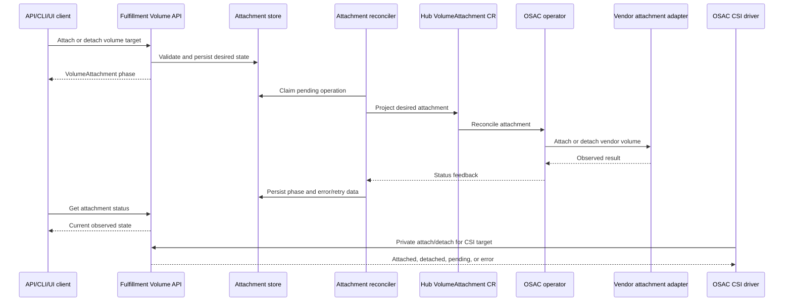

# Volume API Storage Attach and Detach

| Field       | Value |
|-------------|-------|
| Author(s)   | Itzik Ezra |
| Jira        | [OSAC-4884](https://redhat.atlassian.net/browse/OSAC-4884) |
| PRD         | [prd.md](prd.md) |
| Date        | 2026-09-15 |

## 1. Overview

This design adds a durable attachment lifecycle to the OSAC Volume API. The
fulfillment service owns one attachment relationship per volume and compute
target, persists desired and observed state, and reconciles the relationship
through the OSAC operator's provider boundary. Public gRPC, REST, CLI, and UI
clients use the same attach and detach contract for BMaaS and VMaaS. The CSI
driver uses the private form of that contract for CaaS, so CSI publish and
unpublish share authorization, idempotency, retry, deletion protection, and
status behavior. [PRD: In Scope]

The design keeps attachment separate from volume provisioning. It retains the
existing OSAC volume ID, vendor volume ID, vendor context, and CSI volume
handle, while adding a first-class relationship that can survive RPC
deadlines, controller restarts, and backend retries. VM disk presentation is
reconciled from the relationship; provider-specific capabilities remain an
explicit integration prerequisite. [Research: §Recommended Research Direction]

The PRD does not define formal requirement identifiers. This document derives
`FR-1` through `FR-6` and `NFR-1` through `NFR-2` from the published PRD's
In Scope, Out of Scope, and user-story sections for test traceability. These
labels do not add requirements.

## 2. Goals and Non-Goals

### 2.1 Goals

- Use one durable attachment state machine for public BMaaS/VMaaS calls and
  private CSI publish/unpublish requests.
- Preserve idempotent behavior across repeated requests, ambiguous deadlines,
  backend retries, and controller restarts.
- Keep tenant authorization and volume deletion protection at the fulfillment
  service boundary.
- Represent VM boot and additional disks as explicit attachment roles while
  keeping provider routing data private.
- Preserve existing CSI volume identities and provide a migration gate for
  active CSI attachments that cannot yet be proven adoptable.

### 2.2 Non-Goals

- Direct public attachment to CaaS clusters or nodes; CaaS continues to enter
  through the CSI driver.
- A user-facing force-detach operation or an API that hides terminal detach
  failure.
- Replacing volume provisioning, resizing, or deletion with a new lifecycle
  API beyond attachment-related guards.
- Exposing backend-specific attach protocols, credentials, or vendor request
  formats to users.

## 3. Motivation / Background

The current public Volume service exposes List and Get only. Provisioning is
reconciled through fulfillment-service and the OSAC operator, while the CSI
driver proxies ControllerPublishVolume and ControllerUnpublishVolume directly
to vendor CSI controllers. The two paths therefore do not share a durable
attachment record, a common retry policy, or a common deletion guard.
[Codebase: proto/private/osac/private/v1/volumes_service.proto]
[Codebase: fulfillment-service/internal/servers/volumes_server.go]
[Codebase: osac-csi-driver/pkg/driver/controller.go]

The existing Volume status records provisioning and vendor routing data but
has no target relationship, attach phase, operation identity, or retry state.
Embedding a growing relationship list in the generic JSON volume object would
also make uniqueness and concurrent target operations difficult to enforce.
[Codebase: proto/private/osac/private/v1/volume_type.proto]
[Research: §Asynchronous Lifecycle and Recovery]

The design adds a separate persisted attachment record and projects desired
attachment state to a dedicated operator resource. This follows the existing
fulfillment-to-operator resource flow and gives the CSI adapter, direct API,
compute lifecycle controllers, and provider adapter one authority for vendor
side effects. [Codebase: AGENTS.md Architecture]

## 4. Design

### 4.1 Architecture

The fulfillment service becomes the attachment authority. An attach or detach
request first validates the volume, target, access mode, tenant, and current
relationship under a database transaction. It then persists the desired
state and returns the current `VolumeAttachment` object. A worker projects
the desired relationship to a hub `VolumeAttachment` custom resource. The
OSAC operator reconciles that resource through a new provider attachment
interface and reports observed state back to fulfillment-service.

Public BMaaS and VMaaS requests use `DIRECT_API` as their source. The CSI
driver uses `CSI` as its source and supplies a private CaaS target containing
the CSI node identity. The public API rejects CaaS targets; the private CSI
path is the only route for direct Kubernetes attachment.



The diagram shows that the initiating RPC records intent before provider work
and that later status reads are authoritative after the RPC returns. The
provider adapter is called only by the operator path. The CSI driver no longer
creates a second vendor operation path; for CSI calls it waits for the same
persisted relationship to reach the state required by the CSI contract, or
returns the caller's deadline/error while reconciliation continues.

The logical state machine is:

| Desired state | Observed phase | Meaning |
|---------------|----------------|---------|
| `ATTACHED` | `ATTACHING` | The relationship is accepted and provider work is pending or being retried. |
| `ATTACHED` | `ATTACHED` | The provider relationship and, for VM targets, disk presentation are observed. |
| `DETACHED` | `DETACHING` | Provider cleanup or VM disk removal is pending or being retried. |
| `DETACHED` | `DETACHED` | No attachment side effect remains; the record is retained as an idempotency tombstone. |
| Either | `FAILED` | The last operation reached a terminal or non-retryable failure; the relationship remains visible for recovery. |

Only one operation for a `(volume_id, target, device_role)` key runs at a
time. An opposite operation submitted while work is active returns `ABORTED`
with the current attachment status. A repeated operation for the current
desired state returns the existing relationship and does not create a second
provider effect. [Research: §Asynchronous Lifecycle and Recovery]

Two provider and migration capabilities are unverified by the current
repository. **Unverified provider capability:** the current common operator
interface provisions volumes but does not establish a common attach/detach
contract for every backend or target type. Each enabled provider must prove
the target contract, capability reporting, idempotency, and recovery behavior
before the backend is enabled. **Unverified migration capability:** the
current CSI path does not establish that every vendor can enumerate and adopt
already-published volume/node relationships. A backend is migration-ready only
after it provides either published-node inventory or provider-confirmed
idempotent adoption. These are rollout gates, not claims about existing
provider implementations. [Research: §CSI Migration and Compatibility]

VMaaS integration has two cooperating responsibilities. The attachment
controller performs the storage-side relationship. The ComputeInstance
reconciler adds or removes the KubeVirt volume and disk entries for a VM
target, using a stable attachment-derived device name. A boot attachment is
accepted only while the VM lifecycle permits boot-disk mutation; a data
attachment can be reconciled as a hotplug disk when the provider and VM state
allow it. KubeVirt disk presentation is reported as part of attachment
readiness. [Research: §Architecture Patterns]

Bare-metal attachment uses the same OSAC target reference and lifecycle, but
the provider adapter supplies the hardware-specific presentation. The design
does not treat Bare Metal Operator provisioning as a generic volume attach
API; the adapter must establish that boundary for each supported backend.
[Research: §Architecture Patterns]

### 4.2 Data Model / Schema Changes

The fulfillment database adds a `volume_attachments` table. A dedicated row
provides a database uniqueness constraint and row-level serialization that the
existing JSON volume object cannot provide.

| Field | Type | Constraint / purpose |
|-------|------|----------------------|
| `id` | string | Server-generated stable attachment ID. |
| `tenant_id` | string | Copied from the volume's tenant scope; immutable. |
| `volume_id` | string | Foreign key to the active volume; immutable. |
| `target_kind` | enum | `COMPUTE_INSTANCE`, `BARE_METAL_INSTANCE`, or private `CSI_NODE`. |
| `target_id` | string | Validated OSAC target ID, or private CSI node key. |
| `target_context` | protobuf JSON | Target-specific cluster/node or device data; never contains provider secrets. |
| `device_role` | enum | `BOOT` or `DATA`; immutable for the relationship. |
| `read_only` | bool | Requested publish mode; immutable for the relationship. |
| `source` | enum | `DIRECT_API` or private `CSI`. |
| `desired_state` | enum | `ATTACHED` or `DETACHED`. |
| `phase` | enum | `ATTACHING`, `ATTACHED`, `DETACHING`, `DETACHED`, or `FAILED`. |
| `operation` | enum | Last/current `ATTACH` or `DETACH`. |
| `operation_id` | string | Stable controller operation key for the current generation. |
| `attempt` | int32 | Retry attempt for the current operation. |
| `message` | string | Sanitized user/operator-facing status and error message. |
| `last_error_code` | enum/string | Retry classification and terminal error category. |
| `created_at`, `updated_at` | timestamp | Lifecycle and reconciliation timestamps. |

The table has a unique constraint on `(volume_id, target_kind, target_id,
device_role)` and indexes on `(tenant_id, volume_id)`, `(phase,
updated_at)`, and `(target_kind, target_id, phase)`. The volume deletion
transaction rejects deletion while any row for the volume is `ATTACHING`,
`ATTACHED`, `DETACHING`, or `FAILED`. `DETACHED` rows remain as tombstones and
may be reused for a later attach to the same target and role.

The protobuf source adds an OSAC `VolumeAttachment` message and target
messages. The public form exposes only BMaaS and VMaaS target fields; the
private form adds `CsiNodeTarget`, provider routing fields, and `source`.
The attachment message exposes phase, operation, message, operation ID, and
timestamps, while vendor IDs, backend names, vendor context, and secrets stay
private. `Volume` itself may expose a filtered repeated attachment view for
List/Get; the attachment collection remains the authoritative query surface.

The schema migration is additive. Existing volumes receive no fabricated
attachment rows. CSI adoption creates rows from observed relationships or
from the first idempotent publish/unpublish operation after the migration
gate is passed. No vendor volume ID or CSI volume handle is rewritten.

### 4.3 API Changes

The private and public `Volumes` services add these RPCs:

```text
Attach(VolumesAttachRequest) returns (VolumesAttachResponse)
  POST /api/fulfillment/v1/volumes/{volume_id}:attach

Detach(VolumesDetachRequest) returns (VolumesDetachResponse)
  POST /api/fulfillment/v1/volumes/{volume_id}:detach

ListAttachments(VolumesListAttachmentsRequest) returns (...)
  GET /api/fulfillment/v1/volumes/{volume_id}/attachments

GetAttachment(VolumesGetAttachmentRequest) returns (...)
  GET /api/fulfillment/v1/volumes/{volume_id}/attachments/{attachment_id}
```

`Attach` accepts a target reference, `device_role`, `read_only`, and an
optional client request ID. `Detach` accepts the same semantic target key or
the returned attachment ID and an optional client request ID. The server
returns the `VolumeAttachment` object rather than waiting for provider
completion. If completion is observed before the RPC deadline, the response
contains `ATTACHED` or `DETACHED`; otherwise it contains `ATTACHING` or
`DETACHING`. A client can use the attachment ID with Get or List after a
deadline.

Validation rules are:

- The volume exists, is `AVAILABLE`, and belongs to the caller's authorized
  tenant scope.
- Public targets are an existing OSAC ComputeInstance or BareMetalInstance;
  public requests cannot name a CaaS cluster or node.
- The target is in a lifecycle state that accepts the requested role. A boot
  role is rejected after the VM reaches a state where its boot disk cannot be
  changed.
- `device_role`, `read_only`, and target identity form an immutable
  relationship key. A conflicting existing relationship returns its current
  state; it does not create a duplicate row.
- `READ_WRITE_ONCE` and `READ_WRITE_ONCE_POD` reject a second target while an
  incompatible relationship exists. `READ_ONLY_MANY` and
  `READ_WRITE_MANY` are accepted only when the provider capability reports
  multi-target support.
- A backend with controller-side attachment disabled records the logical
  relationship and transitions to the requested terminal state without a
  vendor publish call. It is distinct from an unsupported or failed backend.
- Detach of an already `DETACHED` relationship returns `DETACHED`. Detach of
  a missing relationship returns a detached no-op only when the target key is
  valid and authorized.

The API uses existing gRPC status conventions: `INVALID_ARGUMENT` for
malformed target or role, `NOT_FOUND` for an unknown volume or target,
`PERMISSION_DENIED` for authorization failure, `FAILED_PRECONDITION` for
volume readiness or capability conflicts, `ABORTED` for an opposite operation
already in progress, and `UNAVAILABLE` for a transient control-plane/provider
failure. `DEADLINE_EXCEEDED` means the caller stopped waiting; it does not
claim that a persisted provider operation was undone.

The CLI adds `volume attach` and `volume detach` commands with volume ID,
target kind, target ID, role, read-only, and request-ID options. The commands
print the attachment ID, phase, operation ID, and message, and provide a
status polling option. They do not expose force detach.

The UI adds an Attach action and an Attachments panel on the Volume detail
view. The panel lists target kind/ID, role, read-only mode, phase, last
message, and updated time. Attach validates the target and role before
submission; Detach shows the pending or failed state and links to the
operator-recovery documentation. A force-detach control is absent.

The CSI driver adds private fulfillment-client calls for Attach, Detach, and
GetAttachment. `ControllerPublishVolume` maps CSI `volume_id`, node ID,
capability, read-only, volume context, and secrets to a private CSI target;
it waits until the relationship is `ATTACHED` or its CSI context expires.
`ControllerUnpublishVolume` does the analogous operation for `DETACHED`.
The CSI driver preserves the existing volume handle, vendor volume ID, and
vendor context, and continues the configured no-attach behavior through the
provider capability result. [Research: §CSI controller publish and unpublish]

The protobuf changes are additive to private and public source definitions.
Generated public protobuf, generated Go, REST gateway, CLI, and UI types are
regenerated from source; generated files are not hand-edited.

### 4.4 Scalability and Performance

Each attachment operation adds one or more small database writes and one
operator reconciliation resource. The unique relationship index makes
duplicate checks an indexed lookup. Provider work is asynchronous, so API
workers do not hold request threads while waiting for storage or VM
operations. Retry scheduling uses the existing controller queue/backoff
pattern and avoids tight polling.

Database storage grows with the number of volume/target relationships and
retained detached tombstones. Detached tombstones are retained for the
configured idempotency window and then archived with the same resource
retention policy used by other fulfillment objects. The exact retention
period and expected maximum attachment count are operational inputs that the
deployment must set before rollout; they are not established by the current
repository.

The attachment table and status reads add bounded load proportional to active
relationships. List endpoints require pagination and tenant-scoped filters.
The operator reconciler limits concurrent provider operations per backend and
per target to avoid turning a backend outage into an unbounded retry storm.

### 4.5 Security Considerations

The public attach, detach, list, and get methods use the existing
authentication, attribution, and tenant-scoping middleware. The service
loads the volume and target under the caller's scope and compares their
tenant metadata before creating a relationship. A Cloud Provider Admin can
operate across tenants according to existing role policy; tenant users can
operate only on authorized tenant resources.

Target IDs are validated as resource references, not interpolated into shell
commands or provider URLs. Provider adapters receive structured target data
and resolved protected credentials through the existing operator/provider
path. Credentials, CSI secrets, vendor context, and vendor IDs do not appear
in public protobufs, CLI output, UI fields, status messages, or logs.

The server sanitizes provider errors before persisting `message` and limits
the length of user-visible error text. Structured logs identify tenant,
volume, attachment, target kind, operation, and error class without logging
secret maps. Cross-tenant target references return `PERMISSION_DENIED` and do
not reveal whether the other tenant's target exists.

### 4.6 Failure Handling and Recovery

- **Validation failure:** The API leaves no attachment row and returns the
  specific gRPC error. The CLI and UI display the validation message.
- **Database conflict:** The unique key returns the existing relationship.
  If its desired state matches the request, the operation is idempotent. If
  its opposite operation is active, the API returns `ABORTED` with status.
- **Caller deadline:** The server commits the desired row before launching
  provider work. If the request deadline expires after commit, the caller
  receives `DEADLINE_EXCEEDED`; the row remains available for reconciliation
  and later Get/List. If the transaction cannot commit before cancellation,
  no operation is started.
- **Transient provider failure:** The operator records the retryable error,
  increments `attempt`, keeps the row in `ATTACHING` or `DETACHING`, and
  retries with exponential backoff. A repeated request observes the same
  operation ID.
- **Non-retryable or exhausted failure:** The row enters `FAILED`, stores a
  sanitized error category/message, and remains visible. An attach failure
  does not claim that the provider relationship exists. A detach failure
  blocks volume deletion and prevents a new opposite operation until an
  operator recovery action resolves the state.
- **Provider timeout or uncertain result:** The adapter reconciles the
  provider state before issuing a second side effect. The operation key and
  provider idempotency contract prevent a retry from being treated as a new
  attachment.
- **VM presentation failure:** Storage publication may be complete while VM
  disk reconciliation remains pending. The attachment remains non-terminal
  until both required stages report readiness; the status message identifies
  the stage.
- **Compute target deletion:** The target controller submits detach intents
  for all active relationships before final target cleanup. The target
  remains in its existing deletion-protection path until attachment cleanup
  reaches `DETACHED` or an operator-visible terminal failure.
- **Volume deletion:** The fulfillment delete transaction rejects deletion
  while any non-detached attachment row exists. Once all rows are detached,
  the existing provisioning deletion path can proceed.

There is no public force-detach method. Operator recovery requeues the
attachment after the provider is repaired, refreshes provider state, and
records the resulting transition. The exact operator command or admin UI
entry point remains an open operational choice; it must not bypass provider
state verification.

### 4.7 RBAC / Tenancy

The design adds no new end-user role. Existing Cloud Provider Admin,
Cloud Infrastructure Admin, Tenant Admin, and Tenant User authorization
decisions apply to the new methods. The fulfillment service evaluates both
the volume and the target under the same tenant scope; a valid volume ID
cannot be combined with an unauthorized target ID.

CSI attachment requests are private service-to-service calls authenticated as
the CSI driver for the owning cluster. The driver may create or update only
the private `CSI_NODE` relationship for the resolved volume and node. Public
clients cannot select that target kind or use it to bypass CaaS's Kubernetes
PVC/CSI workflow.

Attachment rows and status are filtered by tenant. Provider and migration
metadata remains private. Tenant annotations and owner-reference conventions
are preserved on projected Kubernetes resources so a relationship cannot
cross tenants during reconciliation. [Codebase: AGENTS.md Required behavior]

### 4.8 Extensibility / Future-Proofing

The typed target oneof allows BMaaS, VMaaS, and private CSI targets to evolve
without exposing a generic unvalidated provider string. The provider adapter
receives a structured capability request so a future target type can be
introduced with explicit validation and tests. The separate relationship
record can later carry additional attachment phases or backend observations
without changing Volume provisioning semantics. The design avoids making
Kubernetes `VolumeAttachment` the universal OSAC model because BMaaS and
VMaaS do not share that Kubernetes target contract. [Research: §CSI Migration
and Compatibility]

## 5. Interface Changes

## IC-1: Public and private attach/detach RPCs

**Requirements:** FR-1, FR-2, FR-4, FR-5, FR-6, NFR-1

Add `Attach` and `Detach` to the private and public `Volumes` services with
REST action routes under `/api/fulfillment/v1/volumes/{volume_id}`. The RPCs
validate tenant, target, role, access mode, and current operation, then return
the persisted `VolumeAttachment` phase. See §4.3 for request, response, and
error details.

## IC-2: Attachment status and collection APIs

**Requirements:** FR-1, FR-3, FR-4, FR-6, NFR-1

Add attachment List/Get methods and expose phase, operation ID, timestamps,
and sanitized messages. `DETACHED` tombstones and `FAILED` detach records
remain queryable for idempotency and operator recovery. See §§4.2, 4.3, and
4.6.

## IC-3: CLI attach/detach commands

**Requirements:** FR-1, FR-2, FR-4, FR-6, NFR-1

Add `volume attach` and `volume detach` commands with target, role,
read-only, request-ID, and status options. The commands print phase and
operator-relevant error state and do not provide force detach. See §4.3.

## IC-4: UI attachment workflow

**Requirements:** FR-1, FR-2, FR-3, FR-4, FR-6, NFR-1

Add Volume detail attachment listing, attach/detach actions, pending and
failed state presentation, target/role validation, and recovery guidance.
The UI never exposes provider secrets or force detach. See §4.3.

## IC-5: CSI publish/unpublish adapter

**Requirements:** FR-3, FR-4, FR-5

Change the OSAC CSI controller to call the private attachment API and wait for
the required observed state while preserving CSI volume handles, node IDs,
capabilities, read-only behavior, and no-attach backend semantics. See
§§4.1, 4.3, and 4.6.

## IC-6: Fulfillment and provider attachment reconciliation

**Requirements:** FR-2, FR-3, FR-4, FR-5, FR-6

Add the attachment table, controller/retry loop, hub `VolumeAttachment` CRD,
operator reconciler, and provider `VendorAttacher` capability contract. The
provider contract is a required implementation boundary; current provider
support is unverified. See §§4.1, 4.2, and 4.6.

## IC-7: Compute target lifecycle integration

**Requirements:** FR-2, FR-6

Add VM boot/data disk relationship handling and target-deletion cleanup for
ComputeInstance and BareMetalInstance lifecycles. VM reconciliation must
complete both storage publication and KubeVirt disk presentation before
reporting `ATTACHED`. See §§4.1 and 4.6.

## IC-8: Volume deletion guard and terminal recovery state

**Requirements:** FR-6, NFR-1

Block volume deletion while any attachment is non-detached and expose
terminal detach failure through API, CLI, UI, and operator status. Recovery
requeues and reconciles the same attachment operation; no force-detach
endpoint is added. See §§4.3 and 4.6.

## IC-9: Attachment observability and documentation

**Requirements:** FR-3, FR-6, NFR-2

Add operation counters, duration and retry metrics, structured events/logs,
and documentation for API, CLI, UI, migration, lifecycle, errors, and
operator recovery. NFR-2 also requires a backend-neutral end-to-end flow and
coverage for migration and error cases; the test requirement itself adds no
runtime interface. See §7 and the testplan.

## 6. Alternatives Considered

### 6.1 Embed attachments only in `Volume.status`

This keeps one protobuf object and avoids a new table. It does not provide a
database uniqueness constraint, efficient target queries, or independent
row-level serialization, and it makes tombstones and concurrent operations
depend on whole-volume updates. The separate attachment record is selected.

### 6.2 Keep direct vendor calls in the CSI driver and add a second direct API path

This minimizes the first CSI code change, but leaves two authorities for
vendor side effects and makes migration/adoption and deletion guards
inconsistent. A shared fulfillment attachment authority is selected.

### 6.3 Make public attach and detach synchronous

A synchronous call is simple for clients when provider latency is low. It
cannot represent a provider operation that outlives a caller deadline and
encourages unsafe retries after `DEADLINE_EXCEEDED`. The persisted
request/status contract is selected. [Research: §Asynchronous Lifecycle and
Recovery]

### 6.4 Use Kubernetes `VolumeAttachment` as the canonical OSAC resource

This would reuse CSI sidecar conventions, but BMaaS and VMaaS targets are not
Kubernetes nodes and KubeVirt disk presentation adds a second relationship.
OSAC keeps its own target-typed relationship and lets the CSI path adapt to
it. [Research: §CSI Migration and Compatibility]

### 6.5 Allow force detach to unblock deletion

Force detach can remove control-plane state while the provider still believes
the volume is attached, creating data corruption or a duplicate attachment.
The PRD explicitly requires terminal detach visibility and operator recovery,
so force detach is excluded.

### 6.6 Use a generic provider target string

A free-form string would avoid adding target messages, but it would move
authorization and lifecycle validation into each provider and make tenant
isolation difficult to audit. Typed OSAC targets are selected; provider data
remains behind the adapter.

## 7. Observability and Monitoring

The fulfillment service emits structured attachment events containing
attachment ID, volume ID, tenant ID, source, target kind, operation, phase,
attempt, and error class. It excludes vendor context and secrets.

The following metrics are added:

- `osac_volume_attachment_operations_total{source,operation,result,error_class}`
- `osac_volume_attachment_operation_duration_seconds{source,operation,result}`
- `osac_volume_attachment_retries_total{source,operation,error_class}`
- `osac_volume_attachment_pending{source,target_kind}`
- `osac_volume_attachment_terminal_failures{source,operation,target_kind}`

The operator records provider-call duration and result using the same
attachment ID and operation ID. Alerts cover terminal detach failures,
pending attachments above the configured age threshold, and retry rates above
the backend baseline. CSI errors remain visible through the CSI driver's
existing logs and metrics, with the attachment ID added for correlation.

## 8. Impact and Compatibility

The protobuf additions and attachment table are additive. Existing volume
IDs, vendor IDs, CSI volume handles, storage tiers, PVCs, and ComputeInstance
resources remain readable. Public Volume clients gain methods and fields
without changing existing List/Get request shapes; generated clients must be
regenerated.

The CSI controller path changes from direct vendor proxying to the private
fulfillment attachment path. Existing CSI-managed volumes and active
attachments are preserved only after the provider-specific migration gate is
validated. The gate must prove published-node inventory or provider-confirmed
idempotent adoption; the current code does not establish either capability.

The new operator CRD and provider adapter require coordinated versions of
fulfillment-service, osac-operator, and osac-csi-driver. Deployment must
roll out the additive schema and private API before enabling the CSI route,
then enable providers one at a time with migration and rollback checks. A
provider that cannot satisfy the migration gate remains on the existing path
until its capability is verified; this is a rollout safety condition, not a
claim that the existing provider path is already compatible.

The public UI and CLI are additive. The current compute disk model requires
new volume-reference and attachment-role handling for boot and data disks;
existing size/storage-tier requests remain supported during the transition.
The docs repository is not changed by this draft phase.

## 9. Open Questions

## 9.1 Which provider capability contract supports each target type?

- **Owner:** Cloud Infrastructure and storage-provider maintainers
- **Impact:** §4.1 architecture, §4.3 validation, §4.6 recovery, §8 rollout

The current repository establishes volume provisioning but not a common
provider attach/detach contract for BMaaS, VMaaS, and CSI node targets. Which
providers can publish, unpublish, report capabilities, enumerate current
relationships, and reconcile uncertain results must be confirmed before
implementation and rollout.

## 9.2 How are active CSI relationships adopted during migration?

- **Owner:** CSI and storage-platform maintainers
- **Impact:** §§4.1, 4.2, 4.6, and 8

Can each supported provider enumerate published volume/node pairs, or provide
an idempotent adoption operation that proves an existing attachment without
requiring user action? The answer determines whether the importer or the
first CSI publish call creates the relationship records.

## 9.3 What VM disk contract covers boot and data roles?

- **Owner:** VMaaS and fulfillment maintainers
- **Impact:** §§4.1, 4.2, 4.3, and IC-7

Which ComputeInstance fields select an existing Volume for a boot disk or
additional disk, and which KubeVirt target/device fields are user-selectable
versus controller-generated? The answer must preserve boot lifecycle rules and
hotplug readiness semantics.

## 9.4 What retry and operator-recovery policy is deployed?

- **Owner:** Fulfillment platform and operations maintainers
- **Impact:** §§4.4, 4.6, and §7

What retryable error classes, maximum retry age/attempt policy, and operator
requeue interface should be used? The design requires these values to be
durable and observable but does not establish deployment-specific thresholds.

## 9.5 Which CSI attachment details are public?

- **Owner:** Fulfillment API and security maintainers
- **Impact:** §§4.2, 4.3, 4.5, IC-2, and IC-4

Should public Volume List/Get show CSI-created attachment summaries, or only
direct BMaaS/VMaaS relationships while retaining full CSI state privately?
Either choice must preserve tenant visibility and avoid exposing cluster or
provider details.

## 9.6 Which deployed environment owns the representative E2E flow?

- **Owner:** QE and storage-integration maintainers
- **Impact:** IC-9, §8, and NFR-2 test coverage

Which backend-neutral environment can exercise a real attach/detach flow,
provider failure and retry, target cleanup, and CSI migration? The current
fake-vendor sanity suite cannot establish that boundary by itself.

---

## Provenance

Authored: draft @ design 0.11.1 - f1d6a4b, workspace main @ 554e5a07a

<!-- ai-workflow-provenance:{"schema_version":1,"provenance_kind":"session","workflow":"design","workflow_version":"0.11.1","ai_workflows":"f1d6a4b","source_repo":"554e5a07a","source_repo_branch":"main","commits_behind_main":0,"commits_ahead_main":0,"main_ref":"main","phases":["draft"],"authoring_modes":["skill"],"context_changed":false,"origin_untracked":false} -->
